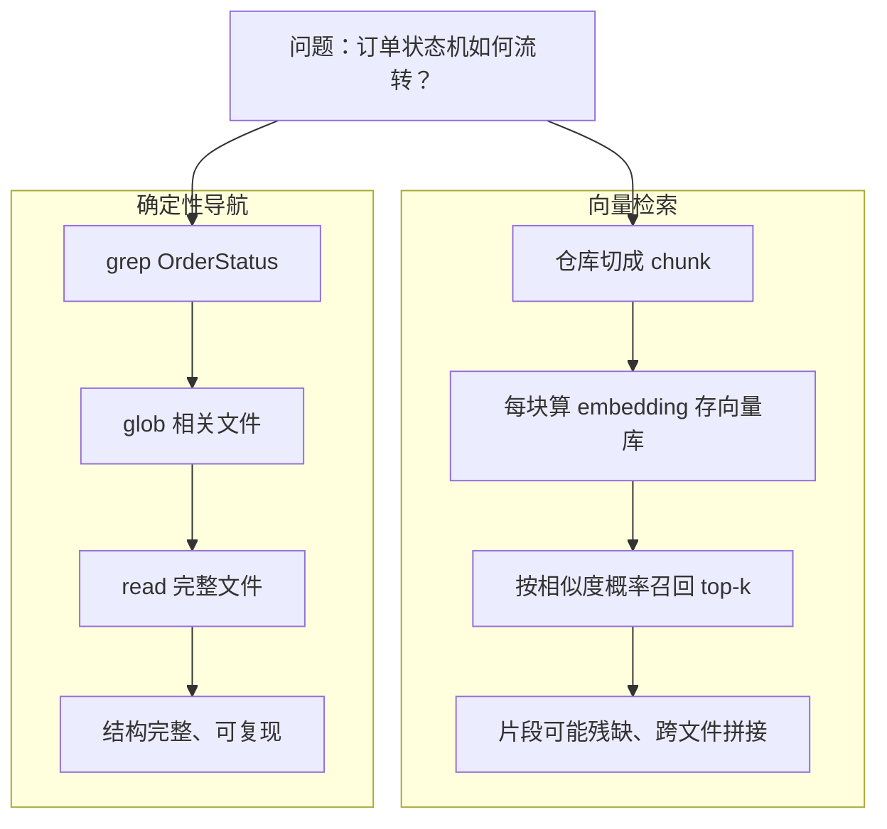
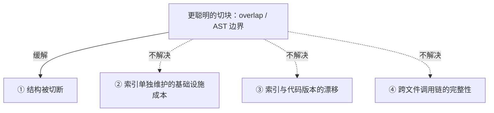

本书从头到尾带你建一座知识库。被服务的对象是 `aishop`——一个虚构的电商后端，有订单、库存、支付、退款、风控、对账几个模块。你要给它建的那座知识库，我们叫它 `aishop-kb`。读到第 23 章，你会拥有一座完整、可自托管、能扫覆盖度、能对外提供服务、能被全团队共建、能自我评测和自检的 `aishop-kb`。

但在写第一条知识之前，有一个更靠前的决策要定：**agent 到底用什么机制，从知识里取答案。** 这个决策错了，后面的组织、分发、治理都建在歪地基上。本章就解决它。

先看一个具体查询。在 `aishop` 里问 agent 一句："订单状态机怎么流转？" 两条取知识的路，给出两种结果：

- 走向量 RAG：把仓库切块、算 embedding、按相似度召回。返回的是三段跨文件的残片——半个 `enum`、一段无关日志、一个测试夹具，而真正定义 `OrderStatus` 的那个文件，因为用词精炼、字面信息少，排在第 4。agent 把残片拼起来，编出一套并不存在的流转规则。
- 走确定性导航：`grep OrderStatus`、`glob` 出相关文件、`read` 完整读回。一次拿到完整的状态机定义，可复现。

同一个问题，同一个仓库，两条路差的不是知识多少，是取知识的机制。多数团队把"建知识库"直接译成"搭一套 RAG"——在还没想清楚 agent 该怎么取知识时，就先锁死了向量检索这一种。本章要拆掉这个默认假设。

## 1.1 本章你会得到什么

1. 一条判断"该用确定性导航还是向量检索"的判据——知识的边界能不能枚举。
2. 四条硬论据，说清为什么对代码知识，确定性导航几乎全面优于向量召回。
3. 一张贯穿全书的地图：检索机制不是二选一，而是按知识的远近分层。
4. `examples/nav-vs-rag/` 里两条路径在 `aishop` 上的实测召回对比，你可以自己跑一遍看差别。

这一章不动 `aishop-kb` 的产物本身——它是地基，先把判据立起来，第 6 章才正式动手建第一版知识库。

## 1.2 两种检索机制

知识检索有两条机制上根本不同的路径。

向量检索是 RAG（Retrieval-Augmented Generation，检索增强生成）的核心环节。它把文档切成小块（chunk），为每块算一个 embedding（一段表征文本语义的浮点数组）存进向量库；查询时算查询向量与各块的相似度，按相似度概率召回若干块。

它为一类特定问题而生：语料庞大、来源分散、答案位置无法预先确定，只能靠语义相似度去逼近。

确定性文件导航是另一条路：agent 用 `grep` 按符号精确匹配、用 `glob` 按路径列举、用 `read` 完整读入命中的文件。它不算相似度，命中与否是确定且可复现的。它的前提是知识边界可枚举——你能通过符号或路径直接定位答案。

回到那个查询。向量检索把整个 `aishop` 切碎、召回一堆语义相似的片段；确定性导航只是 `grep` 一个符号、读回一个文件。两者的差别不在"谁的知识更全"，而在检索机制本身（图 1-1）。

图 1-1：同一问题的两条检索路径。向量检索为"答案位置不确定"而设计；确定性导航以"边界可枚举"为前提。

## 1.3 机制的适配性由知识结构决定

向量检索的全部价值，在于处理"答案可能在任何位置、无法预先圈定"的不确定性。它用一整套索引基础设施，换取在模糊语料里逼近答案的能力。

代码仓库没有这种不确定性。"订单状态机"的定义就在少数几个文件里，`grep` 一个符号即可定位。对一个边界明确的问题动用为模糊性设计的重机制，是机制与问题的错配：付出了索引、embedding、rerank 的全部成本，换回的却是概率性的、可能残缺的结果。

所以检索机制怎么选，不取决于"哪种更先进"，而取决于知识的结构——边界能不能枚举。这条判据贯穿全书，也是本章其余部分要展开的核心。

## 1.4 八个维度的对照

把两种机制在代码知识场景下逐维度摆开，差异更清楚（表 1-1）。

表 1-1：代码知识场景下两种检索机制的对照

| 维度 | 向量检索 | 确定性文件导航 |
|---|---|---|
| 检索方式 | 按相似度概率召回 chunk | `grep`/`glob`/`read`，确定可复现 |
| 知识边界 | 跨源聚合，边界模糊 | 单仓库 scoped，边界可枚举 |
| 知识载体 | embedding 存向量库，与代码分离 | 文件与代码同仓库、同 PR、同版本 |
| 基础设施 | 向量库 + 索引 worker + embedding/rerank | 无，就是 git 里的文件 |
| 更新一致性 | 索引滞后于代码，需重建 | 随代码 PR 同步改，reviewer 可见 |
| 结构保真 | chunk 切断函数、类型、调用链 | 文件完整，可沿 import 追溯 |
| 权限模型 | 需在检索层单独同步访问控制 | 直接继承 git 仓库权限 |
| 主要使用者 | 全员，含非技术人员 | coding agent 与工程师 |

在"单仓库、边界清晰、与代码同源"这一格里，右列几乎全面占优。这个优势由下面四条相互独立的论据支撑。

## 1.5 确定性导航在代码场景中的四条优势

### 1.5.1 切块破坏代码的结构完整性

RAG 的第一步是 chunking——把长文本切成小块。自然语言能这样切，代码不行。函数、类型定义、一条调用链，都是不可切断的语义单元。按固定长度切块，会把函数拦腰截断、把类型定义和它的使用处分进不同 chunk，召回回来的往往是残缺语义。

agent 直接读文件则能沿符号引用确定地跳转。这也是 [Claude Code](https://claude.com/claude-code) 公开采用"agentic 搜索"、而非预建嵌入索引的原因——让模型用 `grep`、`glob` 直接在文件系统里找。

> **agentic 搜索（agentic search）**：把"怎么找"交给模型，而不是交给索引。agent 在推理循环里自主调用 `grep`、`glob`、`read` 这类工具，看到结果后再决定下一步——换关键词重搜、沿 import 跳到定义处、或把命中的文件完整读回，多轮迭代直到取到答案。与之相对的是预建索引的单轮召回：离线把语料切块、算好 embedding，查询时按相似度一次取回若干片段。两者的本质差别在于，检索是模型驱动的多轮探索，还是索引承担的单次查找。Claude Code 采用前者，不为代码库预建任何向量索引；本章说的确定性导航，就是 agentic 搜索在"边界可枚举"场景下的具体形态。

代码上还有一个更隐蔽的失效：**相似度排序和"相关性"并不总是对齐**。embedding 相似度度量的是用词与语义的重合度。而一段代码的权威定义往往用词精炼、字面信息少，反倒是提及它的注释、日志、测试用词更丰富。

结果是，真正定义某个符号的文件，相似度得分可能低于只是"提到"它的文件。第 3 章的实验会具体演示：查一个函数的调用者时，仅在注释里出现该函数名的文件，排名反而高于它的真实定义。

这不是调参能根治的偏差，而是"用文本相似度检索结构化符号关系"这一错配的必然结果。

一个自然的反驳是：用重叠窗口（overlap）或按 AST（抽象语法树）边界切块，能不能消除"切断结构"？能显著缓解。但这恰恰印证了向量路径在代码场景并不"免费"。据 [Cursor](https://cursor.com) 公开的工程说明，它这类选择向量索引的工具，会在朴素切块之上叠加语义／AST 感知的切分，并用 Merkle 树做增量重建来对抗索引漂移。

更关键的是，更聪明的切块只削弱了四条论据里的第一条；后三条不受切块策略影响（图 1-2）。让导航在代码场景胜出的，是这四条的叠加，而非任何单一 chunk 参数。

图 1-2：更聪明的切块只削弱四条论据中的第一条（实线），其余三条（虚线）依然成立。

### 1.5.2 相关性可枚举，无需为不确定性付费

向量检索的成本，换来的是处理不确定性的能力。代码仓库没有这种不确定性：`OrderStatus` 在哪定义、被哪里引用，`grep` 一次即完全确定。为一个确定的问题维护一套概率召回机制，是纯粹的浪费。

### 1.5.3 知识与代码同生命周期

文件式知识随代码的 PR 一并修改、评审、打版本标签。中心化的向量索引则始终面临"索引与真实代码"的一致性漂移——代码改了、索引还没重建，agent 拿到的是旧知识。这个漂移贯穿所有与代码分离的知识形态，第 23 章会专门讲怎么治它；而文件式知识从根上就没有这个洞。

### 1.5.4 零基础设施与可移植性

文件式知识不需要向量库、embedding 服务或 rerank，它就是 git 里的几个 Markdown 和源文件，能随仓库分发、能打包成后面章节要讲的可复用单元。**这种"轻"不是将就，而是一种应当作为默认的形态。**

## 1.6 向量检索的适用边界

以上论证限定在代码知识场景，不能推广成"向量检索无用"。有几类场景，向量检索不仅合适，而且是唯一可行的：

1. 跨源、跨仓库、答案位置不确定。一项决策的来龙去脉散在 Slack、Confluence、二十个仓库里，无法预先圈定范围，只能靠语义召回。
2. 语料庞大、非结构化、频繁变动。几十万篇文档，人工无法以文件方式维护，必须靠自动索引。
3. 面向非技术用户。他们不用 `grep`，需要一个聊天框帮他们找答案。
4. 统一的合规入口。企业需要一个带审计、权限、单点登录的检索门户。

这些正是 [Onyx](https://onyx.app)（开源、可自托管的企业搜索问答系统，前身 Danswer）和 [Glean](https://www.glean.com)（闭源的企业知识图谱平台）的主场。它们赢在跨源模糊召回，而不赢在单仓库代码理解。把它们的能力误用到"让 agent 读懂这个仓库"上，就会重演本章开头那种检索质量不升反降的局面。第 11 章对标 Onyx 时会再回到这条边界。

## 1.7 检索机制的分层

把结论收拢，就是贯穿全书的一条主张：**检索机制不是二选一，而是按知识的"远近"分层。**

- 近处、高相关、与代码同源的知识 → 用文件式确定性组织，agent 直接导航。这是默认形态，也是 `aishop-kb` 的起点（第 6 章）。
- 远处、跨源、模糊长尾的知识 → 才降级到向量检索。它的位置在能力阶梯更高层（第 10、11 章）。

确定性导航内部同样有次序：代码符号 `grep` 直达；业务知识文档则先走索引定位、完整读回，`grep` 只作索引未命中时的兜底。这条检索优先级协议如何写进 `AGENTS.md`，见 6.7.2。

"知识库即 RAG"这个默认假设，源于只看见了远处那一层，忽略了近处——而近处恰恰最该优先建、成本最低、也最被低估。成熟的架构是混合分层，不是非此即彼。想清楚这一点，才不会在第一天就把一个本该用文件夹解决的问题，做成一套需要长期运维的向量基础设施。

## 1.8 动手：两条路径的召回对比

`examples/nav-vs-rag/` 是一个可独立运行的 TypeScript 项目，在 `aishop` 上分别跑两条路径——纯 `grep`/`read` 的确定性导航，和最小的"切块 + 向量召回"，对同一个问题比较召回结果、可复现性、以及代码结构是否被切断。

为了零依赖离线跑，向量路径用了本地确定性的词袋 embedding，不依赖任何外部 API；生产里换成真 embedding 模型即可，详见第 10 章。运行方式与预期输出见该目录 README。

跑完你会看到：对"订单状态机"这个问题，导航路径完整取回状态机定义文件，向量路径召回的是三段跨文件残片，且真正的定义文件因用词精炼排名靠后——和本章开头那个查询一模一样。

## 本章要点

- 检索机制的选择先于知识库的组织、分发与治理；机制由知识结构（边界能否枚举）决定，而非由"哪种更先进"决定。
- 对边界可枚举的代码知识，**确定性导航在结构保真、一致性、基础设施成本、权限继承四方面叠加优于向量检索**；更聪明的切块只能改善其中一项。
- 向量检索的主场是跨源、海量、模糊、面向非技术用户与合规入口——以 Onyx、Glean 为代表。**本书不反 RAG，反的是把它用错地方。**
- 正确形态是检索机制分层：近处用文件式导航，远处才降级向量检索。这条分层是全书能力阶梯的地基。

## 下一章

判据立好了，但还有一个更基础的问题没回答：`aishop-kb` 要装的知识，到底从哪来？第 2 章把知识分成两类来源，给出全书的能力阶梯地图，并交代 `aishop-kb` 会沿这张地图怎么一级级长大。

## 配套代码

见 `examples/nav-vs-rag/`。

---

> 本章来自《Agent 知识库工程实战：组织、分发、共建与度量》开源版 · 作者「递归客」
> 在线阅读完整书系：[inferloop.dev](https://inferloop.dev)
