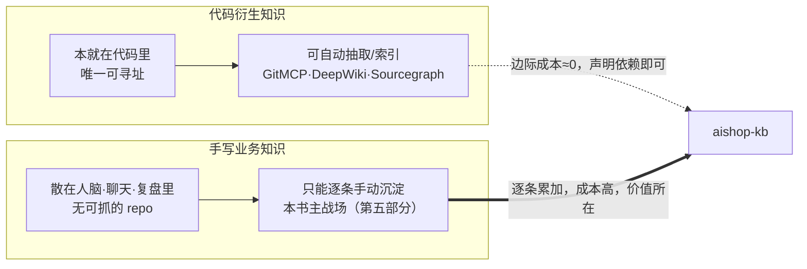
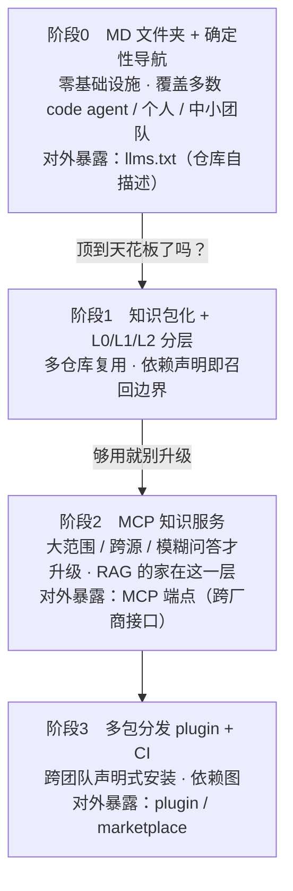

上一章立好了一条判据：agent 该用什么机制从知识里取答案——近处代码用确定性导航，远处模糊才升级向量检索。这条判据是地基，`aishop-kb` 本身还是空的，一个文件都没写。

判据能告诉你取知识用哪把工具，却回答不了两个更靠前的问题：这座知识库要装的知识从哪来，以及它该长成什么形态。这两个问题不定，第 6 章一动手就会跑偏——要么把本该手写的业务规则也指望自动抽取，要么一上来就搭一套用不上的向量服务。

本章给 `aishop-kb` 补的不是产物，是两张全书地图：一张按来源把知识分成两类，划定各自的投入；一张按形态给出四级能力阶梯，交代 `aishop-kb` 会沿它一级级长到第 22 章。

## 2.1 本章你会得到什么

1. 一条分配投入的依据——知识的两类来源在获取成本上相差一个量级，据此决定哪类靠工具、哪类靠人。
2. 一条能力阶梯（文件夹 → 包化分层 → MCP 服务 → 多包分发），以及每一级该不该往上爬的可观察升级信号。
3. 一张贯穿全书的 `aishop-kb` 逐章生长地图，标清每一章给这座知识库加了什么产物——后面每次回看主线都靠它。
4. 一条常被混淆的边界：agent 记忆（Mem0 / Zep / Letta）为什么不是知识库。

这一章仍不动 `aishop-kb` 的产物本身。它和第 1 章一样是地基章，把来源和形态两张地图铺开，第 6 章才正式写第一个文件。

## 2.2 知识决定 agent 的能力上限

给"aishop 的退款接口加一段风控校验"这个任务，一个顶尖模型照样会写错。不是它不会写代码，而是它不知道"aishop 的退款必须先过风控名单"——这条规则只存在于某个老员工的记忆里。知识缺位，能力无从兑现。

可以把 agent 完成任务的实际水平粗略拆成两个乘子：

> agent 的实际能力 ≈ 模型能力 × 它当下能拿到的知识

左边这一项由厂商的迭代节奏决定，不在你手里。右边这一项完全掌握在你手里，边际回报也最高。

知识库工程的全部内容，就是把右边这个乘子做大：把一个通用模型变成懂你们业务的 agent，中间隔着的正是知识这道工序。而这道工序的第一个设计决策，是知识从哪来。

## 2.3 一次扫描量出两类来源

`examples/aishop-scaffold/` 里已经放好了 `aishop` 的最小骨架：`src/` 下有订单、库存、支付三个模块的真实代码，`notes/scratch.md` 里是几条随手记的业务规则，代码注释里还埋着若干 `BIZ-RULE:` 标记。跑一下扫描脚本：

```bash
npx tsx src/scan.ts
```

它把这座骨架里两类知识的起点差异量化出来：

```
代码衍生知识（结构化、可寻址）
  代码文件：3 个 -> src/inventory/inventory.ts, src/order/orderStatus.ts, src/payment/refund.ts
  导出声明：4 个（每个都有唯一位置，可被自动抽取/索引）

手写业务知识（散落、未结构化）
  代码注释里的 BIZ-RULE：2 条（埋在注释里，agent 很难当作知识用）
  notes 随手记条目：3 条（连注释都不是，纯口口相传）
```

同一个仓库，两类知识的处境天差地别。4 个代码符号从第一天起就是结构化、可寻址的；5 条业务知识还散在注释和随手记里，等着被人写清楚。这个差距不是 `aishop` 特有的毛病，而是所有真实代码库的常态，也是本章要展开的第一张地图。

## 2.4 知识的两类来源

### 2.4.1 代码衍生知识的可寻址性

第一类是代码衍生知识：一个函数怎么调用、某个类型有哪些字段、某个接口返回什么结构。这类知识本就以结构化文本活在代码仓库里，每一处都有唯一且可寻址的位置——哪个文件、第几行、哪个符号。

可寻址是它能被自动处理的前提。能定位，就能抽取，就能索引。围绕这一类知识，已经有一批成熟工具把"仓库即知识库"做成了标准动作：

- `GitMCP`：把任意 GitHub 仓库即时包装成 agent 可调用的 MCP 端点。
- `DeepWiki`（Devin 团队出品）：把仓库自动索引成结构化 wiki。
- `Sourcegraph`：基于代码语义索引，提供跨仓库的符号级搜索。

它们的共同点是不依赖任何人工录入。知识本来就在代码里，工具只是把它换一个形态搬出来。

### 2.4.2 手写业务知识的离散性

第二类是手写业务知识："退款为什么必须先过风控""legacy_channel 这个字段当年为什么设计成可空、现在为什么删不掉""大促期间库存服务要提前扩容几倍"。

这类知识是企业真正值钱的部分，但它不在任何代码文件里，而是散落在老员工的记忆、聊天软件的历史消息、几个月前一次事故复盘的口头结论中。没有一个可寻址的 repo，自动抽取的第一步——"抓哪个文件"——就无从谈起。它只能靠人手动写下来、沉淀下来、维护下去。

两类来源在获取路径上的差异是结构性的（表 2-1）。

表 2-1：知识的两类来源对照

| 维度 | 代码衍生知识 | 手写业务知识 |
|---|---|---|
| 原始载体 | 源码、类型、接口签名 | 人脑、聊天记录、复盘结论 |
| 可寻址性 | 有唯一位置（文件/行/符号） | 无固定位置，离散 |
| 获取方式 | 自动抽取 / 索引 | 人工书写、审核、沉淀 |
| 边际成本 | 接近零，一次工具化覆盖全量 | 逐条产生，无法批量 |
| 代表工具 | GitMCP · DeepWiki · Sourcegraph | 无现成工具，靠流程与激励 |
| 本书投入 | 声明依赖现成端点即可（见第 11 章） | 主战场，第五部分四章专攻 |

### 2.4.3 成本量级差与投入分配

表 2-1 最右两列是本书重心分配的依据。代码衍生知识的获取是一次性投入、全量覆盖：接上一个 GitMCP 端点，整个仓库的符号知识就都在射程内，再多十个仓库也是同一套机制，边际成本趋近于零。

手写业务知识则相反。每一条都要一个具体的人，在一个具体的时刻，把脑子里的东西写清楚、让别人审过、放到对的位置。它的成本不随规模摊薄，而是随知识条数线性累加，且卡在最稀缺的资源上——懂业务的人的注意力。

这个量级差决定了两件事：

1. 代码衍生知识不值得投入原创工程力气去自建。重造一个 GitMCP 没有意义，直接声明依赖现成端点即可，这是第 11 章会兑现的具体动作。
2. 手写业务知识才是知识库工程真正的难点和护城河。它没有一键搞定的工具，所有工作量都在"怎么让人愿意写、写得对、写完还能被维护"这套流程和激励上。

本书用整个第五部分（四章）攻第二块，正是因为它**既最难、又最值钱**。图 2-1 把这条分野画出来。



图 2-1：知识的两类来源与获取成本。代码衍生知识可自动化（细箭头，边际成本趋零），手写业务知识只能靠人（粗箭头，成本随条数累加），后者是本书重点。

`aishop` 刻意同时具备这两类来源：它有真实代码（订单、库存、支付的接口与类型），也有只在人脑里的业务规则（下单先锁库存、退款先过风控）。后面每一章都会在同一个仓库上同时处理这两类知识，这个安排本身就是全书"代码衍生易、手写业务难"这条核心张力的实验台。

## 2.5 能力阶梯模型

来源之外的第二个决策是形态：`aishop-kb` 该建成什么样。这里要拆掉一个普遍误区——以为建知识库就得先搭一套服务。

真实路径是一条能力阶梯，从最轻的形态起步，只有当前一级顶到天花板时才升级到下一级。图 2-2 是这条阶梯的全景。



图 2-2：知识库能力阶梯。每跨一级前先问"非升级不可吗"；图中同时标出每一级"怎么把知识给别人复用"的对外暴露形态。

### 2.5.1 四阶与升级信号

四个阶段不是四种可选方案，而是一条有先后的升级路径。判断该不该往上爬，靠的是当前一级出现的具体拥堵信号，而不是"听起来更高级"（表 2-2）。

表 2-2：能力阶梯四阶

| 阶段 | 形态 | 适用面 | 升级信号（出现才往上走） | 落地章节 |
|---|---|---|---|---|
| 0 | MD 文件夹 + 确定性导航 | 单仓库、个人、中小团队 | 同一份知识要在多个仓库里复制粘贴、各自漂移 | 第 6 章 |
| 1 | 知识包化 + L0/L1/L2 分层 | 多仓库、需选择性复用 | 知识量大到 grep 已不精准、需跨源问答、非技术人员要查 | 第 8、9 章 |
| 2 | MCP 知识服务 | 大范围、跨源、模糊问答 | 多团队要声明式安装、需版本与依赖图管理 | 第 10、11 章 |
| 3 | 多包分发 plugin + CI | 跨团队、跨组织分发 | —— | 第 13、14 章 |

这张表里藏着三条判断纪律：

够用就别升级。阶段0 的一个 MD 文件夹加上第 1 章讲的确定性导航，就足以覆盖大多数 coding agent、个人和中小团队，零基础设施。

别因为 RAG 听起来先进就跳级——第 1 章已经论证过，RAG 的家在阶段2，只有到了大范围、跨源、模糊的问答，向量检索才登场。这再次锚定本书对 RAG 的定位：**知识库 ⊋ RAG，RAG 是知识库在特定阶段用到的一种检索机制，不是知识库本身。**

升级要有可观察的触发信号。从阶段0 到阶段1 的信号，不是"团队变大了"这种模糊感觉，而是一个可观察的事实：同一份知识开始在多个仓库里复制粘贴、并各自漂移。从阶段1 到阶段2 的信号，是 grep 在膨胀的知识量上不再精准、或出现了跨源模糊问答、或非技术人员也要查。

没出现信号就升级，付出的是白白的运维成本；信号出现了还硬撑，付出的是知识漂移和检索失准。

示例逐级生长。`aishop-kb` 会从阶段0 的一个 docs 文件夹（第 6 章）起步，一路长成阶段3 带评测 CI 的完整知识库。读者看着同一座知识库一级级爬，而非每章一个孤立玩具。

### 2.5.2 三种对外暴露形态

阶梯还有一条平行的线：`aishop-kb` 的知识，怎么让外部的 agent 复用。这个问题的答案同样随规模分层，且和三级阶梯一一对应（表 2-3）。

表 2-3：三种对外暴露形态

| 形态 | 对应阶段 | 基础设施 | 复用范围 | 落地章节 |
|---|---|---|---|---|
| `llms.txt`（仓库自描述） | 阶段0 | 零，仓库根一个索引文件 | 单仓库、公开，任意 agent 可读 | 第 6 章 |
| MCP 端点 | 阶段2 | 一个知识服务 | 跨厂商 agent 接入，可按 namespace 圈召回范围 | 第 10、11 章 |
| plugin / marketplace | 阶段3 | 打包 + 注册表 | 跨团队声明式安装，带版本和依赖图 | 第 13、14 章 |

三者是"够用就别升级"在暴露形态上的翻版：

1. `llms.txt` 是放在仓库根的纯文本索引，外部 agent（GitMCP 这类）读一下就能理解你的仓库，不需要任何服务，适合单仓库公开复用。
2. MCP 端点（模型上下文协议，Model Context Protocol，让 agent 跨厂商调用外部知识与工具的开放标准）把知识做成服务，Claude、Cursor、Copilot 等任意 agent 接一下即可用，还能按 namespace 圈定谁能召回哪部分——**依赖声明同时是召回范围过滤器**，第 11 章会展开这条核心机制。
3. plugin / marketplace 则像发 npm 包一样，让别的团队声明式安装你的知识包，带版本和依赖图。

范围越大，暴露形态越重，但也别为了小范围复用硬上重形态。对外复用不是一个独立功能，而是分发这条主线的自然产物。

## 2.6 aishop-kb 的逐章生长地图

能力阶梯是抽象形态，落到本书就是一条具体的建造主线：`aishop-kb` 每一部、每几章都会加上一批新产物，从一个空仓库长成完整知识库。图 2-3 是这条主线的全书骨架，也是后面每次回看主线时都要翻回来的那张地图。


图 2-3：`aishop-kb` 逐章生长骨架。横轴是产物阶段，每格标"第几章 + 给 aishop-kb 加了什么产物"；前半程（第6–14章）主攻代码衍生知识的组织与分发，后半程（第15–18章）转入手写业务知识的沉淀与共建，最后（第19–22章）补上消费、安全与度量治理。

对照图 2-2 和图 2-3 能看清一件事：能力阶梯的四阶不是每一章走一级，而是被拆进这条更细的生长线里。阶段0 对应第 6 章的 `docs/` + `llms.txt`，阶段1 对应第 8、9 章的分层与依赖清单，阶段2 对应第 10、11 章的 MCP 服务，阶段3 对应第 12–14 章的分发与 CI。

后半程（手写业务知识）不是阶梯的第五级，而是贯穿所有级别的另一条来源线——它在第 15–18 章集中攻坚，但从第 6 章起就一直和代码衍生知识并行沉淀。

## 2.7 agent 记忆与知识库的边界

往下走之前要划清一条高频混淆的边界：agent 记忆（memory）不是知识库。

Mem0、Zep、Letta 这类"agent 记忆"项目让 agent 记住和某个用户的历史交互、偏好、会话状态。它们和知识库表面相似——都是让 agent 拿到额外信息——但目标、服务对象和生命周期根本不同（表 2-4）。

表 2-4：agent 记忆 vs 知识库

| 维度 | agent 记忆（Mem0 / Zep / Letta） | 知识库（本书） |
|---|---|---|
| 存的是什么 | 某个用户 / 会话的历史、偏好、状态 | 团队共享、可复用的知识资产 |
| 服务对象 | 单个用户的个性化体验 | 全团队 + 所有 agent |
| 生命周期 | 随会话产生、可遗忘、可过期 | 长期沉淀、被版本化、被治理 |
| 正确性要求 | "记得对不对"偏软 | "知识对不对"是硬约束，要评测和防漂移 |
| 典型操作 | 写入 / 检索 / 遗忘 | 组织 / 分发 / 共建 / 度量 |

一句话判据：**记忆是关于某次交互的状态，知识库是关于业务的、可治理的组织资产。** 两者可以并存——一个 agent 既有记忆也接知识库——但工程做法不能混为一谈。

把知识库当记忆做，会丢掉版本和治理；把记忆当知识库做，会为本该过期的会话状态背上不必要的治理包袱。记忆的重点是写入与遗忘，它容忍遗忘、不需要版本和 CODEOWNERS；知识库的重点是组织、分发与治理，它的正确性是硬约束，要评测（见第 21 章）、要防漂移（见第 22 章）。本书从头到尾讲的是知识库。

## 本章要点

- agent 的实际能力约等于模型能力 × 它当下能拿到的知识；模型你决定不了，知识库是边际回报最高的投入。
- 知识分两类来源：代码衍生知识本就可寻址、边际成本趋零，声明依赖现成端点即可；手写业务知识散在人身上、成本随条数累加，是本书主战场（第五部分）。
- 知识库不是一步到位，而是一条能力阶梯（文件夹 → 包化分层 → MCP 服务 → 多包分发），每一级有可观察的升级信号，**够用就别升级**；RAG 的家在阶段2。
- 怎么给别人复用随阶梯分成 `llms.txt` / MCP 端点 / plugin 三种暴露形态，按复用范围选，别为小范围硬上重形态。
- **agent 记忆不是知识库**：前者是可遗忘的会话状态，后者是要评测和防漂移的可治理组织资产。

## 下一章

来源和形态两张地图都铺好了。但代码衍生和手写业务这两类知识，各自还能以不同的载体存活——纯文件、切块、代码图谱还是知识图谱？第 3 章把知识的载体形态摊开，讲清每种形态适合装什么、代价是什么，为第 6 章动手建 `aishop-kb` 选定第一种载体。

## 配套代码

见 `examples/aishop-scaffold/`。

---

> 本章来自《Agent 知识库工程实战：组织、分发、共建与度量》开源版 · 作者「递归客」
> 在线阅读完整书系：[inferloop.dev](https://inferloop.dev)
