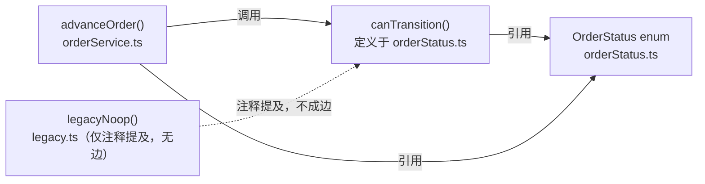
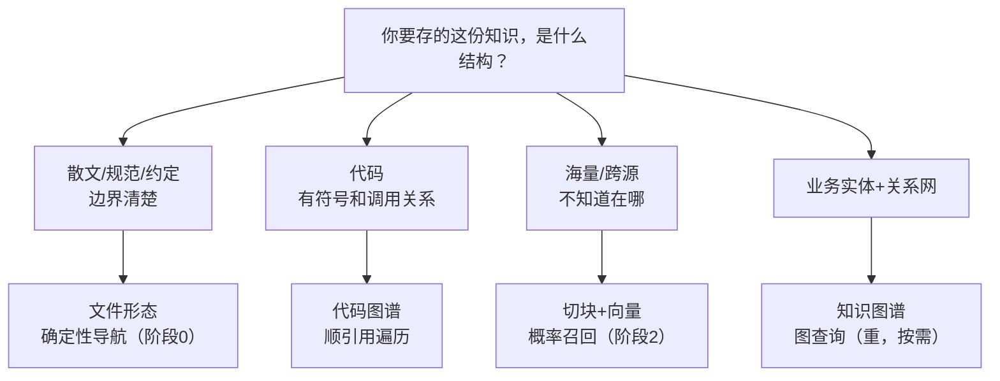

第 2 章把 `aishop-kb` 还没落一个文件时的地图先画了出来：知识分代码衍生与手写业务两类来源，沿文件夹 → 包化分层 → MCP 服务 → 多包分发这条能力阶梯一级级长大，RAG 的家在阶段2。

地图告诉你 `aishop-kb` 该沿哪条阶梯走，却没回答一个更靠前的问题：每一类知识，落到磁盘上该用什么数据结构存。同一份关于 `aishop` 的知识，可以存成四种彼此不同的载体形态，选错了，阶梯爬得再对也白搭。

本章给 `aishop-kb` 的地基再补一块判据：文件、切块、代码图谱、知识图谱四种载体形态，各自的数据结构、检索方式、成本，以及一张选型表。它决定第 6 章之后每一步把知识存成什么样子。

先看一个 `aishop` 上的具体查询。问 agent 一句："谁调用了 `canTransition`？"——`canTransition` 是订单状态机里判断某个状态能否流转到下一个状态的函数。两种常见形态都答不好它：

- 文件形态：`grep canTransition` 把定义、真实调用、注释提及、测试夹具一股脑捞回来，混在一起，还要人肉判断哪些是真调用。
- 切块 + 向量：按语义相似度召回，真正定义 `canTransition` 的文件用词精炼、字面信息少，排名反被只在注释里提了一嘴的文件压到后面。

两种形态都失手，是因为它们都把代码当文本。而这是个关于符号之间怎么连的关系型问题，答案不在任何单个文件里，而在符号的引用边上——这正是第三种形态代码图谱的地盘。

## 3.1 本章你会得到什么

1. 一张四种载体形态的对照表——文件、切块、代码图谱、知识图谱各自的数据结构、擅长回答什么、怎么检索、基础设施成本。
2. 代码图谱为什么是"谁调用了谁、改它影响谁"这类问题的正解，以及 SCIP 与 LSP 如何同源于编译器。
3. 向量相似度对代码符号排序不友好的数值机制，与第 1 章的论断相互印证。
4. `examples/mini-code-graph/` 里代码图谱与向量召回在同一问题上的实测对照，你可以自己跑一遍看排名倒挂。

这一章仍不动 `aishop-kb` 的产物本身——它和第 1、2 章一样是地基，把选形态的判据立起来，第 6 章才正式动手落第一个文件。

## 3.2 四种载体形态

第 1 章的辨析停在文件导航还是向量检索这一层，那是检索机制的选择。载体形态是更前置的一层：**知识以什么数据结构存下来，先于用什么机制去检索它。** 数据结构选错，检索机制再对也无从发挥。

同一份关于 `aishop` 的知识，可以落成四种彼此不同的载体形态。每种形态的数据结构决定了它擅长回答哪类问题、用什么方式检索、要付出多大基础设施成本（表 3-1）。

表 3-1：知识的四种载体形态

| 形态 | 数据结构 | 擅长回答 | 检索方式 | 基础设施成本 |
|---|---|---|---|---|
| 文件（file） | 完整文档 / 源文件，按路径寻址 | "这个东西怎么定义的" | `grep`/`glob`/`read` 确定性导航 | 零，即 git 中的文件 |
| 切块（chunk + 向量） | 切碎的文本块 + embedding 向量 | "跨源、模糊、不知道在哪" | 向量相似度概率召回 top-k | 向量库 + 索引 worker + embedding 服务 |
| 代码图谱（code graph） | 节点=符号，边=定义/引用/调用/实现 | "谁调用了它、改它影响谁" | 顺符号引用边遍历，确定 | 语言级索引器（LSP / SCIP） |
| 知识图谱（knowledge graph） | 节点=业务实体，边=类型化业务关系 | "这个概念和那些概念怎么关联" | 图查询，按关系跳转 | 抽取管线 + 图数据库 |

前两种是第 1 章的主角，这里只补齐它们的数据结构视角。后两种图式形态，是很多团队建知识库时完全没纳入视野、却常常正是缺口所在的那一块，也是本章的重点。

## 3.3 文件形态：完整语义单元与确定性寻址

文件形态的数据结构最朴素：一份完整的 Markdown 或源文件，以路径为唯一地址。它的检索是确定性导航——`grep` 按符号或关键词精确匹配，`glob` 按路径枚举，`read` 完整读回命中文件。命中与否可复现，不涉及任何相似度计算。

这种形态的技术优势来自完整二字。一个函数、一段类型定义、一条 import 链，都是不可切断的语义单元，文件天然把它们整块保存。agent 读回一个文件，拿到的是结构完好的上下文，可以沿 import 继续跳到下一个文件。

它的适用前提是知识边界可枚举：答案落在少数几个能被符号或路径直接定位的文件里。规范、约定、架构决策、业务说明，绝大多数都符合这个前提。这也是文件形态应当作为默认起点的原因（第 6 章动手）。

## 3.4 切块形态：概率召回与对符号排序的失配

切块形态把长文本按固定长度或语义边界切成小块，为每块计算一个 embedding 向量，存入向量数据库。检索时把查询也向量化，按余弦相似度概率性召回相似度最高的 top-k 块拼进上下文。

它的数据结构是向量空间中的一批点，检索是找离查询点最近的几个点。这套机制专为一类不确定性设计：语料庞大、来源分散、答案位置无法预先圈定，只能靠语义相似度逼近。

### 3.4.1 相似度排序与相关性并不对齐

切块在代码知识上有一个比切断结构更隐蔽的失效模式，与检索机制无关，纯粹出在排序上。余弦相似度度量的是查询与文档在词与语义上的重合程度，而一个符号的权威定义往往用词精炼、字面信息少。

`canTransition` 的定义就是一个函数签名加一张状态转移表，除了函数名本身，几乎没有与"谁调用了它"这个查询重合的词。反倒是那些只是提到它的地方——注释、日志、测试夹具——用词更丰富，与查询的字面重合更高。

后果是权威定义在排名里被非权威的提及压过，这背后有一个具体的数值机制：

1. 词袋或 embedding 向量的余弦，会被文档长度和无关词稀释。
2. `orderStatus.ts` 里那张状态转移表塞满了 `OrderStatus`、`Paid`、`Shipped` 一类与查询无关的 token，把它的向量范数撑大、把与查询重合部分的占比压小，余弦随之走低。
3. `legacy.ts` 通篇很短，一句注释里就带着 `canTransition`，重合占比反而更高，余弦更高。

于是真正定义 `canTransition` 的文件排到垫底，只在注释里提了一嘴、根本没调用的文件排到前面。**这不是调 chunk 大小或换 embedding 模型能根治的偏差，而是用文本相似度检索结构化符号关系这一机制错配的必然结果。** 本章示例会把这个排名倒挂真实跑出来，与第 1 章的论断相互印证。

## 3.5 代码图谱：符号引用图与顺引用遍历

代码图谱不把代码当文本，而是当成一张图：节点是符号（函数、类型、变量），边是符号之间的关系（定义、引用、调用、实现）。

问"谁调用了 `canTransition`"，在文件形态里要 `grep` 一遍再人肉判断哪些是真调用、哪些只是同名或注释提及；在代码图谱里，这是从 `canTransition` 节点沿"被调用"边反向遍历一步，结果确定且完整（图 3-1）。

图 3-1：`aishop` 的一小段代码图谱。"谁调用了 `canTransition`"等价于沿实线"被调用"边反向一跳，得到唯一真实调用者 `advanceOrder`；`legacy.ts` 只在注释里提到该函数，图里根本不构成边（虚线），因而不会被误召回。这条调用链在向量切块里会被切断，在图里则是一条确定的边。

### 3.5.1 SCIP 与 LSP 同源于编译器语义分析

代码图谱的边不是靠正则猜出来的，而是编译器的语义分析算出来的。日常写代码时，编辑器里的跳转到定义、查找引用背后是 LSP（Language Server Protocol，语言服务器协议）：编辑器把光标位置发给常驻的语言服务器，服务器基于内存里的类型信息实时算出定义与引用位置返回。

LSP 的产物是即时的、随编辑会话存在的，服务器一关就没了，无法直接当知识库来查询。SCIP（SCIP Code Intelligence Protocol，Sourcegraph 提出的跨语言代码索引格式）解决的正是持久化这一步。

一个 SCIP 索引器通常复用与语言服务器相同的编译器前端做一次全量语义分析，把每个符号、它的定义位置、每一处引用（occurrence）以及符号间关系序列化成一份磁盘上的索引（protobuf 格式）。这份索引不需要常驻服务器就能离线查询。二者的分工可以一句话概括：

- LSP 是实时算、用完即弃，服务编辑器的交互式跳转。
- SCIP 是算一次、持久成一张可查询的图，服务知识库和跨仓库代码智能。
- 二者的事实来源同为编译器的语义分析，SCIP 的前身是微软的 LSIF（Language Server Index Format），针对 LSIF 索引体积大、难以流式处理做了改进。

Sourcegraph 这类代码搜索工具能在超大 monorepo 上做到精确的查找引用，底层格式就是 SCIP。"查找调用者"在这份索引里是一次确定的图操作：定位 `canTransition` 符号，取它的全部引用 occurrence，过滤出属于调用位置的那些，再解析每处调用所在的外层符号。

因为代码本身是结构化的这一事实成立，图与符号索引才是对代码的正确抽象，而不是把它压平成向量块。对"改这个函数会波及哪些地方"这类 agent 高频问题，代码图谱给的是确定答案，向量召回给的是概率猜测。

## 3.6 知识图谱：业务实体关系网与图查询

代码图谱管的是代码内部的符号关系，节点和边都能从源码机械地推导出来。再往上一层是业务概念之间的关系，这是知识图谱的地盘。

它的节点是业务实体（订单、库存、支付、风控名单、用户），边是类型化的业务关系（退款依赖风控名单校验，下单依赖库存锁定）。检索是图查询：从一个实体出发，按关系类型跳转到相关实体。

它擅长回答文件和切块都答不好的问题——"和退款相关的所有业务约束有哪些""改动风控名单会牵连哪些流程"，这些答案不在某个文件里，而在实体之间的关系网中。

企业级把这条路走到极致的是 Glean（一个闭源的企业知识图谱平台）：它为每家企业训练专属的语义模型，把散在各系统里的实体和关系连成一张公司级的图，对外只暴露一个统一的 MCP 端点。

### 3.6.1 知识图谱的成本集中在抽取管线而非查询

知识图谱重，重在一个容易被低估的隐性成本上——抽取管线的持续维护，而不是查询本身。代码图谱的边由编译器保证，源码一改重新索引即可，边的正确性不需要人操心。

业务实体和关系没有这样一个编译器：实体从哪里抽、关系怎么判定，都要靠人写抽取规则从代码和文档里提。业务一变，抽取规则就得跟着变，漏抽、错抽会持续制造图与现实的不一致，最终图的可信度还不如一份手写的关系说明。真正吃工时的不是建图那一次，而是让图长期跟上业务变更这条同步管线。

对多数团队，业务关系用结构化文件加 frontmatter 里的显式关联就能表达八成——frontmatter 即 Markdown 顶部用 `---` 括起来的 YAML 元数据块。例如在退款相关文档里写 `related: [风控名单, 库存]`，用第 9 章讲的元数据来承载关系，稳定、够用、无需维护抽取管线。

只有当关系复杂到必须做多跳图查询时，才值得上真正的图数据库。知识图谱对本书读者更多是一个知道它存在、知道何时需要的选项，而非默认起手式。

## 3.7 四种形态的选型判据

四种形态不是竞争关系，而是各自适配一种知识结构。选错形态，就是第 1 章对代码硬套向量 RAG 那类错配的一般化版本。选型判据落到一张表和一条判断线上（表 3-2、图 3-2）。

表 3-2：四种载体形态的选型判据

| 若知识的结构是…… | 选形态 | 理由 | 何时不选 |
|---|---|---|---|
| 散文 / 规范 / 约定，边界清楚 | 文件 | 完整语义单元，零基础设施，随代码同版本 | 语料海量到人工维护不过来时 |
| 代码，有符号和调用关系 | 代码图谱 | 编译器保证边正确，确定回答影响面 | 只需读单文件、不问关系时用文件即可 |
| 海量 / 跨源 / 不知道答案在哪 | 切块 + 向量 | 用相似度逼近无法预先圈定的答案 | 边界可枚举时属重机制浪费 |
| 业务实体 + 复杂关系网 | 知识图谱 | 支持多跳关系查询 | 关系简单时用 frontmatter 显式关联即可 |

图 3-2：按知识结构选载体形态。这条判断线会在全书反复用到——每次决定这份知识怎么存，先问它是什么结构，而不是先问用哪个向量库。

三条落地判据收拢了这张表：

1. 默认从文件形态起步。多数团队知识的主体是规范、约定、业务说明，文件加确定性导航就够，零基础设施（第 6 章）。
2. 代码理解优先用图，不用向量。"谁调用了它、改它影响谁"这类问题，代码图谱是正解；即便代码库大到 monorepo 级，只要问题是符号关系，仍优先图而非向量——海量不等于该上向量，只有"不知道答案在哪"才该上向量。
3. 切块和知识图谱是重武器，按需上。向量切块留给跨源模糊召回（第 10 章），知识图谱留给复杂业务关系网，两者都不是默认起手式。别为不需要的复杂度买单。

## 3.8 动手：在 aishop 上建最小代码图谱，对照向量召回

`examples/mini-code-graph/` 在 `aishop` 的一段订单代码上建一张最小代码图谱，两条路径回答同一个问题"谁调用了 `canTransition`"。图路径用轻量正则抽出函数定义（`src/graph.ts` 的 `collectDefs`）与调用关系（`findCallers`），构成符号到引用的图；向量路径用第 1 章那套本地词袋 embedding（`src/embed.ts`）跑一遍向量召回，两条路径的结果在 `src/compare.ts` 里并排对照。

运行 `npx tsx src/compare.ts` 即可，只用 Node 内置模块，离线可复现。

示例仓库里三个文件构成对照：`orderStatus.ts` 定义 `canTransition`，`orderService.ts` 的 `advanceOrder` 真正调用它，`legacy.ts` 只在注释里提到它却并未调用。

为零依赖离线跑，示例用正则而非完整 AST 解析器抽符号——真实项目会换成基于编译器 / LSP 的索引器（如生成 SCIP），但图能沿调用边确定找到调用者、向量只能靠文本相似度概率猜这个核心差别，最小实现就足以说清。

这里有一个关键实现细节：`graph.ts` 的 `stripComments` 会先剥掉行注释再判定调用，所以 `legacy.ts` 注释里的 `canTransition` 不构成边；而向量路径读的是含注释的完整文本，注释里的提及照样计入相似度。

跑完的结果印证前文：代码图谱精确返回唯一真实调用者 `advanceOrder`，向量召回则给出一串按文本相似度排序、真假掺杂的文件。

更说明问题的是排名倒挂——真正定义 `canTransition` 的 `orderStatus.ts` 因用词精炼、被状态转移表的无关 token 稀释而排到垫底，只在注释里提了一嘴的 `legacy.ts` 反而排到前面。这正是相似度排序与相关性不对齐在代码符号检索上的具体证据。

## 本章要点

- 载体形态是先于检索机制、更前置的决策：同一份知识至少有文件、切块、代码图谱、知识图谱四种数据结构，各自适配一种知识结构，**选错形态则检索机制再对也无从发挥**。
- 代码图谱把符号和调用关系当一等知识，边由编译器语义分析保证；**SCIP 与 LSP 同源**，前者把后者实时现算的符号关系持久化成可离线遍历的图，这是"谁调用了谁、改它影响谁"的正解，而向量切块恰好会切断这条链。
- 知识图谱把业务实体和关系当一等知识，擅长跨实体的多跳关系查询（Glean 是极致形态），但**重在抽取管线的持续维护而非查询本身**，多数团队用结构化文件加 frontmatter 显式关联即可覆盖八成，属按需选项。
- 向量相似度对代码符号排序不友好有其数值机制：权威定义用词精炼、被无关 token 稀释，排名反低于只是提及它的文件；本章示例把这个倒挂真实跑了出来。
- 选形态的原则是让形态匹配知识的结构：**散文用文件、代码用图、跨源模糊用向量、复杂业务关系用知识图谱**。

## 下一章

四种载体形态的判据立好了，但还有一个更根本的问题没回答：`aishop-kb` 到底该覆盖哪些知识、有没有盲区。第 4 章把覆盖度建成一个可建模的对象——用业务场景与任务场景矩阵，把知识库该装什么从拍脑袋变成可枚举、可度量的清单。

## 配套代码

见 `examples/mini-code-graph/`。

---

> 本章来自《Agent 知识库工程实战：组织、分发、共建与度量》开源版 · 作者「递归客」
> 在线阅读完整书系：[inferloop.dev](https://inferloop.dev)
