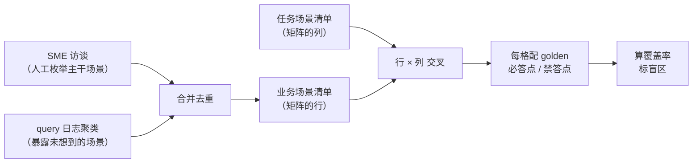
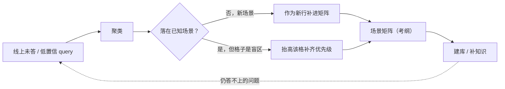

前三章为 `aishop-kb` 立了三样地基：第 1 章定了检索机制的判据（边界能否枚举），第 2 章给了能力阶梯和知识的两类来源，第 3 章讲清了知识落到哪种载体（文件 / 切块 / 代码图谱 / 知识图谱）。判据、阶梯、形态都齐了，`aishop-kb` 却仍是零文件——一份还没动手写第一条知识的设计草案。

真要动手时，一个更靠前的问题挡在前面：这座库到底该覆盖哪些场景？判据只回答某类知识用什么机制取，回答不了哪些知识必须有、缺了哪些会出事。没有这份清单，建库就是凭手感往里塞文档。

本章不写知识，先造这份清单——`aishop-kb` 的考纲。它把覆盖度定义成一张业务场景 × 任务场景的矩阵，成为后续每建一层知识都要回头对照的验收表。

先看一个不造考纲会付出的代价。`aishop` 接入 agent 两周后，有人问：

> 订单命中风控名单还能退款吗？

agent 答"可以，走标准退款流程即可"。实际业务规则是命中风控名单的订单不允许自动退款、必须转人工。答错的根因不在模型，在知识库——建库时压根没人把风控列进要覆盖的场景，这一整类知识从未进库。

这不是有知识但没召回，而是考纲里就没这道题。更糟的是，在有人恰好问到之前，没有任何信号提示这个盲区存在。

## 4.1 本章你会得到什么

1. 一条建库次序原则：先立考纲、再建库，以及为什么缺什么补什么结构性地看不见最危险的盲区。
2. 覆盖度的二维模型——业务场景（行）× 任务场景（列），每个格子是一个可指认、可派活的覆盖单元。
3. 业务场景维的两个枚举来源（SME 人工 + query 日志聚类）和它们必须并用的证据。
4. `examples/scenario-matrix/` 里一份可运行的脚本，把 `aishop` 的两类输入合成一张带盲区标注和优先级的场景矩阵，写出 `scenario-matrix.json` 供第 5 章消费。

这一章仍不产出 `aishop-kb` 的知识文件——它是度量这条线的起点，先把考纲锁定，第 6 章才照着它写第一版知识。

## 4.2 覆盖度为什么前置到建库之前

多数团队的建库次序是：先塞一批文档，接上 agent，跑一段时间，某个问题答错了，再回头补一篇。这套缺什么补什么有一个结构性缺陷。

它只能发现有人恰好问到、agent 又恰好答错的缺口。无人问到的盲区不产生任何信号，会一直潜伏，直到以一次线上事故的形式暴露。开头那个风控退款就是这样——在被问到前，它在任何监控面板上都不可见。

这是一种幸存者偏差。你观察到的缺口，是缺口全集里最不危险的那部分，因为它至少被暴露了。真正危险的是从未进入观测窗口的盲区。

面对没有知识的场景，agent 通常不会沉默。它会用通用知识编一个看似合理的答案，把无知识伪装成有答案。缺什么补什么的流程，对这类失败是结构性失明的。

正确的次序把覆盖什么提前到建库之前：先列出这座库应当覆盖哪些场景，再照单建库。这份清单就是考纲。

有了它，两个此前只能凭感觉回答的问题才有定义——当前覆盖了百分之几、还差哪些没覆盖。**覆盖度不是建完库的验收项，而是建库前就该锁定的目标。**

## 4.3 覆盖度的二维刻画

### 4.3.1 一维文档计数的失效

覆盖了多少难回答，根源在于多数人把它当成一维问题——我有多少篇文档。文档数量与覆盖度几乎正交。

- 一百篇文档全在讲登录、退款一篇没有：文档很多，覆盖很差。
- 六篇文档精准命中六个高频场景的核心决策：文档很少，覆盖可能远高于前者。

用文档数、字数、chunk 数这类体量指标度量覆盖度，量的是库的大小，不是库的完备性。覆盖度的正确刻画是一张二维矩阵，不是一个计数。

### 4.3.2 行：业务场景

第一维是业务场景，即这个系统在做的一件件事。对 `aishop` 而言，是下单、支付、退款、库存、风控、对账这一类。业务场景对应系统里有哪些值得被问到的领域，它是矩阵的行。

### 4.3.3 列：任务场景

第二维是任务场景，即 agent 针对某个业务场景要替人干的活。同一个退款，agent 可能干三种不同的活，各需一类不同知识：

| 任务 | 需要的知识形态 |
|---|---|
| 写一段退款代码 | 接口签名、字段定义、状态机 |
| 排查一笔退款失败 | 日志位置、常见故障模式、上下游依赖 |
| 回答退款的合规约束 | 业务规则，如"超过多少金额需人工审核" |

三者在知识形态、来源、易得性上都不同。把它们压成退款相关文档，会同时漏掉其中两类的缺口。

任务维度必须独立成一维，正因为同一业务场景在不同任务列下的知识需求几乎不重叠。

任务维的枚举本身有方法。一套可复用的分类按 agent 与知识的交互形态划分：

1. 生成类：写代码、写配置、写文档。
2. 诊断类：排障、定位、复盘。
3. 答疑类：合规、约定、架构决策的解释。
4. 审查类：code review、方案评审时对齐既有约定。

`aishop` 示例取前三类作为列——`taskScenarios = ['写代码', '排障', '答疑合规']`（见 `src/data.ts`）。

### 4.3.4 矩阵单元格作为覆盖单元

每一个业务场景 × 任务场景的格子，是一个具体的覆盖单元。覆盖度就是有多少格子填上了能被 agent 召回的合格知识。

表 4-1 是 `aishop` 的覆盖矩阵，与配套示例 `npx tsx src/build.ts` 的实际输出一致：6 个业务场景 × 3 个任务场景 = 18 格，其中 3 格已有 golden。

表 4-1：aishop 覆盖矩阵（✓=该格已有可被召回的 golden 知识，✗=盲区）

| 业务场景＼任务 | 写代码 | 排障 | 答疑合规 |
|---|:---:|:---:|:---:|
| 下单 | ✓ | ✗ | ✗ |
| 支付 | ✗ | ✗ | ✗ |
| 退款 | ✗ | ✗ | ✓ |
| 库存 | ✗ | ✓ | ✗ |
| 风控 | ✗ | ✗ | ✗ |
| 对账 | ✗ | ✗ | ✗ |

把覆盖度落成矩阵，最大收益是盲区从模糊的文档不够变成可指认、可派活的红叉。表里一眼能看到风控、对账两整行全空、支付一格未覆盖——这些在有多少篇文档的一维视角里完全不可见。

"本周补上风控×排障和风控×答疑"这样一句话能直接转成工单；"我们文档不太够"转不成任何具体动作。矩阵把一个模糊的完备性判断，降解成一组离散、可分配、可验收的单元。

## 4.4 业务场景维度的系统枚举：两个来源

构造矩阵最难的一步是列全业务场景这一维。它有两个来源，必须都用——缺任何一个都会系统性地漏掉一整类盲区。

### 4.4.1 来源一：SME 人工枚举

SME 是 subject-matter expert（领域专家），即最懂这块业务的人。找他们把业务流程过一遍，把一件件事列出来。示例中 `smeScenarios = ['下单', '支付', '退款', '库存']`（见 `src/data.ts`）就是这一步的产物。

人工枚举能覆盖大家都知道很重要的主干场景，但有一个天然缺陷：人只会列出他记得的。那些习以为常到根本想不起来要写的场景会被系统性漏掉。越资深的 SME，越容易把大量隐性约定内化成"这还用说"，反而不会列进清单。

### 4.4.2 来源二：真实 query 日志聚类

第二个来源是真实 query 日志。把 agent、旧搜索系统或客服工单里真实被问到的问题捞出来，按语义聚类，每一簇就是一个真实存在的场景，且每簇自带出现频次。

示例用 `rawQueries` 模拟这份日志——一批未打标的原始问句加频次（见 `src/data.ts`）。`build.ts` 里的 `classify()` 把每条问句归到一个业务场景，演示聚类这一步在做什么。生产环境应把 `classify()` 的关键词规则换成 embedding + 相似度聚类，源码注释里写明了这一点。

query 日志的价值在于它暴露用户真的在问、但没人想到要写的场景——恰是人工枚举漏掉的那部分。示例刻意在日志里埋了两条 SME 完全没提到的问句：

- "订单命中风控名单还能退款吗"，频次 25。
- "对账差异怎么定位"，频次 9。

运行后 `smeMissed` 输出"风控、对账"。其中风控的 query 频次高达 25，比 SME 明确列出的库存（12）还高，却完全不在 SME 的清单里。

一个高频、真实、却被领域专家整体遗漏的场景，是两个来源必须并用的最直接证据。

### 4.4.3 两来源的互补性

只用来源一，考纲是你以为该覆盖的；补上来源二，才逼近实际被需要的。

只按已经想到的场景去算覆盖率，等于自己给自己划考纲、再照考纲判自己满分——真正的盲区恰恰落在你没想到要出题的地方。业务场景清单是两个来源的并集，示例中：

```ts
const businessScenarios = [...new Set([...smeScenarios, ...clustered.keys()])];
```

最终得到 6 个业务场景。整条链路如图 4-1。



图 4-1：从两个来源到覆盖率的构造流程。左侧两个来源缺一不可，业务场景清单与任务场景清单交叉成矩阵，右侧的 golden 是把覆盖变成可判定的关键。

## 4.5 单元格到 golden 与知识条目的映射

### 4.5.1 golden 的断言形态

矩阵本身只标出格子，判不了这一格到底算不算覆盖了。要让每一格可判定，得给它配一到几条 `golden` 问答对——一个代表性问题，加一份正确答案该满足什么的判定标准。

判定标准不写成范文（范文无法机器比对），而写成两组断言：

- 必答点（`mustInclude`）：答案里必须出现的关键事实。
- 禁答点（`mustNotInclude`）：答案里绝不能出现的错误。

这个形态借鉴自 agent 评测基准 τ²-bench（tau2-bench，Sierra 2025 年发布，见 github.com/sierra-research/tau2-bench）里的自然语言断言。相比与标准答案的文本相似度，必须包含 X、不得出现 Y 这种断言有两个工程优势：

1. 可解释：一条 golden 挂了，你能立刻看到是漏了哪个必答点、还是踩了哪个禁答点；相似度分数下跌说不清具体错在哪。
2. 抗表述漂移：同一个正确答案可以有无数种措辞，逐字相似度会把换了说法但完全正确误判为不合格；断言只检查关键事实的在与不在，对措辞不敏感。

示例中 `Golden` 接口的 `mustInclude` / `mustNotInclude` 两字段（见 `src/data.ts`）就是这对断言的落地。以退款 × 答疑合规格为例：

- 问题：一笔 6000 元的订单能自动退款吗？
- 必答点：超过 5000 需人工审核；命中风控名单不允许自动退款。
- 禁答点：不能回答"可以直接自动退款"。

有了这样的 golden，这一格覆盖没覆盖就从主观判断变成可运行的检查：把问题丢给接了知识库的 agent，看回答是否命中全部必答点、避开全部禁答点。第 5 章的覆盖度工具正是拿这批 golden 当尺子去量的。

### 4.5.2 从单元格到具体知识条目

golden 是验收标准，不是知识本身。一格从空变 ✓ 的过程是两步：先写 golden 定义答对长什么样，再回填能让 agent 答对的知识条目。

这层映射决定了矩阵不只是度量工具，还是建库任务的派发表。每个盲区格子对应一条写哪份知识、放哪一层的具体工单：

- 退款 × 答疑合规这条业务规则，该沉淀成 L1 领域包里的一份 Markdown。
- 下单 × 写代码的接口签名可能本就在代码里，靠确定性导航即可，无需另写。

哪类知识放哪一层、用哪种检索机制，是后续分层组织几章的主题（见第 8 章）。本章只需确立一点——矩阵的每个格子最终要落到一条可指认的知识条目上，而 golden 是这条知识的验收契约。

示例最后把整张矩阵连同 golden 写出成 `scenario-matrix.json`（`businessScenarios`、`taskScenarios`、`smeMissed`、`goldens` 四个字段），作为第 5 章覆盖度工具的输入。这份文件也是 `aishop-kb` 后续每建一层知识都要回头对照的考纲。

## 4.6 频次加权：把盲区排成优先级队列

### 4.6.1 场景枚举不可能穷尽

必须诚实：枚举整个业务的所有场景是个理想，现实里长尾无限、永远列不全。这不是放弃度量的理由，而是要换一个策略——不追求列全，而是保证该覆盖的先覆盖、没覆盖的能被发现。

### 4.6.2 用 query 频次给盲区排序

真实 query 日志聚类时，每一簇带着出现频次，这个频次是天然的优先级信号。示例中 `clustered` 这个 Map 累加的正是每个场景的 query 频次：

| 场景 | 下单 | 支付 | 风控 | 退款 | 库存 | 对账 |
|---|:---:|:---:|:---:|:---:|:---:|:---:|
| query 频次 | 42 | 30 | 25 | 18 | 12 | 9 |

一个可套用的起点是按帕累托原则，先覆盖累计频次占比约 80% 的头部场景，用有限精力吃掉大部分真实需求。

这里有个反直觉的推论：优先级不该只看格子空不空，而要看空格子背后的频次。

表 4-1 里风控和对账两行都全空，但它们背后的 query 频次并不相同：

- 风控频次 25，高于已部分覆盖的库存（12）。
- 对账频次 9。

因此风控的盲区优先级高于对账——同样是空行，频次把它们排出了先后。频次加权让盲区清单从一堆同等的红叉，变成一份带优先级的待办队列。

### 4.6.3 长尾靠未答率回灌兜底

头部之外的长尾场景，不追求预先列全，而是靠线上未答 / 低置信信号持续发现、持续补。这条线把造矩阵从一次性的前期工作，变成一个自我生长的闭环（图 4-2）：

- 线上跑出来的未答 query，经聚类后落在矩阵里还没有的场景上，就作为新行补进考纲。
- 落在已有场景但对应格子是盲区的，就抬高那一格的补齐优先级。



图 4-2：未答 query 回灌考纲的闭环。矩阵不是建库那天的静态快照，而是随线上真实使用持续生长。闭环的运营细节——未答率怎么采集、低置信怎么判定、回灌怎么审核入库——见第 21 章。

不要把 100% 覆盖写成目标，那是个既达不到、也没必要的目标。真正的目标是高频场景不留盲区、长尾有机制兜底——头部靠矩阵前置枚举打满，长尾靠未答率闭环兜住。

## 4.7 动手：给 aishop 造一份场景矩阵

`examples/scenario-matrix/` 把上面的方法落成可独立运行的 TypeScript。

- `src/data.ts`：两个来源的原始输入——SME 访谈场景、一份未打标的模拟 query 日志（带频次），以及三条 golden 骨架。
- `src/build.ts`：用 `classify()` 把原始问句归类到业务场景（演示聚类），合并两个来源，构建业务场景 × 任务场景矩阵，为每格标出有没有 golden，最后写出 `scenario-matrix.json`。

运行方式（只用 Node 内置模块，无运行时依赖，需 Node ≥ 20.11）：

```bash
npx tsx src/build.ts
```

运行后能看到两件事：

1. 矩阵里哪些格子有 golden、哪些是空的，盲区一目了然，覆盖率统计为 3/18 ≈ 17%。
2. `smeMissed` 输出"风控、对账"，其中风控的 query 频次（25）比 SME 列出的库存（12）还高，直观演示为什么两个来源缺一不可。

这份 `scenario-matrix.json` 会作为第 5 章覆盖度工具的输入。

## 本章要点

- **建库的正确次序是先立考纲、再建库。** 缺什么补什么受幸存者偏差所限，只能发现被问到并答错的缺口，对无人问到的盲区结构性失明。
- **覆盖度的本质是二维矩阵**：业务场景（行）× 任务场景（列），每格是一个覆盖单元。同一业务场景在不同任务列下知识需求几乎不重叠，故任务须独立成一维；文档数量与覆盖度正交。
- **业务场景维必须并用两个来源**：SME 人工枚举给主干，query 日志聚类暴露没人想到的盲区。示例中风控被 SME 整体遗漏却有最高 query 频次，就是并用的直接证据。
- **每格配 golden，用必答点 / 禁答点断言**把覆盖没覆盖变成可运行、可解释、抗表述漂移的判定；断言形态借鉴 τ²-bench。golden 是知识条目的验收契约，每个盲区格子对应一条建库工单。
- **场景枚举不可能穷尽**：用 query 频次加权排定盲区优先级（同为空行，高频优先），头部按帕累托打满，长尾靠未答率回灌闭环兜底（见第 21 章）。不要把 100% 覆盖当目标。

## 下一章

考纲有了，但覆盖率 3/18 这个数字现在还是手工数出来的。第 5 章把 `scenario-matrix.json` 接上真实的 agent，做出一把能自动跑的尺子——语义测试覆盖率工具，让 `aishop-kb` 每加一条知识、覆盖度就自动重算一次。

## 配套代码

见 `examples/scenario-matrix/`。

---

> 本章来自《Agent 知识库工程实战：组织、分发、共建与度量》开源版 · 作者「递归客」
> 在线阅读完整书系：[inferloop.dev](https://inferloop.dev)
