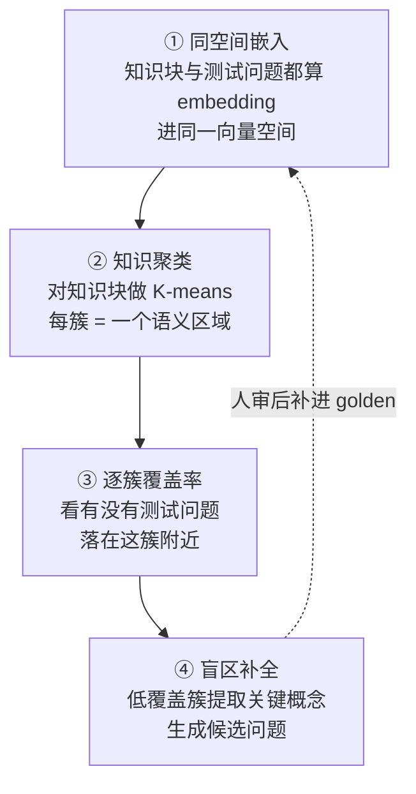
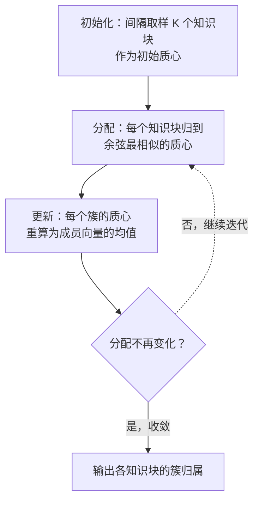

上一章给 `aishop-kb` 留下一份 `scenario-matrix.json`：6 个业务场景 × 3 个任务场景共 18 格，其中 3 格挂着 golden，覆盖率 3/18。这份 JSON 是 `aishop-kb` 的考纲，回答的是"我想考的都考到了吗"。

考纲有一个结构性盲点：它只丈量人已经想到要出题的格子。知识库里若有一整块知识，从没有任何一道题去考它，它在矩阵口径里根本不存在——既不是空格子，也不是满格子，压根没有对应的行。

本章给 `aishop-kb` 的工具链装上第一件工具 `aishop-kb coverage`：换一个方向丈量覆盖度，从知识出发反查题够不够，自动把这类没人想到的盲区揪出来。它是那条逐章生长的 CLI 的第一条命令，后面还会长出 `serve`、`promote`、`eval`、`drift`。

## 5.1 本章你会得到什么

1. 一条判据：为什么统计"测试问题命中了多少知识"当覆盖率不可信，正确的分母只能是知识本身。
2. 语义测试覆盖率的四步方法——把知识和问题嵌进同一空间、对知识聚类、逐簇判覆盖、对盲区生成候选题。
3. `aishop-kb coverage` 命令：`examples/coverage-tool/` 里可离线运行的实现，在 `aishop` 上扫覆盖度、自动揪出盲区。
4. 把这条命令钉进 CI、让覆盖度从一次性验收变成持续门禁的接法。

## 5.2 以题为分母的覆盖率不可信

给 `aishop-kb` 算覆盖率的人，第一版脚本几乎都这么写：拿 golden 里每道题去知识库召回，命中就记一分。`aishop` 的 4 道测试问题全部召回到对应知识，报告打印一行——覆盖率 100%。

同一时刻，`aishop` 的对账逻辑（对账任务每日凌晨跑、差异优先查支付回调）在知识库里躺着，没有任何一道题碰过它。这块知识存在，覆盖率却是 100%。这个数字不是错的，是自欺的。

自欺出在分母。若覆盖率定义为"被题命中的知识 / 所有被题碰过的知识"，这个比值天然趋近满分——因为分母本身就是分子筛出来的。

这和软件测试里只统计被测代码行的覆盖率，是同一个自欺。把从没有任何测试碰过的代码行排除在分母之外，行覆盖率可以是满分，而大片没测的代码在这个口径里完全隐形。

**正确的分母只能是知识本身。**表 5-1 把两种口径并列。

表 5-1：覆盖率的两种口径

| 维度 | 以题为分母 | 以知识为分母 |
|---|---|---|
| 覆盖率定义 | 命中的知识 / 被题碰过的知识 | 被题考到的知识 / 全部知识 |
| 分母来源 | 由分子筛出，趋近满分 | 独立于题，反映真实规模 |
| 能发现的盲区 | 只有"题问了、知识没答上" | 还包括"知识有、没题考" |
| 对未知的态度 | 看不见没人想到的区域 | 主动从知识里长出区域 |
| 类比 | 只算被测代码行的覆盖率 | 算全部代码行的覆盖率 |

以知识为分母，要求先有一份"全部知识"的清单，还要能把它切成可数的单元。知识不像代码行那样天然可数，一库自然语言文档，谈不上有几行该被覆盖。

语义测试覆盖率解决的正是这个问题：它用聚类把连续的知识切成离散的语义区域，让"全部知识"变成一个可数的分母。

## 5.3 语义测试覆盖率的四步

这套方法的骨架来自 2025 年一篇讨论 RAG 语义测试覆盖率的工作（《Methodological Framework for Quantifying Semantic Test Coverage in RAG Systems》，arXiv 2510.00001，2025）。它把知识和问题放进同一个度量空间，二者的距离于是可以直接比较。整个流程分四步，图 5-1 是全景。

图 5-1：语义测试覆盖率的四步。第 ① 步把知识与问题嵌进同一空间是全流程的地基——只有在同一空间里，"这个问题离这块知识有多近"才是一个有意义的数。

### 5.3.1 同空间嵌入

embedding（嵌入）是一段表征文本语义的浮点数组，语义相近的文本，其向量在空间中也相近。第一步把知识库切成块，每块算一个 embedding；上一章 golden 集里的测试问题也各算一个。

二者共用同一个嵌入函数、落在同一个向量空间，于是可以用余弦相似度度量"某个问题离某块知识有多近"。若知识和问题分别嵌进两个空间，向量就不可比，后面三步全部无从谈起。

### 5.3.2 知识聚类为语义区域

`K-means` 是一种把数据点按距离分成 K 个簇的经典聚类算法，同一簇内的点彼此接近，不同簇的点彼此远离。第二步对知识块的向量做 K-means，得到若干簇，每一簇大致对应一个主题或业务场景。

这一步的意义在于：语义区域不是人预先列出来的，而是从知识自身的分布里长出来的。上一章的矩阵靠人枚举场景，这一章靠聚类发现场景——正是"让知识自己聚出场景"这个动作，绕过了"人的出题范围"这个天花板。

### 5.3.3 逐簇覆盖率判定

第三步逐簇判定。对每一簇，计算簇里知识块与所有测试问题的最大相似度；若这个最大值超过阈值，就认为这簇被某道题考到了，否则它就是一块有知识、没题考的盲区。

覆盖率于是有了确定的定义：被考到的簇数 / 非空簇总数。分母是聚类得到的全部语义区域，独立于题，这正是表 5-1 里以知识为分母那一列的落地。

### 5.3.4 盲区补全

第四步针对低覆盖的簇。工具从簇里提取关键概念、据此生成候选测试问题；生产环境用大模型来写这些问题，人工审核后补进 golden 集，再回到第 ① 步重新度量，形成闭环。

这里的映射关系是：簇 ≈ 业务场景，测试问题 ≈ 任务场景，低覆盖簇 ≈ 盲区。它和上一章矩阵的行列语义完全对齐。**矩阵负责人已经想到的场景，聚类负责人没想到的场景，两条路径拼起来才是覆盖度的完整刻画。**

## 5.4 K-means 盲区发现的机制

聚类是这套方法的引擎，值得拆开看。示例的 K-means 实现在 `src/kmeans.ts`，刻意写成确定性的，保证每次运行结果可复现。它的迭代过程见图 5-2。

图 5-2：K-means 的迭代回路。分配与更新交替进行，直到没有任何知识块换簇为止。

### 5.4.1 确定性初始化

标准 K-means 随机挑 K 个点作初始质心，随机性会让每次运行结果不同，不利于教学演示。示例改用确定性初始化：按固定间隔从知识块里取样 K 个点作初始质心（`kmeans.ts` 里的 `step = Math.floor(n / k)`）。

这样每次运行都从同一组质心出发、得到同一份聚类，读者跑出来的结果和书里对得上。

### 5.4.2 迭代分配与质心更新

每一轮做两件事：

1. 分配：每个知识块归到与它余弦相似度最高的那个质心所在的簇。
2. 更新：把每个簇的质心重算为该簇所有成员向量的均值（`meanVector`）。

两步交替，簇的边界逐轮收紧。当某一轮的分配结果和上一轮完全一致时，再迭代也不会变，算法收敛退出。示例设了 `maxIter = 50` 作兜底上限，玩具数据通常几轮就收敛。

### 5.4.3 收敛与簇的语义解释

收敛后，每个知识块拿到一个簇编号，同簇的块在语义上彼此接近。工具再给每簇抽几个主题词，方便人读懂这簇大概讲什么。

示例没接中文分词器，主题词是用 2 字 n-gram 按跨知识块共现频次粗抽的（`coverage.ts` 里的 `topTerms`），所以你会看到"工审"这类无意义碎片——这是演示级近似，生产里换成关键词抽取或大模型摘要就没这问题。

### 5.4.4 方法的三个局限

聚类找盲区这套方法有效，但不是没有代价。有三个局限必须交代清楚，否则接到真实项目会踩坑。

1. **K 的选取**没有免费答案。K 定小了，多个不相关主题被塞进同一簇，盲区被稀释——一簇里只要有一块知识被考到，整簇就算覆盖，其余没被考到的知识被掩盖。K 定大了，同一主题被拆成几簇，又制造虚假盲区。示例取 K=5 是针对这批 10 条玩具知识拍的；真实项目要用轮廓系数（silhouette，衡量一个点更贴近本簇还是邻簇的指标，越高说明聚类越干净）扫一遍 K，选一个簇内紧凑、簇间分离都还不错的值。
2. **词袋 embedding** 会制造假盲区。示例的 embedding 是本地词袋（`embed.ts`），只看词面重合、不懂语义，会把用词不同但语义相关的知识和问题判为不相关。下面实跑里"退款金额超过 5000 需人工审核"被判成盲区，就是因为词袋没把它和问题"一笔 6000 元的订单能自动退款吗"关联起来。换成真 embedding 模型（第 10 章），这个假盲区会消失。
3. **确定性初始化**牺牲了对局部最优的规避。K-means 的目标函数非凸，不同初始质心可能收敛到不同的局部最优。生产实现通常用 k-means++ 初始化并多次重启取最优，示例为了可复现放弃了这一层，接真实数据时应当补上。

词袋 embedding 在这里只是零依赖离线跑的教学替身，两处标着"换真模型"的插槽换掉，骨架和数据流完全不变。

## 5.5 覆盖阈值的标定

判定一簇是否被考到，靠的是"最大相似度 ≥ 阈值"。这个阈值不是常数，示例里取 `COVER_THRESHOLD = 0.25`，是针对这批玩具数据和词袋 embedding 拍出来的经验值，直接照搬到真实项目一定不对。

阈值本质上是在两类错误之间取平衡：

- 定高了，很多已被考到的簇被误判成盲区（假盲区，浪费人力去补根本不缺的题）。
- 定低了，很多并未被认真考到的簇被误判成已覆盖（漏盲区，真正的空白被放过）。

校准的正确做法是用你自己 golden 集的相似度分布来定：把一批确实考到了的知识-问题对和一批确实没考的对分别算相似度，画出两组分布，取一个能较好把两组分开的分界点。

这和给分类器调阈值是同一件事——阈值不是凭感觉给的常数，是在 golden 标注上扫出来的分界点。换了 embedding 模型、换了知识领域，相似度的绝对尺度都会变，阈值必须重新校准。

## 5.6 动手：aishop-kb 的第一条命令 coverage

`examples/coverage-tool/` 把上面四步实现成 `aishop-kb coverage` 的雏形，一个可离线运行的 TypeScript 工具。

它读入 `aishop` 的 10 条知识块（`data.ts`，覆盖下单、库存、退款、风控、对账五类）和上一章产出的 4 道测试问题，做同空间嵌入、K-means 聚类、逐簇算覆盖率，最后对盲区簇生成候选问题。跑法是 `npx tsx src/coverage.ts`，无运行时依赖。

工程上有两个"换成真模型"的插槽，示例标得清清楚楚：一是 embedding 用本地词袋而非真模型，二是补盲区用模板而非大模型。这两个插槽替换掉，"同空间嵌入 + 聚类找盲区"的骨架和数据流完全不变。

跑完得到一份覆盖率报告：知识被聚成 5 个语义区域，逐簇报告主题词、最高命中相似度、覆盖状态，末尾统计覆盖率并为盲区簇生成候选题。示例数据下覆盖率是 3/5，揪出两簇盲区，恰好对应两类不同情况：

- 对账簇（对账任务、差异排查）最高命中相似度 0.00，是彻底的知识真空——测试问题里根本没碰对账，人工出题极易漏掉，正是自动聚类替你揪出的那种盲区。
- 退款人工审核簇（退款金额超过 5000 需人工审核）最高命中相似度 0.16，没过 0.25 的阈值。它是上一节说的假盲区：语义上它和问题"一笔 6000 元的订单能自动退款吗"高度相关，只是词袋没能把二者关联起来。

一真一假两簇盲区放在一起，恰好演示了这把尺子的能力和边界：真盲区去补题，假盲区去升级 embedding。读报告时要能分辨这两者——`aishop-kb coverage` 揪出的是候选，人来判它是缺题还是缺模型。

## 5.7 覆盖度进 CI

覆盖度最容易被误用的地方，是把它当成建库时跑一次的验收项。它不是。知识库是活的，`aishop-kb` 每往上爬一级能力阶梯（加一批知识、换一层组织方式），知识的分布就变了，旧的覆盖率数字随之失效。

**覆盖度是持续指标，要反复跑。** 落地方式是把 `aishop-kb coverage` 钉进 CI。每次知识库有变更（新增知识包、修改 golden 集），流水线就重跑一遍，把结果和上一次基线比：

1. 覆盖率不能跌破设定的下限。
2. 盲区簇数量不能比基线增加。
3. 新冒出来的盲区簇要在 PR 里显式标注，要求提交者说明是补题还是接受。

这样覆盖度就从一次性验收，变成挡在合并前的一道持续门禁。这条门禁怎么和有效性度量、评测指标一起钉进流水线，在第 21 章展开；本章只需确立定位：这把尺子是要反复用的，最终会成为知识库健康度看板的一部分。

## 本章要点

- 覆盖度有两个测量方向：从题看知识（上一章矩阵）和从知识看题（本章）。真正危险的盲区——有知识、没题考——只能被后者照见。
- 以题为分母的覆盖率不可信，分母由分子筛出、天然趋近满分；正确的分母是知识本身，这和软件测试里只算被测代码行的自欺是同一个错误。
- 语义测试覆盖率四步：知识块与测试问题嵌进同一向量空间 → 对知识做 K-means 得语义区域 → 逐簇算覆盖率 → 低覆盖簇自动生成候选题、人审入库。簇 ≈ 业务场景，测试问题 ≈ 任务场景，低覆盖簇 ≈ 盲区。
- K-means 找盲区有三个局限：K 的选取需用轮廓系数扫描、词袋 embedding 制造假盲区（真模型缓解）、确定性初始化牺牲了对局部最优的规避。
- 覆盖阈值不是常数，是在 golden 集相似度分布上扫出来的分界点；换 embedding 模型或知识领域都要重新校准。
- `aishop-kb coverage` 实跑覆盖率 3/5，一真（对账 0.00）一假（退款审核 0.16）两簇盲区，分别演示这把尺子的能力和替身 embedding 的边界。
- 覆盖度是持续指标而非一次性验收，每爬一级能力阶梯都要重跑，最终进 CI 门禁（第 21 章）。

## 下一章

`aishop-kb` 的工具链有了第一条命令 `coverage`，能丈量、能揪盲区——但它到现在还没有一行真正的知识文件。第 6 章正式动工：给 `aishop-kb` 建起第一个 `docs/` 文件夹，配上 `llms.txt` 自描述，让 agent 靠确定性导航就能取用，这是能力阶梯的第一级。

## 配套代码

见 `examples/coverage-tool/`。

---

> 本章来自《Agent 知识库工程实战：组织、分发、共建与度量》开源版 · 作者「递归客」
> 在线阅读完整书系：[inferloop.dev](https://inferloop.dev)
