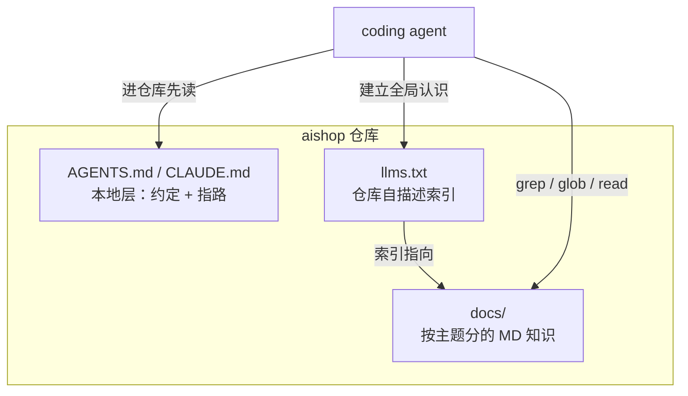
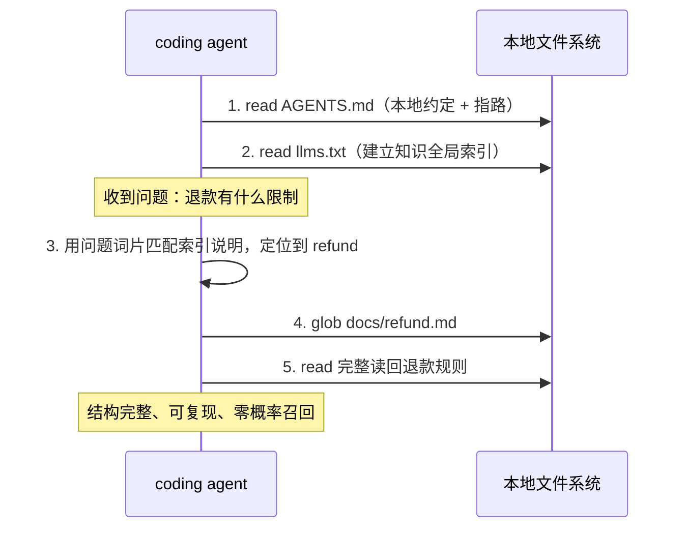

前五章把地基和工具都备齐了：第 1 章立了检索机制的判据，第 2 章画了能力阶梯地图，第 3 到 5 章讲清了知识的载体形态、覆盖度建模，还给 `aishop-kb` 装上了 CLI 的第一条命令 `coverage`。此刻 `aishop-kb` 的样子是这样的：

```
aishop-kb/
  cli/
    coverage.ts     # 第 5 章的第一条命令，能扫覆盖度、找盲区
```

它有工具，却没有知识。`coverage` 现在扫出来的覆盖度是零——因为 `aishop` 仓库里还没有一个字是专门写给 agent 读的。判据、地图、量尺都就位了，唯独知识本体是空的。

本章正式给 `aishop-kb` 建第一版产物：能力阶梯第零级的三个构件——一个 `docs/` 文件夹、一份 `llms.txt` 索引、一份 `AGENTS.md` 本地层。**从本章起，`aishop-kb` 从一个空壳 CLI 变成一座真能被 agent 消费的知识库。**

## 6.1 本章你会得到什么

1. 阶段0 知识库的三个构件——`docs/` 组织范式、`llms.txt` 自描述索引、`AGENTS.md` 本地层——各自的职责边界与协作方式。
2. `docs/` 的组织尺子：[Diátaxis](https://diataxis.fr) 四象限，按知识类型而非功能模块分区，让可自动维护的知识与需人手写的知识在文件层面就分开。
3. `llms.txt` 规范（[llmstxt.org](https://llmstxt.org)）的完整落地，以及它作为能力阶梯里最轻一种对外暴露形态的定位。
4. `examples/stage0-docs/` 里在 `aishop` 上真能跑的确定性导航脚本，和建完后 `aishop-kb` 的目录快照。

## 6.2 一个外部 agent 进仓库的第一分钟

先看一个具体场景。一个外部 agent 通过 [GitMCP](https://gitmcp.io) 接入 `aishop` 仓库，被问"6000 元的订单能不能自动退款"。它此刻对这个仓库一无所知：不知道有没有文档，也不知道退款规则写在哪。

没有索引时，它只能全爬。它列目录、读 `package.json`、翻 `src/` 下几十个文件，试图从代码里反推退款约束，烧掉大量 token，还很可能漏掉那条"超过 5000 需人工审核"的业务规则——因为这条规则根本不在代码里，它在某个人的脑子里，从没落成文件。

对照另一条路径：仓库根有一份 `llms.txt`。agent 读这一个文件，就知道退款规则在 `docs/refund.md`，直接读回，一次命中。两条路径的差距列在表 6-1。

表 6-1：外部 agent 进入 `aishop` 的两种起手

| | 没有自描述索引 | 有 `llms.txt` |
|---|---|---|
| 第一步 | 列目录、逐个猜哪些文件相关 | 读 `llms.txt`，拿到知识全图 |
| 定位退款规则 | 从 `src/` 反推，可能失败 | 索引直接指向 `docs/refund.md` |
| token 成本 | 高，爬多个无关文件 | 低，读一个索引 + 一篇文档 |
| 人脑里的业务规则 | 抓不到 | 已被写成文档，可命中 |

这个场景暴露了阶段0 要解决的两件事：知识要先落成文件才可能被取到，索引要先存在 agent 才不必盲爬。三个构件正是为这两件事而设。

## 6.3 阶段0 的三个构件

阶段0 知识库由三个构件组成，各自承担一项独立职责，结构如图 6-1。



图 6-1：阶段0 知识库的三个构件。`AGENTS.md` 是进仓库的第一份本地须知，`llms.txt` 是给外部 agent 的全局索引，`docs/` 是分主题的知识本体，三者职责不重叠。

三者分工明确：

1. `docs/` 存放知识本体，是被检索的对象。
2. `llms.txt` 是索引，回答"有哪些知识、各在何处"。
3. `AGENTS.md` 是本地约定，回答"进了这个仓库要先知道什么"。

把索引与本地约定分开，是因为二者面向不同读者。`llms.txt` 服务任意外部 agent，`AGENTS.md` 服务在本仓库工作的 agent，混在一处会让两类需求互相干扰。

## 6.4 docs 目录的组织范式

`docs/` 不是把知识随手堆进去的垃圾桶。目录一旦超过十几篇文件，无组织的平铺会让 agent 与人都难以定位。文件式知识库的第一项工程决策，是给 `docs/` 一套稳定的组织约定。

### 6.4.1 按知识类型分区，而非按功能模块分区

一个常见错误是让 `docs/` 的结构镜像代码目录——`docs/order/`、`docs/inventory/` 对应 `src/order/`、`src/inventory/`。这会把同一模块的教程、参考、排障揉进一个目录。读者要查"怎么排查对账差异"，却要在一堆混杂文档里翻找。

更有效的划分维度是知识的类型，而非它所属的功能。Diátaxis 框架为技术文档给出了一套成熟的类型划分，把文档沿两条轴分为四个象限：一条轴是"学习还是使用"，另一条是"实践还是理论"（表 6-2）。

表 6-2：Diátaxis 四象限及其在 agent 知识库中的落点

| 象限 | 面向 | 回答的问题 | agent 知识库中的例子 |
|---|---|---|---|
| 教程 Tutorial | 学习 + 实践 | 带我走一遍 | 新人如何在本地跑通下单链路 |
| 操作指南 How-to | 使用 + 实践 | 怎么完成某个任务 | 如何给订单加一个新状态 |
| 参考 Reference | 使用 + 理论 | 确切的定义是什么 | 订单状态机的全部状态与迁移表 |
| 解释 Explanation | 学习 + 理论 | 为什么这样设计 | 为什么下单要先锁库存 |

四象限对 agent 知识库尤其有价值的一点，是它把参考与解释显式分开。

参考类知识（字段定义、状态迁移表、API 契约）大多是代码衍生的，可自动抽取、可校验、边界清晰。解释类知识（为什么下单先锁库存、为什么金额单位用分）几乎全靠人手写，是本书反复强调最难沉淀、最值钱的一类。

把二者混在一篇文档里，会让可自动维护的部分被需要人审的部分拖住——它们的更新节奏与治理方式本该不同。**阶段0 就在文件命名上把参考与解释分开，是为后面几章的分层治理埋好接缝。**

不必为小仓库强上四个子目录。象限的价值在于提供一把分类的尺子：写一篇新文档前先问它属于哪一类，避免把参考写成半吊子教程、把解释塞进操作步骤。

### 6.4.2 一篇文档一个主题，边界与代码对齐

`docs/` 的每篇文档应对应一个可命名的知识单元，且这个单元的边界最好与代码的模块边界对齐。`aishop` 的 `docs/` 按业务主题切分：

```
aishop/
  docs/
    orders.md      # 订单状态机与流转约定（参考 + 解释）
    inventory.md   # 下单锁库存、分布式锁、大促扩容（解释 + 操作）
    refund.md      # 退款前置条件、金额审核、自动退款与风控校验（参考）
    risk.md        # 风控名单同步与二次验证（参考 + 操作）
    reconcile.md   # 对账任务与差异排查（操作）
  src/
    order/
      orderStatus.ts   # 状态机定义，被 docs/orders.md 引用
  llms.txt
  AGENTS.md
```

一主题一文件的粒度有两个工程理由：

1. 它让确定性导航可命中：agent `glob docs/refund.md` 就能完整取回退款规则，无需在一篇万字长文里定位段落。
2. 它让知识与代码同生命周期：改退款逻辑的 PR 顺手改 `docs/refund.md`，reviewer 在同一个 diff 里看到代码与文档的变更是否一致。

第 1 章论证过，知识随代码 PR 同改是文件式路径相对向量索引的根本优势。落到 `docs/` 的组织上，就是让文档边界不要横跨多个会各自独立演进的代码模块。

## 6.5 llms.txt：仓库的自描述索引

`docs/` 解决了知识存在哪，但一个外部 agent 初次进入仓库时，并不知道 `docs/` 里有什么、该从哪篇读起。`llms.txt` 就是为消除 6.2 节那次盲爬而设的自描述索引。

### 6.5.1 规范来源与格式

llms.txt 是 2024 年 9 月由 Answer.AI 的 Jeremy Howard 提出的约定（规范见 llmstxt.org），主张在网站或仓库根放一个名为 `llms.txt` 的 Markdown 文件，用大模型友好的结构列出本项目有哪些关键内容、各在什么路径，让 agent 读一个文件就建立全局地图。规范定义的结构很克制：

- 一个 H1，写项目名（唯一必需的元素）。
- 一段可选的 blockquote 摘要，一句话说明项目是什么。
- 若干个 H2 分节，每节下是一组文件链接，格式为 `- [名称](路径): 说明`。
- 一个可选的 `## Optional` 分节，列次要文件——当 agent 上下文预算紧张时，这一节可整段跳过。

规范还定义了一个 `llms-full.txt` 变体：把所有被索引文档的正文直接内联进单个文件。二者的取舍是上下文预算问题——`llms.txt` 只给索引、按需再取，省 token；`llms-full.txt` 一把全给、省往返，但可能撑爆上下文。

阶段0 优先用 `llms.txt`，把取哪篇的决策留给 agent，正契合确定性导航"先定位、再完整读"的节奏。`aishop` 的 `llms.txt` 直接落这套结构：

```
# aishop

> 虚构电商后端。coding agent 请先读本文件建立全局认识，再按路径确定性取知识。

## 知识文档

- [订单](docs/orders.md): 订单状态机与流转约定
- [库存](docs/inventory.md): 下单锁库存、分布式锁、大促扩容
- [退款](docs/refund.md): 退款前置条件、金额审核（超 5000 需人工）、自动退款与风控校验
- [风控](docs/risk.md): 风控名单同步与二次验证
- [对账](docs/reconcile.md): 对账任务与差异排查

## 代码入口

- 订单状态机定义: src/order/orderStatus.ts
```

每行说明不是装饰，而是索引的检索面。agent 靠这句话判断"退款有什么限制"该去哪篇——说明里写清"金额审核（超 5000 需人工）"，agent 不必读完 `refund.md` 就知道命中。

配套脚本 `src/navigate.ts` 正是拿问题的词片去和这些标题加说明做匹配。索引的说明写得越准，定位越准——所以说明要写关键词，不要写"这是关于退款的文档"这种零信息量的复述。

### 6.5.2 索引作为第一种对外暴露形态

`llms.txt` 是第 2 章能力阶梯里三种对外暴露形态中最轻的一种：用一个纯文本文件，零基础设施地让单仓库知识可被任意外部 agent 复用。

任何遵循这套约定的工具——例如把任意 GitHub 仓库即时变成 agent 端点的 GitMCP——进入你的仓库，读一眼 `llms.txt` 就知道知识版图，无需你部署任何服务。往上的两种形态（[MCP](https://modelcontextprotocol.io) 端点、plugin 分发）要到第 10 章与第 13 章才需要，且只在知识量超出单个索引能承载时才升级。按规模选形态、够用不升级，是这条主线的原则。

## 6.6 AGENTS.md：进仓库的第一份本地须知

第三个构件 `AGENTS.md`（[Claude Code](https://claude.com/claude-code) 的同名文件是 `CLAUDE.md`，作用一致）是仓库本地层，第 8 章会正式称它 L2。它与 `llms.txt` 的分工前面已述：索引面向外部检索，本地须知面向在本仓库工作的 agent。它承载两类内容。

第一类是本仓库特有、不成文却必须遵守的约定。`aishop` 的 `AGENTS.md` 写了两条：金额单位是"分"，改订单 status 必须走 `advanceOrder` 而非直接赋值。这类约定是典型的解释类知识，写错就会生成单位混乱或绕过状态机的代码。

第二类是指路：业务规则去 `docs/`（清单在 `llms.txt`），代码定义去 `src/`。

指路让 `AGENTS.md` 保持精简——它不重复知识本体，只告诉 agent 去哪找。一旦 `AGENTS.md` 开始抄写 `docs/` 的内容，两处就会漂移，agent 读到的约定和真实文档打架。让它只放约定加指针，是把唯一真相留在 `docs/` 与 `src/`。

`AGENTS.md` 正在被多家 agent 工具采纳为半标准约定（规范见 [agents.md](https://agents.md)）。二者是否可跨工具移植、如何用一份源产出多种格式，是第 12 章的主题；阶段0 只需知道它是 agent 进仓库读的第一份文件。

## 6.7 确定性导航：agent 如何消费这个文件夹

三个构件搭好后，agent 的消费路径是完全确定的，如图 6-2。



图 6-2：阶段0 知识库的确定性导航时序。agent 先读约定与索引建立全局认识，遇到具体问题时用词片匹配定位、`glob` 命中、`read` 完整读回，全程无相似度、无向量库、无索引维护。

这条路径与第 1 章讲的确定性导航是同一机制，区别只在对象：第 1 章导航的是代码符号，这里导航的是专为 agent 写的知识文档。机制不变——边界可枚举的知识，用 `grep`/`glob`/`read` 精确定位，不用向量。命中与否确定且可复现，改一篇文档，下一次导航立即反映最新内容，不存在索引滞后。

### 6.7.1 索引匹配的实现与"找不到"的诚实

配套脚本 `src/navigate.ts` 把这条路径实现成三步：解析 `llms.txt` 得到文档清单，用问题的二字词片（bigram）与每篇的"标题 + 说明"做重合度打分，取最高分完整读回。用二字词片而非单字，是为了让"订单"和"退款"这类意图能被区分，避免单字"款"既命中退款又命中对账的歧义。

这个打分是确定性的，不是概率召回——同一问题永远定位到同一篇文档。脚本对零命中的处理更能体现这种确定性：当问题与索引里所有说明都对不上时，`locate` 返回 `null`，脚本明确报未命中并建议人工检索或补一篇 `docs/`，而不是硬把分数最高（哪怕分数是 0）的文档塞回去。

一个确定性系统在找不到锚点时就该说找不到，这与向量检索"总能返回 top-k、哪怕全不相关"形成对比。**把无答案当成合法输出，是文件式导航相对概率召回在可靠性上的一处隐性优势**——它不会用一个自信的错答案污染 agent 的上下文。

### 6.7.2 检索优先级协议：索引优先，grep 兜底

图 6-2 的时序有一个隐含前提：agent 会自觉先读索引。实践中不能指望自觉——多数 agent 拿到问题的第一反应是全仓库 `grep` 关键词。对业务知识文档，盲 grep 有三个问题：

1. 命中的是散落的原始匹配。"退款"二字可能出现在注释、日志、测试夹具里，噪音大、烧 token，这正是 6.2 节那次盲爬的另一种形态。
2. 可能命中过期注释或历史代码，把废弃规则当现行规则读回。
3. 会漏掉字面不匹配的知识。索引说明里人工提炼的语义（如"金额审核"对应"超 5000 需人工"）未必含有问题的关键词原文，grep 找不到它。

对策是把检索次序写成 `AGENTS.md` 里的显式协议，让索引优先成为硬约定而不是期望。`aishop` 的 `AGENTS.md` 加上这一节：

```markdown
## 检索约定

查业务规则、流程或约束时，按以下顺序，禁止跳步：

1. 先读 llms.txt，用各条目的说明定位候选文档
2. 完整读回候选文档；能回答就到此为止
3. 索引里没有相关条目时，才允许 grep 全仓库兜底
4. 兜底得到的结论，标注"来自代码反推，未经文档确认"
```

两处措辞值得注意。禁止项要写得具体——"禁止跳步"是可执行的规则，"建议先读索引"只是可忽略的偏好；prompt 约定的执行强度取决于措辞的确定性。第 4 条则让兜底结果带上来源标记，代码反推的规则可能是实现细节而非业务承诺，不该与文档确认过的知识混为一谈。

这条协议与 6.7.1 的 `navigate.ts` 是同一思路的两种实现：脚本把次序固化在代码里，必然被执行，但只覆盖预设入口；prompt 协议靠 agent 遵守，执行有折扣，却能覆盖 agent 自由探索的全部场景。两者不互斥，阶段0 同时用。

注意 grep 在协议里不是被废除，而是被放回正确的位置。索引是人工维护的，永远有盲区；没有第 3 步兜底，索引缺一条就等于那条知识不存在——兜底保证的是召回下限。

这条协议还有一个超出检索本身的价值：**兜底被触发的频率，就是索引盲区的信号**。agent 每落到一次 grep 兜底，说明 `llms.txt` 缺一条索引项或 `docs/` 缺一篇文档——这正是第 5 章 `coverage` 要找的盲区，也是第 16 章上收回路的天然输入。

## 6.8 为什么阶段0 对多数团队够用

阶段0 常被低估，是因为它看起来太简单，不像个知识库。但简单恰恰是它的工程优势。它够用的判断建立在三条相互独立的理由上。

1. coding agent 的知识需求高度集中在本仓库。agent 在 `aishop` 里干活，要用的知识九成是 `aishop` 自己的规范、状态机、业务约束，边界可枚举、与代码同源，正是第 1 章判据里该用确定性导航的那一格。跨仓库、跨源、模糊长尾的知识确实存在，但它是少数，那是阶段2 服务化要解决的问题。
2. 阶段0 的边际成本几乎为零，收益立即兑现。写一篇 `docs/refund.md` 不需要部署、不需要索引、不需要 embedding 服务，它就是 git 里的一个文件，随仓库分发、随 PR 评审、随 tag 打版本。团队不必先建平台再产出知识，写一篇就多一篇可用知识。
3. 阶段0 是后续所有阶段的地基，不是会被推翻的临时方案。第 8 章的分层组织、第 10 章的知识 MCP 服务、第 13 章的 plugin 分发，都建立在知识已经是仓库里结构化 Markdown 文件这个前提上。

**手写业务知识的第一步永远是把散落的知识落成可寻址的文件——制造出可寻址的结构化文件，是一切知识库工程的原点。**

### 6.8.1 主动索引与现抓现搜的成本对比

阶段0 够用的另一面，是它比让每个 agent 现抓现搜更省。GitMCP 那类工具处理的是"你没为它准备任何东西"的任意仓库：agent 来问，它临时抓 GitHub 文件、切块、搜索、返回片段。这套机制的价值在于兜底陌生仓库，但代价是每次提问都要重跑一遍抓取与切块。

如果你主动放一份 `llms.txt`，就等于把有什么、在哪一次性告诉了所有 agent，此后每次提问都省掉临时抓取、切块、搜索这几步，直接定位并完整读回。两条路径的步骤差距如图 6-3。


图 6-3：现抓现搜与主动索引的步骤对比。一份 `llms.txt` 把有什么、在哪提前固化，换掉了每次提问都要重跑的抓取、切块、搜索三步。

`llms.txt` 有它的边界：它是给愿意读它的 agent 看的约定，不是强制标准；当知识量大到一个索引列不完、或需要跨仓库聚合时，单个文本文件就不够了——那正是升级到阶段2 服务化的信号。但在单仓库、知识量适中的场景，主动组织一次的成本，远低于让每个 agent 每次现抓现搜的累积成本，它是绝大多数团队的合理终点。

## 6.9 动手：建 aishop-kb 第一版

`examples/stage0-docs/` 在第 2 章的 `aishop` 骨架上，把散落的知识整理成一个可运行的阶段0 知识库，包含四部分产物：

- `docs/` 下五篇按主题分的 Markdown（订单、库存、退款、风控、对账）
- 一份符合 llms.txt 规范的 `llms.txt` 索引
- 一份放本地约定与指路的 `AGENTS.md`
- 一个最小导航脚本 `src/navigate.ts`

示例只用 Node 内置模块，无运行时依赖。

建完后，`aishop-kb` 第一版的产物落在 `aishop` 仓库内部：

```
aishop-kb/                     # 知识库产品
  cli/
    coverage.ts                # 第 5 章的第一条命令

aishop/                        # 被服务的电商后端（本章新增知识文件）
  docs/                        # ← 本章新增：阶段0 知识本体
    orders.md
    inventory.md
    refund.md
    risk.md
    reconcile.md
  llms.txt                     # ← 本章新增：自描述索引
  AGENTS.md                    # ← 本章新增：本地约定 + 指路
  src/order/orderStatus.ts     # 已有代码，被 docs/orders.md 引用
```

阶段0 的知识本体和代码同住一个仓库，这不是过渡形态的将就，而正是本章论证的核心——知识与代码同源、同 PR、同版本。第 8 章做分层时才会把可复用的部分抽成独立包；在此之前，同仓库共处就是最省的形态。

运行方式见该目录 README。脚本先解析 `llms.txt` 得到五篇知识清单，再用问题词片确定性定位。三个测试用例：

- 问"6000 元订单能不能自动退款"，定位到 `docs/refund.md`，完整读回退款规则：只有 paid 后可退、超 5000 需人工审核、命中风控名单不允许自动退款。
- 问"大促库存要怎么扩容"，定位到 `docs/inventory.md`。
- 问一个索引里没有的问题（如"今天天气怎么样"），脚本老实报未命中而非硬给错答案。

全程确定性、可复现、零基础设施。

这个 `docs/` 目录就是 `aishop-kb` 能力阶梯的第零级，后续每一章都在它之上生长。

## 本章要点

- **能力阶梯第零级——`docs/` 目录 + `llms.txt` 索引 + 确定性导航——对多数团队是终点而非过渡**：coding agent 的知识需求高度集中在本仓库，边界可枚举、与代码同源，正是该用确定性导航的场景。
- `docs/` 按知识类型（Diátaxis 四象限：教程、操作、参考、解释）而非功能模块划分，一篇文档一个主题、边界与代码对齐，让参考类（可自动维护）与解释类（需人手写）知识在文件层面就分开。
- `llms.txt` 是 llmstxt.org 定义的自描述索引，用 H1 项目名 + 分节文件清单让外部 agent 一次建立全局地图；每行说明是索引的检索面，要写关键词而非零信息复述。它是最轻的一种对外暴露形态。
- `AGENTS.md`/`CLAUDE.md` 是 L2 本地层，只放本仓库特有约定与指路，不抄写知识本体，以避免与 `docs/` 漂移。
- 主动写一份 `llms.txt` 的一次性成本，远低于让每个 agent 每次现抓现搜的累积成本；**确定性导航在找不到时会诚实报未命中，不会用自信的错答案污染上下文**。

## 下一章

`aishop-kb` 第一版是从零手写的五篇干净文档，但真实团队的存量知识散在旧 wiki、Confluence、README 和聊天记录里。第 7 章讲如何把这些存量知识冷启动迁进 `aishop-kb` 的 `docs/`——哪些直接搬、哪些要重写、哪些该丢。

## 配套代码

见 `examples/stage0-docs/`。

---

> 本章来自《Agent 知识库工程实战：组织、分发、共建与度量》开源版 · 作者「递归客」
> 在线阅读完整书系：[inferloop.dev](https://inferloop.dev)
