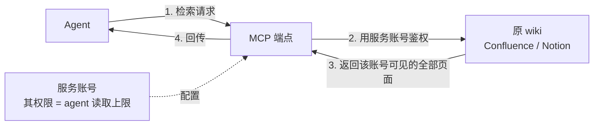
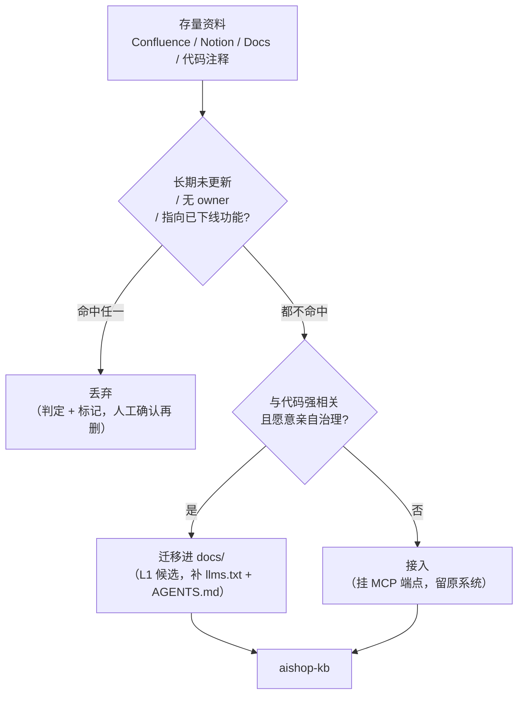

上一章给 `aishop-kb` 建起了阶段0 的三件套：`docs/` 下五篇手写文档、一份自描述的 `llms.txt` 索引、一份放本地约定的 `AGENTS.md`。这一版干净、可导航、零基础设施。

但它只装了新写的知识。真实团队接手一个系统时，值钱的知识早已散落在别处——一个塞了三年的 Confluence、一个半荒废的 Notion、几十篇散在 Google Docs 里的设计文档。`aishop-kb` 现在对这些存量视而不见。

本章给 `aishop-kb` 做一次存量知识的冷启动：对每一份现成资料判定它的归宿，该接的接进来、该搬的搬进 `docs/`、该丢的清出去。这个判定过程叫分诊。

## 7.1 本章你会得到什么

1. 一套分诊判据：把每份存量知识判为接入、迁移或丢弃，并说清三条路在治理归属上的本质差异。
2. 一张 Notion / Outline / Confluence 三种主流 wiki 的 MCP 接入取舍表。
3. `examples/cold-start/` 里一个可运行的分诊脚本：对 10 份存量文档自动分档，把该迁移的写进 `aishop-kb` 的 `docs/`。

## 7.2 冷启动面对的是存量而非空目录

先看一个具体处境。`aishop` 团队有一个用了三年的 Confluence 空间，约 300 页，覆盖订单、库存、支付各模块的设计文档、会议纪要和排障记录。

这 300 页里，有当前架构的权威说明，也有讲早已重构掉的旧设计的僵尸页面，还有大量和 `aishop` 无关的行政流程。全量搬进 git 不现实，全部不管又会丢掉真正的业务知识。

所以冷启动的核心工作不是搬运，而是分诊。对存量里的每一份知识，判定它走哪条路（表 7-1）。

表 7-1：三条路的对照

| | 接入（connect） | 迁移（migrate） | 丢弃（discard） |
|---|---|---|---|
| 知识去向 | 留在原系统 | 抽进 git 仓库 | 判定淘汰，标记清单 |
| 取用机制 | MCP 端点实时查 | `docs/` 文件，确定性导航 | 不再取用 |
| 版本与治理 | 跟原系统走，与代码异源 | 与代码同仓库、同 PR、可 pin 版本 | 无 |
| 权限模型 | 继承原系统访问控制 | 继承 git 仓库权限 | 无 |
| 新鲜度责任 | 原系统维护者 | 迁入方 owner + PR 评审 | 无 |
| 接入成本 | 低（连一次） | 高（清洗 + 结构化 + 持续维护） | 极低（打标记） |
| 适合的知识 | 量大、别处活跃维护、非核心 | 少而精、与代码强相关、要被治理 | 过期、重复、无人认领 |

选错这三条路的代价是实打实的。把本可接入的大型 wiki 强行搬进 git，是在制造一份永远追不上原系统的过期副本。把该沉淀的核心业务规则留在会腐烂的 wiki 里，是把最值钱的知识锁在最不可控的地方。把僵尸文档原样导入，则是在第一天就往知识库里投毒。

## 7.3 三条路的本质差异在新鲜度责任

表 7-1 里最容易被忽略的是 "新鲜度责任" 这一行。它比接入成本更能决定选路。

接入把维护责任留在原系统的维护者手里。这既是它的优点（你不必操心），也是它的软肋（你无从保证）。

迁移则把责任转移到迁入方。知识一旦进了 `docs/`，它的过期就是你的问题，它需要一个 owner 为它的准确性负责。

这条判据比知识量大不大更本质：**一份知识该不该迁移，取决于你是否愿意为它的长期准确性负责**。不愿意负责的知识不该迁进来，哪怕它主题上和 `aishop` 代码高度相关。

## 7.4 分诊的判据与优先级

三条路不是并列选择，判据之间有先后。冷启动应当先做减法（判定丢弃），再在剩下的有效知识里区分迁移与接入。

这个顺序不能颠倒。先做减法能避免把清洗成本浪费在注定要淘汰的内容上。

### 7.4.1 淘汰判据优先于相关性判据

僵尸文档的典型特征有三条：

1. 长期未更新（如一年以上没人动）。
2. 无人认领（没有 owner）。
3. 内容指向已下线的功能。

这三条任意命中，都应先判丢弃，且这一判断优先于 "主题是否和代码相关"。

理由在治理而非内容。一份两年没更新、讲早已重构掉的旧架构的文档，哪怕标题里全是订单、库存这些核心词，迁进 git 也只会污染知识库——agent 检索到它，会拿着一份对不上现状的旧知识去回答。

相关性高反而放大了危害，因为它更容易被召回。所以分诊里存在一个刻意的优先级：**owner 与时效性检查排在话题相关性之前**。

配套示例的 `triage()` 函数正是按这个顺序写的：先查 age、再查 owner、再查 `已下线` 标记，最后才做关键词相关性匹配（见 `examples/cold-start/src/triage.ts`）。

这里的丢弃指判定加标记，不是脚本自动删除原系统页面。冷启动脚本只产出一份 "建议淘汰" 清单，原页面要不要真删仍需人工确认。把判定和执行删除分开，是这一步的安全底线——自动化可以帮你筛，但不能替你删。

### 7.4.2 相关性与治理意愿共同决定迁移

通过淘汰这一关的有效知识，再按两条判据区分迁移与接入：与代码的相关性、以及迁入方的治理意愿。两条都成立才迁移。

- 迁移：与 `aishop` 代码强相关、且你愿意为其准确性负责。典型是核心业务规则（如「下单先锁库存」）、架构决策记录、字段口径约定。这些知识和代码同生共死，理应同仓库、走同一套 PR 评审、被 pin 到版本，也就是后续要展开的 L1 知识包（分层见第 8 章）。
- 接入：有效、但别处维护更合适、或你不打算亲自治理。典型是全公司 HR 政策、财务报销流程、另一个团队维护的产品 wiki。别人在持续更新，你没有理由也没有能力治理得更好，接一个 MCP 端点实时查即可。

这条判据呼应全书的一条主张——够用就别升级。迁移的复杂度不在 "抽取" 这一次动作，而在此后长期的清洗、结构化和维护。为一份别人正在好好维护的知识付出这份长期成本，是纯粹的浪费。

## 7.5 接入：给现有 wiki 挂 MCP 端点

接入的技术手段是给现有系统挂一个 MCP 端点（MCP 作为跨厂商调用外部知识的开放标准，见第 2 章）。它几乎零成本：不用搬家、不用清洗，连上就能让 agent 查到。

代价是知识与代码异源，版本、权限、新鲜度全跟着原系统走，你治不了。所以接入只适合 "不需要你治理" 的知识。

主流团队 wiki 的接入方案各有取舍（表 7-2）。选型除了看有没有现成 MCP，更要看两点：返回给 agent 的文本是否干净（直接影响 token 消耗和检索质量），以及是否可自托管（影响数据边界与合规）。

表 7-2：三种主流 wiki 的接入取舍

| | Notion | Outline | Confluence |
|---|---|---|---|
| MCP 方案 | 官方 MCP，最成熟 | 开源，社区 / 自建 MCP | 官方 + 社区方案，企业装机量最大 |
| 存储形态 | 块结构（block），富文本 | Markdown-first（原生 Markdown） | 富文本 + 存储格式，历史包袱重 |
| 返回文本 | 需从 block 结构还原，略啰嗦 | 原生 Markdown，干净、省 token | 需转换，格式噪声较多 |
| 检索能力 | 官方搜索 API | 全文检索 | CQL（Confluence Query Language）条件检索 |
| 自托管 | 不支持（SaaS） | 支持（开源可自部署） | 支持（Data Center 版） |
| 适合场景 | 团队已重度使用 Notion | 想要干净 Markdown、数据自控 | 企业存量大、需精细化条件检索 |

三者的差异集中在存储形态，而存储形态直接决定接入质量。

Notion 以块结构存储富文本，MCP 取回内容时要把嵌套的 block 树还原成线性文本，还原结果往往带着冗余的结构标记，喂给 agent 既费 token 又引入噪声。

Outline 原生以 Markdown 存储，MCP 返回的几乎就是干净正文，同样一段知识占用的上下文明显更少。在 agent 场景下，上下文是稀缺资源，返回文本的干净程度不是细节而是硬指标。

Confluence 的优势不在文本干净，而在 CQL。企业里 Confluence 动辄几万页，CQL 允许按空间、标签、时间、作者做条件检索，把召回范围先圈小再交给 agent，这对超大存量库是刚需。

回到 7.2 那个 300 页的空间，CQL 正是先把范围收窄到 "订单空间、近一年、非归档" 的手段。

一个常被忽略的取舍是权限的传递。接入意味着 agent 的检索权限继承自原系统的账号，用一个高权限服务账号去连 Confluence，agent 就能读到它本不该看到的内容。

这条权限链路如图 7-2：agent 的读取范围完全由 MCP 端点所配的服务账号决定，服务账号能看到多少页面，agent 就能召回多少页面，中间没有额外的过滤层。

图 7-2：接入端的权限边界。agent 的读取上限等于 MCP 端点服务账号的权限，越权配置会让 agent 召回到不该看的内容。

这类接入端的权限与隔离问题，是第 20 章要专门处理的边界。冷启动接入时至少要记住一句：**给 MCP 端点配什么账号，agent 就有什么读权限**。

## 7.6 迁移：分诊而非全量拷贝

迁移是把知识从原系统抽出来、变成仓库里的文件。这一步最大的陷阱是一键全量导入：把三年的 Confluence 整个导成 Markdown 塞进 `docs/`。

这么做等于把原系统的全部问题——过期内容、重复页面、自相矛盾的旧决策——原封不动搬进新库。垃圾进、垃圾出，而且此后你要为这批垃圾的准确性负责。

正确的迁移是一次分诊，对存量里的每一份知识做前面那套判断，只把「有效 + 与代码强相关 + 愿意治理」的那一小部分抽进来。冷启动是给知识做一次体检的最好时机：那些没人敢删、又没人敢信的僵尸文档，正应该在这一步被清出去。

完整的分诊流程如图 7-1，判据顺序对应 7.4 节——先做淘汰减法，再在有效知识里区分迁移与接入。

图 7-1：冷启动分诊流程。淘汰判据（长期未更新 / 无 owner / 已下线）优先于相关性判据；丢弃是判定加标记，删除仍需人工确认。

迁移进来的知识别忘了补上第 6 章那套确定性导航的配置：放进 `docs/`、登记进 `llms.txt`、需要的约定写进 `AGENTS.md`。

到这一步，被选中的存量资料就正式成为 `aishop-kb` 的一部分，后续可以进一步包化为 L1 知识包（见第 8 章）。

## 7.7 动手：给一批存量资料做冷启动分诊

`examples/cold-start/` 模拟一次真实的冷启动。它由两个文件驱动：

- `src/data.ts`：给定 10 份从 Notion / Confluence / Google Docs 导出的存量文档，每份带来源、owner、最后修改时间和内容。
- `src/triage.ts`：用一套演示级规则对每份做分诊，把判为迁移的写进 `aishop/docs/`，并打印分诊报告。

运行方式见该目录 README（`npx tsx src/triage.ts`，仅用 Node 内置模块，零运行时依赖）。规则用固定参考日期 `2026-07-06` 保证结果可复现。

判据顺序严格对应前文：先查是否超一年未更新、是否无 owner、内容是否涉及 `已下线`，命中任一即判丢弃；剩下的有效文档再匹配 `aishop` 业务关键词（订单 / 库存 / 退款 / 风控 / 对账 / 支付），命中判迁移，否则判接入。

跑完会看到 10 份文档被分成三档：

1. 迁移 4 份：订单状态机说明、退款合规要求、对账流程、大促库存扩容经验，写入 `aishop/docs/`。
2. 接入 3 份：全公司报销政策、搜索平台团队 wiki、新人 onboarding 指南，留原系统挂 MCP。
3. 丢弃 3 份：2023 双十一秒杀活动页（已下线）、库存旧设计草稿（无 owner）、旧版系统架构图（两年未更新）。

值得对照的是 "库存旧设计草稿" 这一份。它的主题（库存扣减设计）和 `aishop` 代码高度相关，若只看相关性该判迁移。

但因为它无 owner，分诊在相关性检查之前就把它判为丢弃。这正是 7.4.1 那条优先级的直接体现——没人认领的知识，相关性再高也不该迁进来背在自己身上。

示例把关键词匹配当作相关性判据的占位实现，真实项目应换成 embedding 相关性判断（检索机制见第 10 章），并把丢弃从脚本判定改为进入人审队列而非自动删除。

## 本章要点

- 冷启动面对的是存量而非空目录，**核心工作是分诊而非搬运**：给每份存量知识判定接入、迁移或丢弃。
- 三条路的本质区别在治理归属与新鲜度责任。**决定迁移与否的是治理意愿，不是知识量或主题相关度**——愿意长期为准确性背书才迁，否则接入或丢弃。
- 分诊判据有先后：**淘汰判据（长期未更新 / 无 owner / 已下线）优先于相关性判据**；丢弃是判定加标记，删除仍需人工确认。
- 接入适合量大、别处活跃维护、无需你治理的知识；Notion、Outline、Confluence 各有取舍，选型看返回文本是否干净与是否可自托管。
- 迁移适合少而精、与代码强相关、你愿意治理的知识，抽进 `docs/` 后补 `llms.txt` 与 `AGENTS.md`，作为 L1 知识包候选，切忌一键全量导入。

## 下一章

`aishop-kb` 的 `docs/` 现在混装了手写的和迁入的知识，但它们还平铺在一个目录里，没有分层。第 8 章把这些知识拆成 L0 / L1 / L2 三层，用选择性依赖取代全局大库。

## 配套代码

见 `examples/cold-start/`。

---

> 本章来自《Agent 知识库工程实战：组织、分发、共建与度量》开源版 · 作者「递归客」
> 在线阅读完整书系：[inferloop.dev](https://inferloop.dev)
