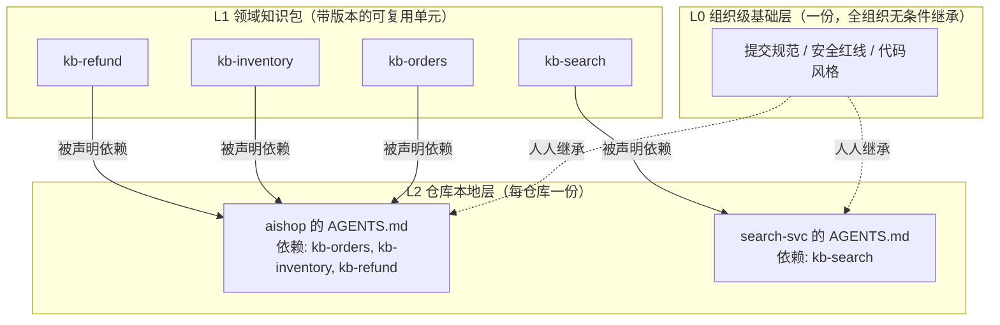
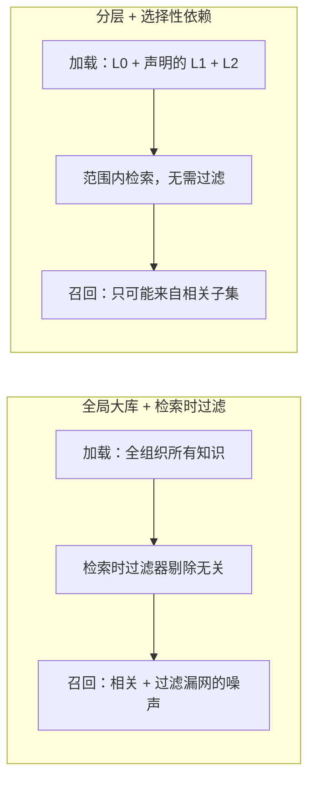
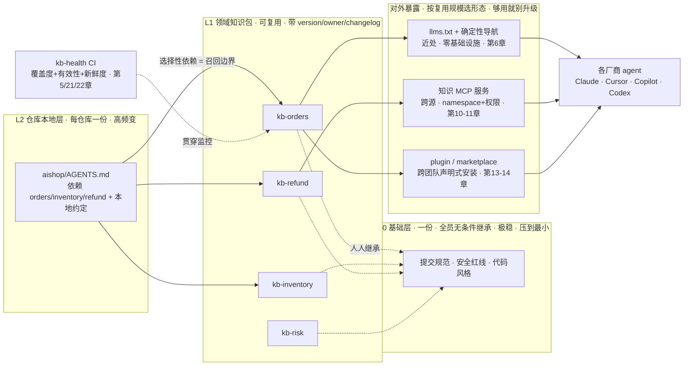

到这里，`aishop-kb` 的知识全都堆在 `aishop` 仓库的一个 `docs/` 文件夹里。第 6 章新写的约定、第 7 章从存量 wiki 冷启动迁进来的内容，都躺在同一层目录下。

在单仓库、单团队的边界内，这是最优解：零基础设施、随代码同版本、agent 直接导航，前两章已经论证过。

但知识的价值在于复用，而复用意味着跨越单仓库的边界。一旦 `aishop-kb` 的某条知识要被别的仓库、别的团队共用，单文件夹模型会立刻撞上两堵墙。

本章把 `aishop-kb` 的 `docs/` 重整成 L0/L1/L2 三层包，给出重整后的目录快照，并交代这套分层为什么是全书「反二元」主张的落点。

## 8.1 本章你会得到什么

1. 一套把知识按共享半径分成 L0/L1/L2 三层的组织模型，附一张三层职责对照表。
2. 一个把 `aishop` 的单 `docs/` 重整成三层包的目录快照，L0 抽公共约定、L1 拆领域包、L2 只留本地增量与依赖声明。
3. `examples/layered-kb/` 里的加载器，演示同一个退款问题在两个仓库上截然不同的召回结果——`aishop` 命中、`search-svc` 查不到。

## 8.2 一条约定漂了三个仓库

先看一件真实会发生的事。

`aishop` 的一条组织级约定是"金额单位一律用分"。这条约定被复制进了二十个后端仓库的各自 `docs/`，每个仓库一份副本。

某天财务口径改了，金额单位从"分"改成"元"。改动要手工同步到二十个仓库，结果漏改了三处。

这三个仓库的 agent 于是带着过期约定继续工作：它们仍以为金额单位是分，在生成对账代码时把数字放大了一百倍。没有任何机制发现这个矛盾——因为二十份副本之间只有复制关系，没有依赖关系。

这不是执行力问题，而是组织形态问题。把同一条知识复制二十份，就等于埋了二十个各自独立漂移的定时炸弹。要拆掉它，得先看清多数团队为什么会走到这一步。

## 8.3 伪二元：全局大库与每仓库各搞一套

面对跨仓库共享知识的需求，团队通常在两个选项之间摇摆。本节论证：这两个选项其实是同一道伪命题的两面。

### 8.3.1 全局大库的失效：检索污染

第一种直觉是把所有团队、所有领域的知识汇进一个大库。前端规范、后端约定、`aishop` 的业务规则、支付团队的接口文档，全堆在一起。库越全，看起来越强大。

但对检索而言，"全"是负债。agent 在 `aishop` 里问退款规则，它需要的只是退款那几条。可库里同时躺着搜索服务的索引约定、支付网关的对账逻辑、前端的组件规范。

这些内容在字面和语义上都可能与查询沾边，于是被一并召回，挤占上下文预算，稀释真正相关的信号。这正是第 1 章那个向量检索失效模式在组织层的放大：语料越大越杂，概率召回的信噪比越低。

更隐蔽的代价是权限与治理。全组织一个大库，意味着访问控制、废弃清理、owner 归属全都塌缩成一份巨型共享责任。没有人真正为其中某一块负责，于是没有人清理，库只增不减。

### 8.3.2 每仓库各搞一套的失效：复用漂移

被检索污染劝退的团队，往往滑向另一个极端：每个仓库维护自己那份知识，谁也不依赖谁。检索是干净了，`aishop` 的库里只有 `aishop` 的东西，但复用被彻底放弃。

8.2 节那条漂了三个仓库的约定，就是这个极端的产物。一条组织级约定被复制二十份，改口径时漏改三处，三份副本从此各自漂移，最终互相矛盾。

复制是知识工程里最昂贵的耦合。它制造了"看起来独立、实则必须手工同步"的隐形约束，而这种约束没有任何机制能自动维护。

### 8.3.3 共同病根：共享半径被压平

两种失效模式指向同一个诊断：它们都把"这条知识该被多大范围共享"这个维度压平了。

- 全局大库假设一切知识的共享半径无穷大，所有人都该看到所有知识。
- 每仓库各搞一套假设一切知识的共享半径为一，谁也不共享给谁。

真实世界的知识分布在这两个极端之间。有的该全组织共享（提交规范），有的该在几个相关仓库间共享（退款规则），有的只属于单个仓库（本仓库金额单位）。

**把共享半径当成一个可分层的变量，而不是一个二值开关，伪二元就自动解开了。**

## 8.4 按共享半径切分：L0/L1/L2 三层模型

分层的切法直接对应共享半径：全组织共享的沉到最底层，领域内共享的做成中间层，仅本仓库使用的留在最上层。三层各自的职责、稳定性、变更频率、owner 与载体都不同（表 8-1）。

表 8-1：L0/L1/L2 三层职责对照

| 维度 | L0 组织级基础层 | L1 领域知识包 | L2 仓库本地层 |
|---|---|---|---|
| 内容 | 全组织都该遵守的底线 | 可复用的领域知识单元 | 单仓库特有的约定与指路 |
| 共享半径 | 整个组织，一份 | 依赖它的所有仓库 | 单个仓库 |
| 变更频率 | 极低 | 中 | 高 |
| 稳定性 | 最稳，动一次全组织受影响 | 较稳，走版本演进 | 随代码 PR 频繁变 |
| owner | 平台 / 架构治理团队 | 领域团队（有明确 owner） | 仓库所属团队 |
| 载体 | 一份共享文件 / 基础包 | 带版本、changelog 的知识包 | `AGENTS.md` / `CLAUDE.md` |
| 加载方式 | 人人继承，无需声明 | 被 L2 选择性声明依赖 | 随仓库天然加载 |
| 例子 | 提交规范、安全红线、代码风格 | `kb-orders`、`kb-inventory`、`kb-refund` | `aishop` 的"金额单位是分" |

三层的依赖关系如图 8-1，重点在箭头方向。L2 主动声明它依赖哪些 L1，L0 则被所有仓库无条件继承。知识不是被推给仓库的，而是被仓库按需拉取的。



图 8-1：L0/L1/L2 三层模型与依赖方向。L0 被所有仓库无条件继承（虚线）；L1 是带版本的可复用领域包，由 L2 主动声明依赖（实线）拉取；`aishop` 声明了订单、库存、退款三个包，`search-svc` 只声明了搜索包，二者的知识范围因此天然不同。

### 8.4.1 L0 组织级基础层

L0 是每个仓库、每个 agent 都会加载的东西。它的体积直接转化为全组织每一次 agent 调用的固定上下文开销，这条约束决定了 L0 的第一原则：压到最小。

只有同时满足两个条件的知识才配进 L0：

1. 全组织通用——不是"大部分团队"，是全部。
2. 极少变化——提交规范、安全红线、基础代码风格这类底线。

一个常见错误是把某个主力技术栈的约定塞进 L0，理由是"反正大部分仓库都用"。但"大部分"不是"全部"，那几个不用该栈的仓库会被迫加载无关知识，L0 就开始膨胀。判据要卡死在"全部且极稳"，宁可漏放，不可错放。

L0 的变更是重操作：改一次，全组织所有仓库的 agent 行为都可能随之改变。因此它应由平台或架构治理团队集中把关，走严格评审。示例里的 L0 就是 `kb/L0/base.md` 那三条，克制不是简陋。

### 8.4.2 L1 领域知识包

L1 是复用的主战场，也是全书把知识库当软件工程来做的最核心一层。"订单""库存""退款"这类领域知识，既不该全组织共享，也不该被复制进每个用到它的仓库。

正确的形态是把它做成独立的包：谁需要谁声明依赖。这一层对应 npm 包的心智模型，而这个类比是精确的，不是修辞：

- 有明确的 owner，对应 npm 的 maintainer。
- 有语义版本，对应 `package.json` 的 version。
- 有变更记录，对应 CHANGELOG。
- 被多个下游按名称依赖，对应 `dependencies`。

把领域知识从"散落在各仓库的副本"升级为"一份带版本的可依赖单元"，就把复制耦合替换成了依赖耦合。退款规则改一处，所有声明依赖 `kb-refund` 的仓库通过版本升级一次性获得更新，8.2 节那种漏改从根上不再可能。

一个 L1 包该做多大、要不要为单条规则单独拆包、版本怎么演进，是下一章要正式处理的问题。本章只需锚定 L1 的定义：可复用、带版本、有 owner 的领域知识单元。

### 8.4.3 L2 仓库本地层

L2 是仓库特有知识的家，落在 `AGENTS.md` 或 `CLAUDE.md` 里。它只放两类东西：本仓库独有的约定，以及依赖声明。

独有约定指别的仓库不该知道、也无法复用的知识。`aishop` 的"本仓库金额单位是分"就是典型：它是这个仓库的局部实现选择，共享半径恰好为一。

依赖声明则是 L2 与 L1 的接口。`aishop` 的 `AGENTS.md` 里写着 `依赖: kb-orders, kb-inventory, kb-refund`，这一行既是"我需要这三个领域包"的意图，也是下一节要展开的召回边界。

L2 的一条纪律是不重复 L1 已有的内容。某条知识若已在 L1 包里，L2 就只声明依赖，绝不抄一份下来。一旦 L2 抄了 L1，8.2 节那个复制导致漂移的故障就在仓库内部复活了。L2 是最薄的一层，只承载"本地增量 + 去哪找"。

## 8.5 裁剪的正确形态：选择性依赖

分层最关键的价值，不在于把知识分成三堆，而在于它给出了"裁剪"的正确形态。

### 8.5.1 检索时过滤是在错误地基上打补丁

回到检索污染那堵墙。面对全局大库召回混杂的问题，多数团队的第一反应是在检索层加过滤：按 namespace、按 tag、按权限把无关内容筛掉。

这能缓解症状，但地基是歪的。知识已经全部堆进了同一个库，过滤是在事后从一大堆无关内容里往外捞相关的那部分。过滤器要维护、要跟着组织结构演进、会有配错的漏洞，而它对抗的污染，本可以从一开始就不产生。

分层给的是釜底抽薪的答案：裁剪就是选择性依赖——不在检索时做减法，而在加载时做加法。

### 8.5.2 依赖声明即召回边界

`aishop` 在它的 L2 里只声明依赖 `kb-orders`、`kb-inventory`、`kb-refund`。那么 agent 在 `aishop` 里工作时，被加载进上下文的就只有这三个包加上 L0。支付团队、搜索团队的知识包根本不进入加载范围。

召回范围在加载那一刻就被依赖声明圈定在相关子集里。**检索污染不是被过滤掉的，而是压根没进来。**

这两种做法的差别如图 8-2。全局大库先把一切加载进来再靠过滤器往外剔除，选择性依赖则从加载起点就只拉取声明的子集。二者的召回洁净度不是量的差异，而是"事后补救"与"事前圈定"的机制差异。



图 8-2：两种裁剪方式。左侧先全量加载再事后过滤，噪声可能漏网；右侧由依赖声明在加载起点圈定范围，无关知识从未进入，无需过滤器。

这是全书反复出现的**依赖声明即召回边界**原则第一次落地。这里它体现在文件加载层；第 9 章的包元数据、第 11 章的 MCP 命名空间会把同一个原则推进到分发层和服务层。三处机制不同，内核一致：声明你依赖什么，就等于声明了你能召回什么。

### 8.5.3 反二元如何同时满足复用与干净

伪二元之所以是伪的，是因为它假设复用和干净不可兼得：要复用就得共享大库（脏），要干净就得各自为政（不复用）。

分层拆穿了这个假设。**复用与干净由两个正交的机制分别承担**：用 L1 解决复用（一份知识、多处依赖，改一处全体生效），用选择性依赖解决干净（只加载声明的那几个包，无关知识不进来）。

"裁剪"在旧的心智里是个减法动作——从大库里砍掉不需要的。分层把它变成加法：默认什么都没有，仓库按需声明要哪几个包。

加法的裁剪天然不会污染，因为没被声明的东西从一开始就不在这个仓库的视野里。**裁剪的正确形态不是从全集里删，而是从空集里选。**

### 8.5.4 分层分包的完整架构

把本章的三层模型与选择性依赖放进全书的坐标里，就得到一张理想知识库的分层分包全景（图 8-3）。中间的 L0/L1/L2 是本章讲的组织内核；它向右按规模选择一种对外暴露形态，供各厂商 agent 消费；一条健康度 CI 贯穿全层做治理。后面各章逐一展开这张图的每一块，本章先把骨架立起来。



图 8-3：理想的分层分包知识库全景架构。内核是 L0/L1/L2 三层——L0 一份被全员继承、L1 是带版本的可复用领域包、L2 按需选择性依赖；内核按复用规模选一种对外暴露形态（llms.txt / MCP / plugin），被各厂商 agent 消费；一条健康度 CI 贯穿全层持续治理。这正是全书要带你建成的 `aishop-kb` 的目标形态，后续各章逐块落地。

## 8.6 分层的边界与常见误用

分层不是免费的，它把"一个大库"的复杂度换成了"一张依赖图"的复杂度。这张图管理不好会产生几类典型故障，值得在动手前先标出来。

1. L0 膨胀。判据一旦松动，L0 会持续吸纳"大部分仓库都需要"的知识，最终变回一个全组织大库，只是换了名字。防线只有一条：严守"全部且极稳"，任何只服务部分团队的知识一律下沉到 L1。
2. L1 粒度失当。包拆太粗，下游被迫依赖一个包却只用其中一小块，圈定精度下降；拆太细，依赖清单爆炸、版本管理成本飙升。这个权衡是第 9 章包化的核心议题。
3. 依赖漂移。这是最隐蔽的一类。L2 声明了一个不存在的包（拼错包名、包还没发布、包被下线），加载器会静默地少加载一块知识，agent 在缺失知识下继续工作而无任何报错。

示例的 `loader.ts` 对第三类做了最原始的一道防线：解析到一个在 `kb/L1` 下找不到的依赖时，打印告警而非静默跳过。第 22 章的治理机制会把它扩展成系统化的漂移检测。

## 8.7 动手：把 aishop 的 docs 重整成三层

`examples/layered-kb/` 把 `aishop` 原来那个单 `docs/` 文件夹，重整成 L0/L1/L2 三层。重整后的目录如下：

```
layered-kb/
├── kb/
│   ├── L0/
│   │   └── base.md              # 提交规范 / 安全红线 / 代码风格（全组织无条件继承）
│   └── L1/
│       ├── kb-orders/knowledge.md
│       ├── kb-inventory/knowledge.md
│       ├── kb-refund/knowledge.md    # 退款金额超过 5000 元需人工审核
│       └── kb-search/knowledge.md
├── repos/
│   ├── aishop/AGENTS.md         # L2：本地约定（金额单位是分）+ 依赖 kb-orders/kb-inventory/kb-refund
│   └── search-svc/AGENTS.md     # L2：只依赖 kb-search（对照仓库）
└── src/
    ├── loader.ts                # 读 AGENTS.md 的依赖行，加载 L0 + 声明的 L1 + L2
    └── compare.ts               # 同一个退款问题在两个仓库的召回对照
```

三层的落点很直接：

1. 全组织通用的约定抽进 `kb/L0/base.md`。
2. 订单、库存、退款、搜索各做成 `kb/L1/` 下的独立包，一包一份 `knowledge.md`。
3. `aishop` 的 `AGENTS.md` 只保留本地约定加一行依赖声明，不抄任何 L1 内容。

`src/loader.ts` 模拟 agent 的加载行为：读仓库 `AGENTS.md` 里的 `依赖:` 行，加载 L0 加上被声明的 L1 包加上 L2 本地内容。加载完成后，它只在这个已加载范围内检索。`src/compare.ts` 用同一个问题——"退款金额超过多少要人工审核"——分别问两个仓库：

- `aishop` 声明依赖含 `kb-refund`，加载范围里有退款包，命中"退款金额超过 5000 元需人工审核"。
- `search-svc` 只声明依赖 `kb-search`，加载范围里根本没有退款包，同样的问题直接查不到——不是被过滤掉，而是压根没加载进来。

这就是依赖声明即召回边界在文件层的最小可运行演示。运行方式（`npx tsx src/compare.ts`，仅用 Node 内置模块、零运行时依赖）与预期输出见该目录 README。

## 本章要点

- **单文件夹装不下跨团队知识，会撞上两堵墙**：全局大库的检索污染、每仓库各搞一套的复用漂移。二者的共同病根是把共享半径这个维度压平成了二值开关。
- "全局大库 vs 每仓库各搞一套"是伪二元。正确答案是按共享半径分三层：L0 组织级基础层（一份、无条件继承、压到最小）、L1 领域知识包（带版本、有 owner、可复用）、L2 仓库本地层（本地增量 + 依赖声明）。
- 三层的职责、稳定性、变更频率、owner 各不相同（表 8-1）；依赖方向是 L2 主动声明依赖 L1、L0 被无条件继承（图 8-1）。
- 裁剪的正确形态是选择性依赖：不从全集里删，而从空集里选。仓库只加载 L2 声明的 L1 包加 L0，检索污染压根没进来（图 8-2）。
- 复用与干净由两个正交机制分别承担：L1 解决复用，选择性依赖解决干净，故可同时满足——这就是反二元的完整含义。
- 分层的复杂度在于依赖图：警惕 L0 膨胀、L1 粒度失当、依赖漂移。漂移由第 22 章的治理机制处理，L1 的版本与包化在第 9 章展开。

## 下一章

三层分好了，但 L1 现在只是几个裸目录：没有版本、没有 owner、没有 changelog，加载器也只能靠目录是否存在来判断依赖是否有效。第 9 章给 `aishop-kb` 的每个 L1 包加上 manifest 和元数据（版本、owner、新鲜度）。这层元数据让"依赖声明"从一个名字升级成一份可校验的契约。

## 配套代码

见 `examples/layered-kb/`。

---

> 本章来自《Agent 知识库工程实战：组织、分发、共建与度量》开源版 · 作者「递归客」
> 在线阅读完整书系：[inferloop.dev](https://inferloop.dev)
