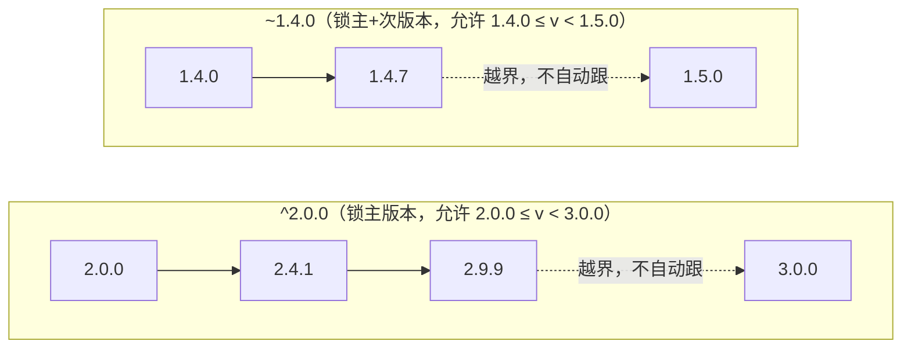
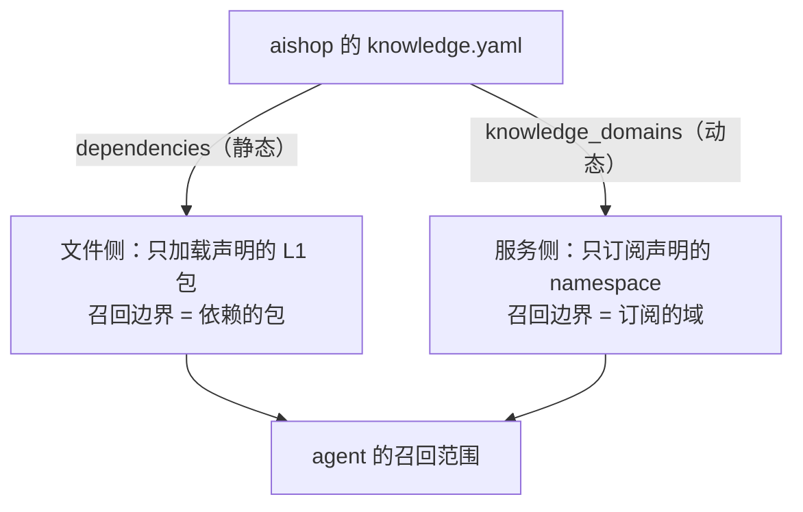

走到这一章开头，`aishop-kb` 已经是一座分了层的知识库。第 8 章把它拆成 L0 组织基础层、L1 领域包、L2 仓库本地层，目录长这样：

```
aishop-kb/
  kb/
    L0/base.md                      # 组织级：提交规范、安全红线
    L1/kb-orders/knowledge.md       # 领域包，此刻只是一个 Markdown
    L1/kb-inventory/knowledge.md
    L1/kb-refund/knowledge.md       # "退款超过 5000 元需人工审核"
  repos/aishop/AGENTS.md            # 依赖: kb-orders, kb-inventory, kb-refund
  cli/                              # aishop-kb coverage
```

分层解决了"知识放哪、谁默认继承谁"，却留下三个治理洞。每个 L1 包还只是一个 `knowledge.md`，缺三样东西：

1. 没有版本：`kb-refund` 改了内容，下游无从知道该跟到哪一版。
2. 没有 owner：规则出了问题，不知道找谁改、谁审。
3. 没有新鲜度：一条规则半年没人复核，也看不出它是否还成立。

`repos/aishop` 那行 `依赖: kb-orders, ...` 同样朴素，它能圈召回范围，却无法被工具校验。本章给每个 L1 包补上一份 `knowledge.yaml` 包清单（name/version/owner/deps）和五字段 frontmatter，再把那行依赖升级成可校验的仓库清单。

## 9.1 本章你会得到什么

1. 每个 L1 包一份 `knowledge.yaml` 包清单（name/version/owner/deps）加五字段 frontmatter；本章给出 `kb-refund` 加完后的完整快照。
2. `aishop` 仓库根的 `knowledge.yaml`：把一行依赖升级成带 semver 区间的清单，同时划定文件侧与服务侧两条召回边界。
3. 一套分级 TTL 的新鲜度门禁：`last_reviewed` 配 TTL，超期未复核的知识自动告警。
4. `examples/deps-metadata/` 里可跑的 manifest 解析器加 frontmatter 校验器，输出一份 1 错 2 警、可直接挂 CI 的报告。

## 9.2 包的身份：knowledge.yaml 清单

先看一个 `aishop-kb` 里真实会踩的坑。`kb-refund` 最初只装退款规则，有人图省事，把运费计算规则也并了进去，反正都跟钱有关。

运费口径几乎每周调，退款阈值一年动一次。等到给包配上版本号，这个粒度错误立刻显形：运费每改一次，`kb-refund` 就得升一次版本。

所有只依赖退款规则的仓库，都收到升级提示、被拉去重新 review，它们和运费毫无关系。`kb-refund` 的版本号，被运费的变更节奏绑架了。

要防住这类问题，先得让每个包有正式身份：它叫什么、现在是哪一版、归谁管、又依赖谁。这就是包清单 `knowledge.yaml` 的职责。`kb-refund` 加完清单后长这样：

```yaml
# kb/L1/kb-refund/knowledge.yaml —— 包的身份清单
name: "@kb/refund"
version: 2.1.0            # 包自身的当前版本
owner: 李四               # 包的维护者
deps:                     # 包也可以依赖别的包
  "@kb/orders": "^3.0.0"  # 退款要引用订单状态机
```

四个字段各管一件事：

- `name`：包在依赖图里的唯一标识，`@kb/` 前缀标明它是知识包。
- `version`：包当前发布到的版本，下游用它来 pin。
- `owner`：包的维护责任人。
- `deps`：这个包自身依赖的其他包，让知识依赖能像代码依赖一样成图。

包清单里的 `owner` 是包级维护者，和后面 frontmatter 里的文件级 `owner` 分工不同。`kb-refund` 只有一个知识文件时两者重合，包一旦装进多份文档，它们就会分开。

### 9.2.1 清单与 lockfile 的分工

包清单只声明"我是谁、我要什么范围"，不锁定"最终解析到哪个精确版本"。后者是 lockfile 的职责。

清单写版本范围（`^3.0.0`），lockfile 记录某次解析真正落到的精确版本（`3.4.2`），保证团队每人、每次 CI 拉到同一份知识快照。

这套"范围声明 + 精确锁定"的分工，与 npm 的 `package.json` + `package-lock.json` 完全同构。本章示例的解析器只处理清单一侧，lockfile 的生成留给分发工具链（第 13 章）。

## 9.3 语义版本映射知识变更

`version` 和 `deps` 里的范围用的都是语义版本（semantic versioning，简称 **semver**，形如 `主版本.次版本.修订号`）。

把 semver 搬到知识上，解决的正是上面那行"没有版本"的洞：知识包会变，下游需要一种机制，在自动获得改进与不被破坏性变更打穿之间取舍。

### 9.3.1 版本号对应的内容变更语义

代码包用 semver 表达 API 兼容性，知识包用它表达内容兼容性。三级版本号各对应一类知识变更：

- 修订号 +1：不改变规则含义的修正，如改错别字、补例子、润色措辞。
- 次版本 +1：向后兼容的新增。加一整套新退款场景，老规则不动，下游不读新规则也不出错。
- 主版本 +1：破坏性变更。改掉一个会左右 agent 行为的数值（如把审核阈值从旧值调到 `5000`）、废弃一条被广泛引用的老规则、或改掉某个概念的定义，下游按旧理解行事就会错。

这套映射给"知识包该怎么发版"定了可操作的判据。写包的人每次改动都要自问一句：这次变更会不会让按旧版本理解的下游出错？

不会，就是次版本或修订号；会，就必须升主版本，并在 changelog 里写清迁移方式。

### 9.3.2 `^` 与 `~` 的升级区间

下游用版本范围声明"愿意自动跟到哪"。`^` 锁主版本，允许次版本和修订号自动升；`~` 锁主加次版本，只允许修订号自动升。

`aishop` 对 `@kb/refund` 写 `^2.0.0`，意思是 2.x 的次要更新自动跟、3.0.0 这种大版本不盲跟；对更新节奏敏感的 `@kb/inventory` 写 `~1.4.0`，把自动升级压到只收修订号。两种区间如图 9-1。



图 9-1：semver 版本范围。`^` 只锁主版本，次版本和修订号都能自动升；`~` 锁到次版本，只有修订号能自动升。越过边界的版本可能含破坏性变更，不会被自动跟上，需下游显式抬高范围才引入。

### 9.3.3 包粒度：一起变、一起被依赖

回到运费那个坑。它暴露的是包粒度问题，semver 给了它精确的切法：**按"一起变、一起被依赖"的边界切包。**

一组规则若总是同时修改、又总被同一批仓库依赖，就该是一个包。若某条规则的变更节奏、owner、使用方都和其他规则不同，它值得单独成包。

运费和退款正好相反：变更节奏差一个数量级（周对年），使用方也不重叠。硬塞进一个包，退款下游就被运费的高频变更反复惊动，版本号再也无法告诉它们这次动的是退款还是运费。

反过来追求"一条规则一个包"同样有害：包越碎，清单越长，依赖图越难维护，收益递减。**变更节奏不同的知识塞进一个包，等于把版本号交给最吵闹的那部分内容。**

## 9.4 依赖声明即召回边界

包有了身份，下一步是让仓库声明它依赖哪些包。第 8 章那行 `依赖: kb-orders, ...` 在这里升级成 `aishop` 仓库根的 `knowledge.yaml`：

```yaml
# aishop 仓库根的 knowledge.yaml
extends: "@kb/base@^2.0.0"        # L0 组织级基础层，跟主版本
dependencies:                      # L1 静态知识包，带 semver 区间
  "@kb/orders": "^3.1.0"
  "@kb/inventory": "~1.4.0"
  "@kb/refund": "^2.0.0"
knowledge_domains:                 # 动态知识：只声明订阅哪些 namespace
  - payment/*
  - risk/blocklist
local: ".kb/local/"                # L2 本地增量目录
```

这份清单把一行依赖扩成四块：

- `extends`：继承哪个 L0 组织基础层。用 `extends` 而非 `dependencies`，强调它是所有仓库默认继承的底座，不是可选领域包。
- `dependencies`：带 semver 区间的 L1 静态依赖，清单主体，也是"选择性依赖"的落点，写谁就召回谁。
- `knowledge_domains`：订阅哪些动态知识 namespace，不引入任何内容进仓库。
- `local`：L2 本地增量目录，还没上收到共享包的知识先落这里（第 16 章）。

`dependencies` 和 `knowledge_domains` 分开，不是排版，是两类知识载体的分界。前者是静态知识，后者是动态知识，两侧共同决定 agent 的召回范围。

### 9.4.1 静态知识：包边界即召回边界

静态知识（规范、约定、架构决策，体积小、要版本化）走 `dependencies`，包化进 git。仓库依赖哪些包，agent 的召回就只在这些包里发生。

`aishop` 依赖 orders、inventory、refund 三个包，它的 agent 检索本地知识时视野被这三个包框死。别的领域包即便存在于组织知识仓库里，也不进入这个仓库的召回范围。

不 install 的包，天然不会污染召回。选择性依赖在这里同时就是裁剪检索污染的手段。

### 9.4.2 动态知识：namespace 订阅即召回边界

大规模动态知识（海量代码文档、API、语料，体积大、变化快，不适合塞进 git）走 `knowledge_domains`。仓库不把内容拷进来，只声明订阅哪些 namespace（命名空间，给动态知识划分的域，如 `payment/*`）。

内容留在服务端注册表里，也就是能力阶梯阶段 2 要搭的知识 MCP 服务（第 10 章）。这个订阅声明有一个关键性质：它同时就是召回范围过滤器。

`aishop` 订阅了 `payment/*` 和 `risk/blocklist`，它的 agent 向知识服务检索时，服务端只在这两个 namespace 内召回，其余领域根本不参与相似度计算。这里的 `payment`、`risk` 是区别于三个 L1 静态包（`kb-orders`/`kb-inventory`/`kb-refund`）的另一批动态语料示意，特意换个命名，避免与第 10 章 orders/inventory/refund 那组 namespace 混淆。这条边界后续还要承担第二重职责，也就是权限隔离，留到第 11 章展开。

静态用包边界、动态用 namespace 订阅，载体不同，但"你声明什么就召回什么"是同一条规则，且都由 `knowledge.yaml` 一处声明（图 9-2）。



图 9-2：依赖声明即召回边界，在文件侧与服务侧是同一套机制。静态知识靠依赖的包圈边界，动态知识靠订阅的 namespace 圈边界，两侧都由 manifest 一处声明，共同决定 agent 能看到的知识范围。

这套机制把"圈定召回范围"从检索时的运行时过滤，前移成了分发时的声明。**仓库写下依赖的那一刻，就已经决定了它的 agent 能看到什么、看不到什么。**

## 9.5 五字段 frontmatter：让每份知识可治理

版本和依赖解决了"包怎么升、仓库依赖谁"，还差一层：每份知识文件本身得能被治理，归谁管、何时验证过、是否还算数。这靠给每个知识文件头部加一段 frontmatter。

本书采用一套五字段 schema，直接对标 `ai-asset-standards`（本组织已有的资产标准）。`kb-orders/knowledge.md` 的头部：

```yaml
---
title: 订单规则
type: reference          # Diátaxis 四象限之一（教程/操作/参考/解释，见第 17 章）
owner: 张三              # 谁对这份知识负责
last_reviewed: 2026-06-10 # 最后一次人工确认有效的日期
status: active           # active | deprecated
---
```

### 9.5.1 五字段各自对应一种治理动作

这五个字段不是登记表。每一个都挂着一个具体的治理动作，缺任何一个都留一处治理盲区（表 9-1）。

表 9-1：知识包元数据五字段及其治理语义

| 字段 | 含义 | 对应的治理动作 | 缺失或失效的后果 |
|---|---|---|---|
| `title` | 知识的标题 | 索引、检索命中时的展示 | 无标题，无法被人和工具正确引用 |
| `type` | Diátaxis 四象限归类 | 决定读者以何种预期消费（见第 17 章） | 教程与参考混淆，读者定位错 |
| `owner` | 责任人 | 出问题找谁、谁有权改、审核归谁 | 无主的僵尸文档，冷启动判"丢弃"的依据之一（第 7 章） |
| `last_reviewed` | 最后人工确认有效的日期 | 配合 TTL 做新鲜度告警 | 无法判断是否过期，漂移无从检测 |
| `status` | `active` / `deprecated` | 废弃标记，让 agent 别再取用 | 废弃知识仍被当作有效知识召回 |

校验它的方式，就是一个能进 CI 的脚本。`ai-asset-standards` 里的 `check-frontmatter.mjs` 正是干这个的，本章示例实现了一个最小版。**五字段元数据是知识包与一堆 Markdown 的分水岭。**

## 9.6 last_reviewed 与分级 TTL 的新鲜度治理

五字段里，`last_reviewed` 最容易被写成一次性摆设，它其实是新鲜度治理的抓手。

单看一个日期没有意义，把它配上一个 TTL（time-to-live，存活期）才成为门禁：超过 TTL 未复核的知识自动标红，提醒 owner 回来确认这条规则还成不成立。

本章示例取 90 天作 TTL，参考日固定为 2026-07-06。`kb-refund` 的 `last_reviewed` 停在 2026-01-01，已 186 天，越过 90 天线，触发新鲜度告警。

### 9.6.1 按 type 分级的 TTL

不同类型的知识衰减速度天差地别，成熟的治理应按 `type` 或包给 TTL 分级，而非一刀切：

- 频繁调整的业务阈值（如运费口径）衰减快，TTL 该短到 30 天。
- 相对稳定的架构决策记录衰减慢，TTL 给到半年甚至更长也不虚。

TTL 的意义不在强制谁改内容。复核后哪怕内容一字未动，也要把 `last_reviewed` 推到今天，向下游证明这条知识刚被确认过、仍然有效。

**TTL 强制的从来不是改内容，而是一次人工确认。**这一步把新鲜度从主观感受变成可审计信号，也是第 22 章漂移检测的地基。

## 9.7 动手：解析 manifest 与校验元数据

`examples/deps-metadata/` 做两件事，全用 Node 内置模块、零运行时依赖。

第一，`src/manifest.ts` 解析 `aishop/knowledge.yaml`，解出继承的 L0、带版本的 L1 依赖、订阅的 namespace、本地目录。`src/main.ts` 再把这份解析结果打印成这个仓库完整的召回边界。为保持零依赖，解析器针对本清单结构手写，生产环境换成 `js-yaml` 即可。

第二，`src/validate.ts` 扫描每个 L1 包的 frontmatter，检查五字段是否齐全、`last_reviewed` 是否超过 90 天 TTL、有没有 `status: deprecated` 却仍被依赖的包。检查结果汇成一份可直接进 CI 的报告。

示例仓库在 `aishop` 的清单里刻意多依赖了一个 `@kb/legacy-shipping`（一个已废弃的包），好把三类问题都触发出来。跑 `npx tsx src/main.ts`，你会看到召回边界被清单完整圈定，校验器则报出：

- `kb-orders`：五字段齐全且新鲜，OK。
- `kb-inventory`：缺 `owner`，ERROR（治理缺口）。
- `kb-refund`：`last_reviewed` 已 186 天超过 TTL，WARN（新鲜度告警）。
- `kb-legacy-shipping`：`status: deprecated` 却仍被依赖，WARN（下游该迁移）。

合计 1 个错误、2 个告警。因为存在硬错误，脚本以非零退出码结束，可直接当 CI 门禁挂上流水线。这三类问题正是后面治理章要系统解决的，这里先让它们从靠人记得变成机器必检。

## 本章要点

- 包清单 `knowledge.yaml`（name/version/owner/deps）给每个包一个可发版、可依赖的正式身份；清单声明版本范围，lockfile 锁定精确版本，分工与 npm 的 `package.json` + lock 同构。
- 语义版本让知识包像代码包一样可控升级：修订号是不改含义的修正、次版本是向后兼容的新增、主版本是破坏性变更；下游用 `^`/`~` 声明自动跟随区间。
- 包按"一起变、一起被依赖"切粒度：一旦把变更节奏差一个数量级的知识合进同一个包，高频那部分就会绑架整个包的版本号，让稳定内容的下游被反复惊动。
- "依赖声明即召回边界"在文件侧（依赖的包）与服务侧（订阅的 namespace）是同一套机制，由清单一处声明，把圈定召回范围从运行时过滤前移为分发时声明。
- 五字段 frontmatter（title/type/owner/last_reviewed/status）让每份知识可治理：owner 定责、last_reviewed 配分级 TTL 管新鲜度、status 管废弃，是漂移检测（第 22 章）的地基。

## 下一章

清单和元数据让 `aishop-kb` 的知识可依赖、可治理，但它还只能被 `grep`/`read` 就地导航。第 10 章给 `aishop-kb` 装上第二条 CLI 命令 `serve`，起一个知识 MCP 服务，让这些知识第一次能被任意 agent 跨厂商接入。

## 配套代码

见 `examples/deps-metadata/`。

---

> 本章来自《Agent 知识库工程实战：组织、分发、共建与度量》开源版 · 作者「递归客」
> 在线阅读完整书系：[inferloop.dev](https://inferloop.dev)
