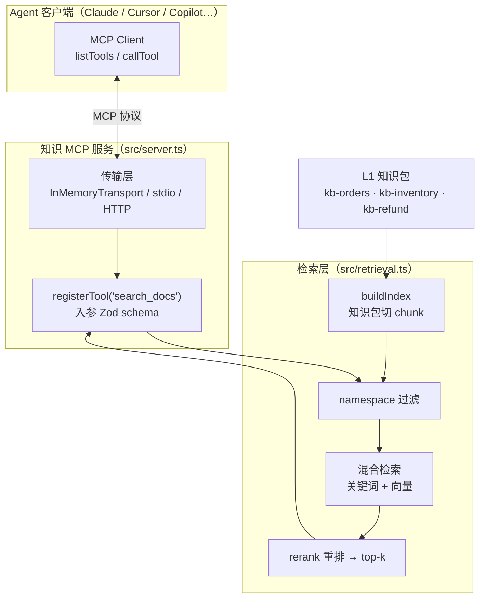
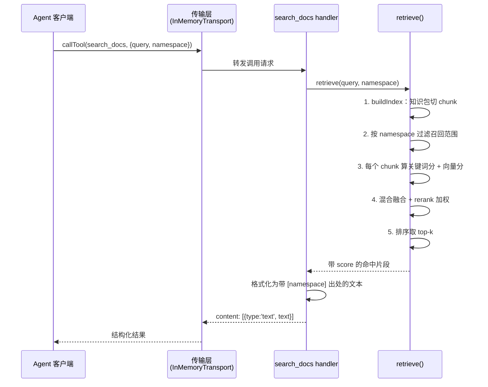

走到这一步，`aishop-kb` 已经长成一座像模像样的文件式知识库了。它现在的样子：

```
aishop-kb/
  kb/
    L0/base.md                      # 组织级：提交规范、安全红线
    L1/kb-orders/knowledge.md       # 领域包
    L1/kb-orders/knowledge.yaml     #   带 version / owner / 依赖
    L1/kb-inventory/…
    L1/kb-refund/…                  # "退款超过 5000 元需人工审核"
  repos/aishop/AGENTS.md            # 依赖: kb-orders, kb-inventory, kb-refund
  cli/                              # aishop-kb coverage  ← 第 5 章加的第一条命令
```

第 6 到 9 章把它从一个 `docs/` 文件夹，升级成了分层、带版本、带元数据的知识包；`aishop-kb` 的 CLI 也有了第一条命令 `coverage`，能扫覆盖度、找盲区。agent 用 `grep`/`read` 直接导航就能取用这些知识。**对绝大多数团队，到这里就是终点。**

但 `aishop-kb` 开始积累一类新知识：跨包、模糊、要按语义聚合的问题，比如"关于退款的所有约束有哪些"——它横跨 refund、risk、orders 三个包，没有一个符号能定位它。文件导航答不好这类问题。

这一章给 `aishop-kb` 加上第二条命令 `aishop-kb serve`：起一个知识 MCP 服务，让它的知识第一次能被任意 agent 跨厂商接入。

## 10.1 本章你会得到什么

1. 一条判断"何时该从文件式升级到服务"的准入门槛——三类升级信号，不满足就别升。
2. 一个用官方 TS SDK 手搭、能被真实客户端连上的最小知识 MCP 服务。
3. 检索层的四个调优旋钮（分块 / embedding / 混合检索 / rerank）该怎么选、怎么换到生产。
4. `aishop-kb serve` 命令：`examples/knowledge-mcp/` 里可运行的落地，把三个知识包索引进来、按 namespace 圈范围对外提供检索。

## 10.2 服务化的准入门槛

先划门槛，再谈实现。文件式知识的失效，不是"文档变多了"这种模糊的量变，而是三类结构性信号中任意一类越过了阈值。

1. 知识规模超出遍历检索的可行域。确定性导航的前提，是 agent 能靠符号或路径把答案圈进少数几个文件。当知识膨胀到几万篇、且答案位置无法由符号预测时，`grep` 退化成全库扫描，单次检索的 token 与延迟不可接受。判断标准不是文档数，而是"一个典型问题能否用一两个符号定位"——只要还能，规模再大也不必上服务。
2. **跨源聚合。** 知识散在多个仓库、wiki、工单系统里，无法预先 scope 进单一工作区。文件式导航依赖"知识与代码同仓库"，跨源场景下这个前提不成立，需要一个统一端点把多源召回收敛到一处。
3. **开放式语义问答。** 文件式擅长"某条规则是什么"这类边界明确的查询，不擅长"关于退款的所有约束有哪些"这类需要跨文档聚合、按语义逼近的模糊查询。后者正是向量检索的适用域（见第 1 章）。

**三类信号任一成立，才值得承担阶段2 的运维成本。** 向量库、embedding 服务、索引重建管线，都是需要长期维护的实体基础设施。反过来，若知识仍是"按包 scope、按符号定位"的近处知识，停在文件式就是正解。

本章后续默认 `aishop-kb` 已越过门槛：它既有代码衍生的近处知识，也开始积累跨包、需要语义召回的远处知识。

## 10.3 MCP：跨厂商的暴露协议

越过门槛后第一个决策是：选什么协议把知识暴露出去。答案是 MCP（Model Context Protocol，模型上下文协议，Anthropic 于 2024 年底提出的开放标准）。

选它的理由单一而决定性：**它是目前唯一被主流 agent 工具共同采纳的开放协议。** 一个 MCP 服务可同时被 Claude、Cursor、GitHub Copilot、Codex、Windsurf、ChatGPT 接入，一次实现、处处复用，不必为每个客户端各写一套适配。

这是第 2 章能力阶梯里"对外暴露形态"的第二级：按 namespace 圈定复用范围的跨厂商接口。

MCP 的接口模型分三层。理解这三层，才能看懂示例代码里每一段的职责（图 10-1）。

### 10.3.1 传输层：字节流的载体

传输层（transport）负责客户端与服务端之间的字节流。生产常用两种：`stdio`（服务作为子进程，走标准输入输出，适合本地工具）和 Streamable HTTP（服务作为独立/远程进程，适合团队共享的端点）。

本章示例用第三种——`InMemoryTransport`，客户端与服务在同一进程内用一对内存管道直连。选它是为了让示例零网络依赖、离线端到端跑通。把它换成 HTTP 传输，上层的 tool 定义与检索逻辑一行都不用改。

### 10.3.2 协议层：工具的发现与调用

服务端把能力注册为若干 `tool`（工具），每个 tool 有名字、自然语言描述、和用 JSON Schema 声明的入参。客户端先 `listTools` 发现有哪些 tool，再按需 `callTool` 调用、拿回结构化结果。

对知识服务，最核心的 tool 就一个 `search_docs`——入参是查询串与可选 namespace，返回带出处的知识片段。

### 10.3.3 检索层：tool 背后的真正工作

检索层是 tool handler 内部的实现，与 MCP 协议本身解耦。MCP 只规定"有个叫 `search_docs` 的 tool 接受 query 返回 text"，至于这段 text 怎么检索出来——分块、向量、混合、重排——协议一概不管。

这种解耦是有意的：它让你先用最朴素的检索跑通协议，再独立地把检索质量往上迭代，两件事互不阻塞。



图 10-1：知识 MCP 服务的三层架构。传输层与协议层由 MCP SDK 提供，检索层是自建实现；`aishop-kb` 的三个 L1 知识包在 `buildIndex` 里被切成 chunk，每个包对应一个 namespace。各文件路径对应 `examples/knowledge-mcp/`。

## 10.4 用 TS SDK 手搭最小服务

用官方 TypeScript SDK（`@modelcontextprotocol/sdk`）搭这个服务，落到代码上是两个文件：`server.ts` 定义并注册 tool，`smoke.ts` 起一个客户端连上去真实调用。

### 10.4.1 注册 search_docs 工具

服务端用 `McpServer` 的 `registerTool` 注册工具，入参 schema 用 Zod（一个 TS 的运行时类型校验库）声明。摘自 `src/server.ts`：

```ts
server.registerTool(
  'search_docs',
  {
    description: '在 aishop 知识库检索相关片段，可用 namespace 圈定范围（orders / inventory / refund）',
    inputSchema: { query: z.string(), namespace: z.string().optional() },
  },
  async ({ query, namespace }) => {
    const hits = retrieve(query, namespace); // 检索层实现，见 retrieval.ts
    const text = hits.length
      ? hits.map((h) => `- [${h.namespace}] ${h.text}　(score ${h.score.toFixed(2)})`).join('\n')
      : '未召回任何片段';
    return { content: [{ type: 'text', text }] };
  },
);
```

工具的 `description` 不是注释，而是给 agent 看的。客户端 `listTools` 时拿到的就是这段描述，agent 据此判断何时调、namespace 填什么。描述里显式列出可选 namespace，是为了让 agent 能自行把查询 scope 到正确的域。

返回值里每条片段都带 `[namespace]` 前缀作为出处。出处是知识可信度的一部分，不能丢——agent 拿到知识的同时得知道它来自哪个包。

`namespace` 参数直接决定召回范围，这是第 9 章"依赖声明即召回边界"在服务侧的兑现：**agent 订阅了哪个 namespace，服务就只在那个域里召回。**

### 10.4.2 端到端连接与调用

服务定义完，用 `InMemoryTransport` 起一个真实客户端验证整条链路。`InMemoryTransport.createLinkedPair()` 造出一对相连的传输端，一端接服务、一端接客户端，随后客户端就能 `listTools` 和 `callTool`，与走网络传输时的 API 完全一致：

```ts
const [clientTransport, serverTransport] = InMemoryTransport.createLinkedPair();
await server.connect(serverTransport);
await client.connect(clientTransport);

const tools = await client.listTools(); // 发现服务暴露的 tool
const res = await client.callTool({
  name: 'search_docs',
  arguments: { query: '退款超过多少要人工审核', namespace: 'refund' },
});
```

一次 `search_docs` 调用的完整时序见图 10-2。



图 10-2：一次 `search_docs` 调用的完整时序。第 2 步的 namespace 过滤在最前端收窄范围，第 3 至 5 步是检索层内部的混合检索与重排。示例为离线零依赖，把过滤、混合、rerank 揉进同一个 `retrieve()` 一次算完（对应 `retrieval.ts`），没有真的把候选送去独立 rerank 服务往返；生产把 rerank 拆成独立服务时，才会在第 4 步多一次网络往返。

## 10.5 检索调优的四个旋钮

`retrieve()` 内部的检索质量，由四个工程旋钮决定。这一节只讲工程选型与取舍，不推算法——本书的立场是让工程师**会选、会调，而不是会推公式**。示例 `retrieval.ts` 把四个旋钮都实现成零依赖的最小版，让数据流看得清；每个都留了"换生产实现"的插槽。

### 10.5.1 分块：检索单元的粒度

分块（chunking）把长文档切成可检索的单元。旋钮是块大小与重叠：块太大则召回不精准，块太小则语义被切碎（一条规则的前提与结论被分到两个 chunk）。

对结构化知识文档，优先按语义边界切——Markdown 小节、列表项、一条完整规则——而非按固定字数硬切。示例的 `aishop-kb` 知识包每行一条独立规则，就按行切，"退款超过 5000 元"和"需人工审核"不会被拆开。生产文档结构更复杂时，按标题层级切、相邻块留少量重叠，是更稳的默认。

### 10.5.2 embedding：看 MTEB retrieval 轨，别只看榜首

embedding 是把文本映射成向量的模型，召回质量首先取决于它。选型有公开榜单 MTEB（Massive Text Embedding Benchmark）可参考，重点看它的 retrieval 子轨而非综合分。

榜单分数之外，有三个工程约束往往更关键：

1. 向量维度：维度越高，存储与检索开销越大，1024 维和 384 维的库体积差近三倍。
2. 最大输入长度：它必须容得下你的 chunk，否则超长部分被截断。
3. 自托管还是调 API：涉及数据是否出域的合规问题。

榜单变化很快，引具体分数务必标日期。示例用本地词袋余弦冒充 embedding，纯为离线跑通；生产换真模型，不改检索层其余结构。

### 10.5.3 混合检索：补上纯向量的盲区

只用向量检索会在一类场景系统性漏召回：精确关键词匹配。向量度量语义相似度，而查一个确切的字段名、错误码、API 名时，需要的是字面精确命中，语义相似反而会把"长得像但不是"的结果排上来。这与第 1 章那个现象同源——权威定义用词精炼，纯向量下反倒排名靠后。

混合检索（hybrid）同时跑关键词检索与向量检索、再融合两路得分：关键词路保精确，向量路保语义。生产里关键词路常用 BM25（Elasticsearch/Lucene 的默认排序算法）。示例里 `keywordScore` 与 `vectorScore` 就是这两路的最小版，融合成一个加权分：

```ts
// 混合：向量分 + 关键词覆盖率；rerank：关键词精确命中额外加权，把"字面对得上"的顶上来
const score = 0.5 * vec + 0.5 * Math.min(1, kw / Math.max(1, q.length)) + 0.3 * kw;
```

### 10.5.4 rerank：两段式换精度

召回阶段追求"广"——尽量不漏，通常放宽阈值多召回一批候选。但候选多了，排在前面的未必最相关。rerank（重排）是两段式检索的第二段：对第一段召回的 top 候选，用一个更强、更慢的模型二次打分排序。

两段式的价值在分工：第一段快而广，第二段准而慢，只对少量候选跑昂贵模型。生产用专门的 cross-encoder 重排模型；示例里上式 `0.3 * kw` 这一项就是朴素 rerank，让关键词精确命中的片段额外加分顶上来。

四个旋钮串起来，就是图 10-2 第 3 至 5 步、也就是 `retrieve()` 的执行顺序：切 chunk → namespace 过滤 → 关键词分 + 向量分 → 混合融合与 rerank 加权 → 排序取 top-k。不必一上来全开到生产强度，先看清数据流，再逐个把 embedding、rerank 换成生产模型，架构骨架不变。

### 10.5.5 从示例到生产：一条 pgvector 路径

示例用内存索引与词袋向量，生产的标准落地是把索引与向量落进 pgvector（PostgreSQL 的向量扩展）。迁移路径清晰而不改架构：

- `buildIndex` 从"读文件切行"换成"离线把每个 chunk 过 embedding 模型，连同 namespace 与出处写入一张带 `vector` 列的表"。
- `retrieve` 从"内存遍历打分"换成一条 SQL——`WHERE namespace = $1` 做过滤、`ORDER BY embedding <=> $query_vec` 做向量近邻、再叠一路全文检索做关键词。

namespace 过滤在这里从内存 `filter` 变成 SQL 的 `WHERE`，但"订阅即召回边界"的语义完全一致。`server.ts` 与 `smoke.ts` 一行不用动——**这正是把检索层与协议层解耦的回报。**

## 10.6 动手：给 aishop-kb 装上 serve 命令

`examples/knowledge-mcp/` 是本章的可运行落地，也就是 `aishop-kb serve` 这条命令的雏形。它用官方 TS SDK 搭一个真能连的知识 MCP 服务，把 `aishop-kb` 的三个 L1 知识包（`orders`、`inventory`、`refund`）索引进去，每个包挂一个 namespace。

`search_docs` 做"namespace 过滤 → 混合检索 → rerank → 带出处返回"，再用 `InMemoryTransport` 连一个客户端真实调用。

跑起来（`npm install && npm start`）会看到两次调用的对照：

- 问"退款超过多少要人工审核"并限定 `namespace='refund'`，服务只在退款包召回，返回"退款金额超过 5000 元需人工审核"作 top、带 `[refund]` 出处。
- 换成不带 namespace 的"大促库存要怎么处理"，则跨包召回、命中库存包的扩容规则。

限定 namespace 时只在该域召回、不限定则跨包，这就是"订阅即召回边界"在服务侧生效。

## 本章要点

- 从文件式升级到 MCP 服务有明确门槛：知识规模超出遍历检索、跨源无法单仓库 scope、需要开放式语义问答——三类信号任一成立才升，否则停在阶段0/1，别为用不上的规模付运维成本。
- MCP 是唯一被主流 agent 工具共同采纳的开放协议，一次实现处处复用。接口分传输层、协议层、检索层，检索层与协议解耦，可先跑通协议再独立迭代检索。
- 手搭核心是 `registerTool` 注册 `search_docs`、`InMemoryTransport` 端到端验证；tool 的 description 是给 agent 看的调用依据，返回片段必须带 namespace 出处；namespace 参数是"订阅即召回边界"的服务侧兑现。
- 检索调优四旋钮：分块按语义边界、embedding 看 MTEB retrieval 轨并权衡维度/长度/合规、混合检索补关键词盲区、rerank 两段式换精度。换到 pgvector 不动 MCP 骨架。

## 下一章

`aishop-kb` 现在有了 `serve` 命令，知识第一次能被任意 agent 接入。但一个服务端立刻带来两个新问题：namespace 该怎么划、谁能召回哪部分知识（权限）。第 11 章把召回边界工程化，并兑现第 2 章的承诺——把 GitMCP、Context7 这类现成的代码衍生层直接声明为依赖，而不自建。

## 配套代码

见 `examples/knowledge-mcp/`。

---

> 本章来自《Agent 知识库工程实战：组织、分发、共建与度量》开源版 · 作者「递归客」
> 在线阅读完整书系：[inferloop.dev](https://inferloop.dev)
