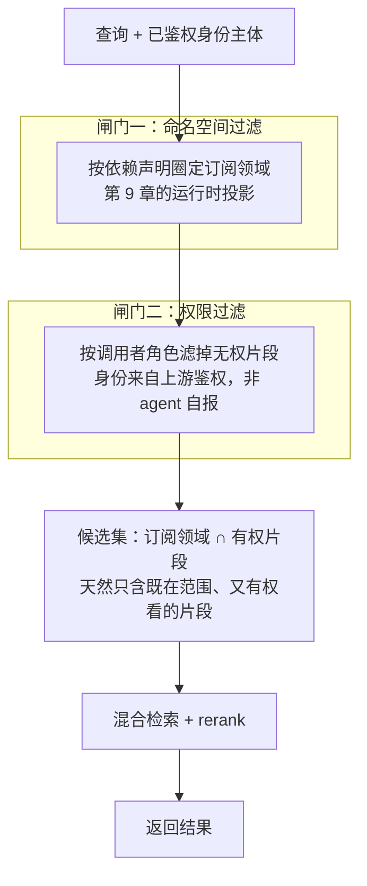
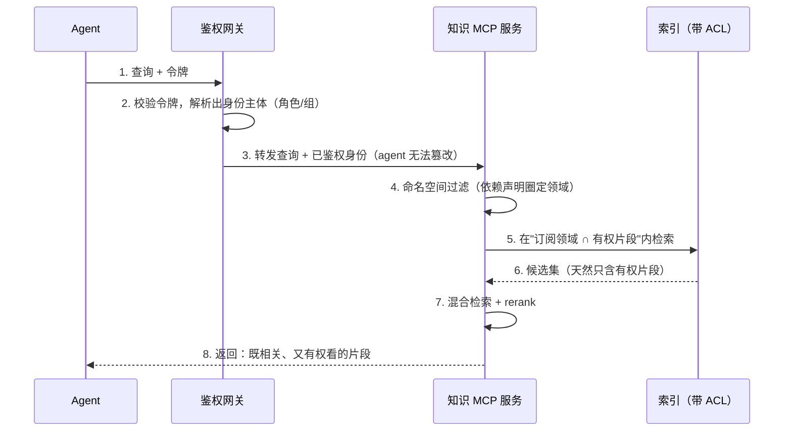

上一章给 `aishop-kb` 装上了 `serve` 命令。它现在的 CLI 有两条命令，对外多了一个 MCP 端点：

```
aishop-kb/
  cli/
    coverage                # 第 5 章：扫覆盖度、找盲区
    serve                   # 第 10 章：起知识 MCP 服务，按 namespace 圈范围
  kb/L1/kb-orders/…         # orders / inventory / refund 三个知识包
  examples/knowledge-mcp/   # serve 的可运行落地
```

知识第一次能被任意 agent 跨厂商接入。但这个端点有个缺口：它按 namespace 圈了"在哪个领域查"，却没圈"这个领域里谁能看哪些"。任何连上来的 agent，都能召回它订阅领域内的全部片段。

本章给 `aishop-kb` 的服务端把召回边界工程化：在命名空间之外补上权限这道闸门，让 `refund` 领域里的风控细则只对财务角色可见；再接一类现成端点作依赖，避免重复造轮子。

## 11.1 本章你会得到什么

1. 一道加在检索层的权限闸门：给知识片段标注可见角色，召回时按调用者身份过滤，无权片段从不进入候选集。
2. 一份权限感知召回的时序，说清身份主体为什么必须来自上游鉴权、而非 agent 自报。
3. 一张与开源企业搜索 Onyx 的逐维度对标表，标出手搭版本与企业级成熟形态的分界线。
4. 一段同时挂两类 MCP 端点的客户端配置：自建服务管私有业务知识，GitMCP / Context7 管公开的代码衍生知识。

## 11.2 一次不该发生的召回

客服 agent 处理一张退款工单，向上一章的知识服务发起查询：

```
callTool search_docs { query: "这个订单能不能退", namespace: "refund" }
→ - [refund] 命中风控名单的订单不允许自动退款。
```

这条判定规则来自风控，属于内部名单口径，客服角色不该看到它。它却随退款查询一起被召回了，因为服务只按 namespace 圈了领域，没有按身份圈可见片段。

企业知识天然带访问约束。财务的退款审核口径、风控的名单规则、法务的合同模板，都存在于某个明确领域里，却不该被任意一个 agent 召回。

召回边界因此要由两道闸门构成：

1. 命名空间：按知识的归属领域切分范围，回答"在哪个领域里查"，来自仓库的依赖声明（第 9 章）。
2. 权限：按调用者的身份切分同一领域内的可见片段，回答"这个领域里谁能看哪些"，来自角色与数据源的访问控制。

两道闸门在机制上同构：都在召回那一刻把范围缩小，而不是召回之后再删。上一章已经装好第一道，本章把第二道加进检索层。

## 11.3 依赖声明如何成为召回过滤器

第 9 章确立过一条主张：仓库的依赖清单不只是安装列表，它同时是召回范围的过滤器。这一节把这条主张落到检索层，说清"声明"到"过滤"之间那一步怎么发生。

### 11.3.1 命名空间是依赖声明的运行时投影

仓库在 `AGENTS.md` 或依赖清单里声明订阅哪些知识包，本质是声明一组命名空间。检索层拿到这组命名空间，把它作为召回的第一道 `WHERE` 条件：查询只在被订阅的命名空间内进行。

一个只声明依赖了 `orders`、`refund` 的仓库，其 agent 永远不会召回 `hr`、`legal` 的片段。不是因为那些片段不相关，而是因为它们从未进入这个仓库的召回范围。

这层投影是"够用就别升级"原则在检索侧的体现。命名空间过滤把范围锁在依赖图之内，避开了全局大库那种"什么都能搜到、于是什么都搜不准"的检索污染。范围越窄，top-k 信噪比越高——这与向量库规模无关，只与召回范围的圈定方式有关。

### 11.3.2 声明式过滤是一道负向前置闸门

依赖声明作为过滤器，作用方向是负向的：它规定的不是"要召回什么"，而是"什么不进入候选集"。这个方向决定了它必须前置。

若把命名空间当成召回后的排序特征——先全库检索、再对结果按命名空间加权——未订阅领域的片段依然被读进了候选集。检索预算被浪费，日志里也出现了本不该出现的知识。**正确的位置是在候选集构建之前就把范围切掉**，让未订阅的命名空间根本不参与相似度计算。

权限过滤与此完全同构，只是切分维度从"领域"换成"身份"。理解了命名空间过滤的负向、前置特性，权限过滤就是同一模式的复用。

## 11.4 权限感知召回

### 11.4.1 事后过滤的两个缺陷

一种直觉但错误的做法是：检索层照常召回所有相关片段，返回给调用者之前，在应用层过滤掉当前身份无权查看的部分。这种事后过滤有两个缺陷，且都不是调参能补救的。

第一是不安全。被过滤掉的无权片段，在过滤发生之前已经被检索层读入内存、可能已写进检索日志与链路追踪。泄露的窗口在"读入"那一刻就打开了，"返回前删掉"只是掩盖症状。

对合规审计而言，"系统读取过但没返回"和"系统从未读取"是两种风险等级。

第二是不准。检索层的 top-k 预算是固定的。若召回的前 k 条里有一半是无权片段，事后过滤后可能只剩两三条；而那些本该排进 top-k 的有权片段，早在召回阶段就被无权片段挤了出去。

事后过滤的结果不是有权知识的完整子集，而是被无权知识污染后的残余。

### 11.4.2 权限下推到检索层

正确做法是**把权限过滤下推到召回阶段**：检索只在"当前身份有权访问"的片段集合内进行。给每个片段标注可见范围，检索时把调用者身份作为一道过滤条件，与命名空间并列，在候选集构建阶段就排除无权片段。

本章示例 `examples/scoped-recall/` 用最小的 ACL（Access Control List，访问控制列表）演示这道下推。`src/retrieval-acl.ts` 里每个片段带一个 `roles: string[]` 字段，`retrieve` 在打分之前先做两道 `filter`：

```ts
const scoped = index
  .filter((c) => (opts.namespace ? c.namespace === opts.namespace : true))
  .filter((c) => c.roles.includes(opts.role)); // 权限下推：无权片段压根不进入检索
```

两道过滤都发生在混合打分之前，无权片段从不进入候选集。如图 11-2 所示，命名空间与权限是叠加生效的两道闸门：查询进来后先按依赖声明圈定的命名空间缩小到"订阅领域"，再按上游鉴权解析出的调用者身份滤掉无权片段，两道闸门叠加后得到的候选集才进入混合检索。



图 11-2：命名空间与权限两道闸门在候选集构建前叠加生效的结构。两道闸门都是负向前置过滤器，未订阅领域与无权片段在此被切掉，根本不参与后续相似度计算与打分。

示例的知识文件把可见角色内联在每一行：

- `kb/refund/knowledge.md` 的三条审核细则都标注 `finance` 可见。
- `kb/orders/knowledge.md` 的"订单 paid 后才能发起退款"标注 `support,finance` 共同可见。

`src/demo.ts` 用同一个问题"退款超过多少要人工审核"分别以两个角色调用。财务角色召回到"退款金额超过 5000 元需人工审核"等细则，客服角色召回为空——不是被排在后面，而是从未进入候选。这正是权限下推与事后过滤的可观测差异。

### 11.4.3 权限感知召回的时序

权限下推要成立，检索层必须在召回那一刻就拿到可信的调用者身份。身份不能由 agent 在查询参数里自报，那等于把闸门的钥匙交给被拦的人。

它应当来自调用链上游的鉴权环节：网关校验过的令牌、会话绑定的用户。检索层只信任这个已鉴权的身份主体。图 11-1 给出加了权限后的召回时序。



图 11-1：权限感知召回的时序。身份主体（步骤 2）由网关而非 agent 提供，命名空间与权限两道过滤（步骤 4、5）都在候选集构建阶段生效，检索层拿到的候选（步骤 6）已经只含有权片段，无权知识从不进入内存与打分。

### 11.4.4 ACL 数据模型的两种形态

给片段标注可见范围，实现上有两种形态，取舍取决于组织规模。

一种是角色内联，像本章示例那样把可见角色直接写进片段元数据（`roles: [finance]`）。它零基础设施、随知识文件走 git，reviewer 在 PR 里就能看到谁改了可见范围。适合角色数量有限、变动不频繁的团队；代价是片段量与角色矩阵变大后，批量调整可见范围要改动大量文件。

另一种是外部 ACL 表。片段只存一个资源标识，可见范围由一张独立的"主体—资源"授权表维护；检索时先查当前身份能访问哪些资源标识，再把这个集合作为召回过滤条件。它能承接企业级的权限规模与频繁变动，代价是引入一张需要与真实权限源保持同步的表。

而"同步"正是下一节 Onyx 要解决的核心难题，也是它社区版与企业版的分界线。

## 11.5 Onyx 对标

自己给检索层加命名空间和 ACL 是一回事，把它做到能扛真实企业的数据源规模、连接器数量与权限同步，是另一回事。Onyx（前身 Danswer，一个可自托管的开源企业搜索与问答系统）提供了企业级成熟形态的完整样本。

截至 2026 年 7 月，它内置约 54 个数据源连接器。它适合作为手搭版本的参照终点，而非照抄对象。

### 11.5.1 入口形态：自身即 MCP 服务

Onyx 内置 MCP server，把整个知识库暴露成一个统一端点，任意 agent 都能连过来检索。这与上一章手搭的知识服务是同一种入口形态——单一 MCP 端点对外、内部聚合多源——区别只在它背后扛的是几十个数据源的规模。

这印证了本书论点 3：无论手搭还是企业级产品，对外暴露知识的正确形态都收敛到 MCP 这一个端点。

### 11.5.2 范围圈定：document set 即命名空间

Onyx 用 document set（文档集，给文档打标分组的集合）圈定召回范围。它的检索工具 `search_indexed_documents` 支持 `document_set_names` 参数，调用方按文档集名指定要检索的范围。

这在作用上等价于本章的命名空间：都是用一个声明把召回范围前置圈定。手搭版本用目录名当命名空间，Onyx 用 document set 当命名空间，机制同构，只是后者带了完整的管理界面与打标流程。

### 11.5.3 权限来源：社区版骨架 vs 企业版连接器同步

这一层必须说准，否则容易误导选型。Onyx 的 ACL 数据模型与"检索期强制过滤"在社区版就有：每个文档带可见范围、检索时按当前身份过滤，正是本章讲的权限下推那层骨架。社区版下你可以手工给文档配可见范围，并享受召回期过滤。

真正属于企业版的，是从数据源自动同步权限这件事。去 Confluence、Google Drive、Slack 这些连接器背后同步"每个人具体能看哪些文档"，让知识库里的可见范围与源系统的真实权限保持一致。

社区版下这些连接器不会填充外部权限，因此不能指望它开箱就能连上 Google Drive 做按人隔离。区分这条边界，是引用 Onyx 时最容易出错、也最需要讲清的一点：**权限过滤的骨架是开源的，权限的自动同步是商业化的**。

### 11.5.4 部署重量与定位

Onyx 偏重：Postgres、向量库、多个服务容器协同，不适合逐步手搭理解。它提供一个 `docker-compose.onyx-lite.yml` 精简档，能起一个最小闭环连上试，用来观察企业级形态长什么样。

它的定位是手搭知识服务的成熟目标态参照。你从它身上学"企业级该具备哪些能力"——多连接器、权限同步、document set 范围管理——而不是把它那套架构搬进一个小团队。表 11-1 把手搭版本与 Onyx 逐维度对标。

表 11-1：手搭知识服务与 Onyx 的召回边界对标

| 维度 | 本书手搭版本 | Onyx（企业级参照） |
|---|---|---|
| 入口形态 | 单一 MCP 端点（第 10 章） | 内置 MCP server，单一端点 |
| 范围圈定 | 目录名即命名空间 | document set + `document_set_names` 参数 |
| 权限模型 | 片段内联 `roles` ACL | ACL 数据模型 + 检索期强制过滤（社区版即有） |
| 权限来源 | 手工标注可见角色 | 从连接器同步源系统权限（企业版专属） |
| 数据源规模 | aishop 单仓库若干领域 | 约 54 个连接器，跨系统聚合 |
| 部署重量 | 零依赖，Node 单进程 | Postgres + 向量库 + 多容器 |
| 适用定位 | 小团队按需生长的起点 | 成熟目标态，学能力而非照搬 |

## 11.6 代码衍生层：声明依赖，不自建

到这里兑现第 2 章埋下的一条承诺。手搭知识服务解决的是你自己的、需要治理的私有业务知识。但还有一类知识不该自建。

第三方库的文档、某个开源框架的 API，是代码衍生知识，它们本就以结构化形式活在别人的仓库里。把它们索引进自己的服务，既要承担索引维护成本，又要面对上游更新后的漂移，是纯粹的浪费。

### 11.6.1 GitMCP 与 Context7 是现成端点

对代码衍生知识，正确做法是直接声明依赖现成的 MCP 端点。第 2 章点名的两个代表在这里落成具体动作：

- GitMCP：把任意 GitHub 仓库即时变成一个 MCP 端点。要用某个开源库的文档，让 agent 连它的 GitMCP 端点按需现抓，无需预索引。
- Context7：预索引了大量热门库的版本化文档，用"解析库名 → 查文档"两步召回，适合需要跨版本精确文档的场景。

这两类端点与自建服务是互补关系，也对应第 9 章"代码衍生层作为依赖声明接入、不自建"的具体形态。自建服务管私有业务知识，GitMCP / Context7 管公开的代码衍生知识，两者都以 MCP 端点形式存在，agent 同时挂上即可。

### 11.6.2 同时挂两类端点

`clients.example.json` 给出这种组合的客户端配置。`aishop-knowledge` 指向上一章手搭的自建私有知识服务，`some-lib-docs` 直接声明一个 GitMCP 端点作为代码衍生知识来源：

```json
"mcpServers": {
  "aishop-knowledge": { "command": "npx", "args": ["tsx", ".../knowledge-mcp/src/stdio.ts"] },
  "some-lib-docs":    { "url": "https://gitmcp.io/owner/some-lib" }
}
```

这段配置是能力阶梯"对外暴露 / 复用形态"第二级——MCP 端点——的完整落地。私有知识经自建端点按命名空间与权限圈定复用范围，公开知识经现成端点零成本接入。**代码衍生知识别自建，直接声明依赖现成端点**；把原创力气留给下一部分要讲的手写业务知识共建。

## 本章要点

- 召回边界由两道闸门构成：命名空间按依赖声明圈定归属领域，权限按调用者身份圈定同一领域内的可见片段；两道机制同构，都必须在候选集构建阶段前置生效。
- 命名空间是依赖声明的运行时投影，作为负向前置过滤器把召回范围锁在依赖图之内，与向量库规模无关地提升 top-k 信噪比。
- **权限必须下推到检索层**：事后过滤既不安全（无权片段已进内存与日志）也不准（无权片段挤掉了该看的有权片段）；调用者身份须由上游鉴权提供，不能由 agent 自报。
- Onyx 是把召回边界做到企业级的成熟参照：自身即 MCP 端点、用 document set 圈范围、ACL 与检索期过滤在社区版即有，但从连接器同步源系统权限是企业版专属；当目标态学，别照搬其重架构。
- 代码衍生知识别自建，直接声明依赖 GitMCP / Context7 现成端点；自建服务管私有业务知识，两类端点互补。

## 下一章

`aishop-kb` 的服务端现在有了两道召回边界：命名空间与权限。但同一份知识源要被 Claude、Cursor、Copilot 等不同端的 agent 复用，各端的接入格式并不一致。第 12 章把这一份源分发到多端 agent，讲可移植内核与分发外壳的分离。

## 配套代码

见 `examples/scoped-recall/`。

---

> 本章来自《Agent 知识库工程实战：组织、分发、共建与度量》开源版 · 作者"递归客"
> 在线阅读完整书系：[inferloop.dev](https://inferloop.dev)
