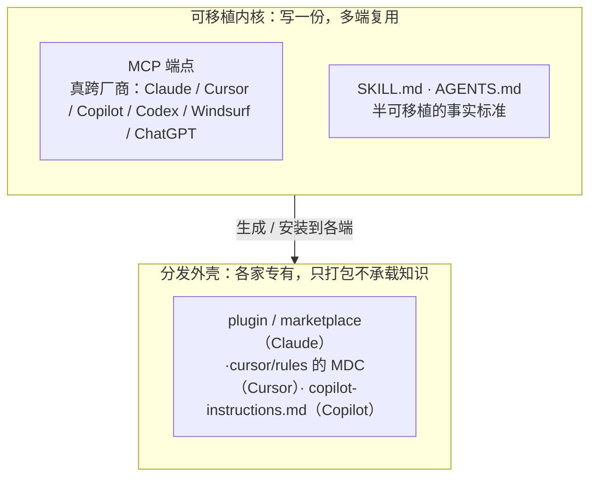
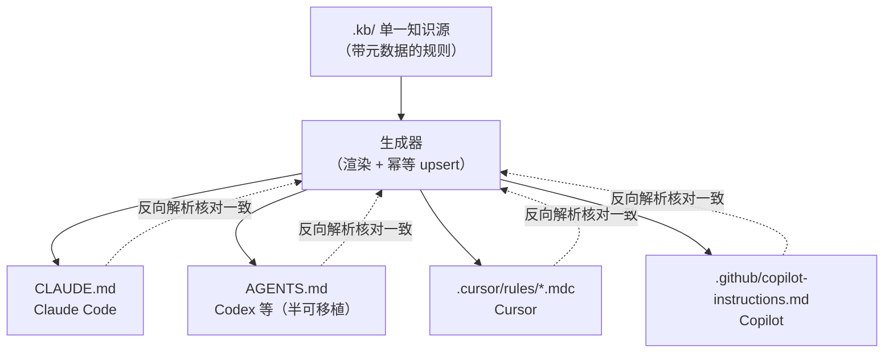

走到这里，`aishop-kb` 已经有了一个带 namespace 与权限的知识 MCP 服务。它现在的样子：

```
aishop-kb/
  kb/
    L0/base.md                      # 组织级约定
    L1/kb-orders/…                  # 领域包，带 version / owner
    L1/kb-refund/…                  # "退款超过 5000 元需人工审核"
  repos/aishop/AGENTS.md            # 依赖: kb-orders, kb-inventory, kb-refund
  cli/                              # aishop-kb coverage   ← 第 5 章
                                    # aishop-kb serve      ← 第 10、11 章
```

第 10、11 章加的 `aishop-kb serve` 命令，起一个知识 MCP 服务，让任意支持 MCP 的 agent 都能连上同一个端点，按命名空间圈定召回范围。

但 `aishop-kb` 的知识并没有全部走到 MCP 里。一部分仍留在文件式载体上：Claude 侧的 Skills、随仓库走的本地约定和规则。这些知识现在只有 Claude 生态的客户端读得到，Cursor、Copilot、Codex 的用户接不上同一份源。

于是团队里出现了知识分叉：同一条本地约定，Claude 用户写进 `CLAUDE.md`，Cursor 用户抄进 `.cursor/rules`，两份各自维护、各自漂移。本章让 `aishop-kb` 把一份本地知识源分发到所有 agent 端，从根上消除这种分叉。

## 12.1 本章你会得到什么

1. 一张知识载体的可移植性分层表——判断哪些知识写一份多端能用、哪些不得不为每家单独落地。
2. 一条分发纪律：想被所有 agent 复用的知识落到 MCP 加 Skills，plugin 只当 Claude 侧的安装器。
3. `examples/cross-agent/`：一份 `.kb/rules.yaml` 源，一键生成 `CLAUDE.md`、`AGENTS.md`、`.cursor/rules/*.mdc`、`copilot-instructions.md` 四家格式，并反向核对四份完全一致。

## 12.2 一条约定，四份漂移的副本

`aishop` 团队里，有人用 Claude Code，有人用 Cursor。退款审核阈值从 5000 元降到 3000 元那天，改动只落进了 Claude 用户维护的 `CLAUDE.md`：

```markdown
# CLAUDE.md（Claude 用户改过）
- 退款金额超过 3000 元需人工审核。
```

Cursor 用户读的是另一个文件，没人同步，它还停在旧值：

```mdc
# .cursor/rules/aishop.mdc（没人改，仍是旧值）
- 退款金额超过 5000 元需人工审核。
```

结果是同一笔 4000 元退款，Cursor 用户的 agent 直接放行，Claude 用户的 agent 会拦下来走人工审核。同一个仓库、同一条约定，两个 agent 给出相反判断。

问题的根不在谁忘了同步。一句 `金额单位是分`，要喂给 Claude Code 得写进 `CLAUDE.md`，喂给 Cursor 得写进 `.cursor/rules` 的 MDC，喂给 Copilot 是 `.github/copilot-instructions.md`，喂给 Codex 是 `AGENTS.md`。

一条知识，四种格式，四份手写副本。副本越多，漂移越不可避免。

## 12.3 格式碎片的结构性成因

要设计分发方案，先得看清为什么会有这么多格式。这不是历史包袱，是各家厂商的产品选择。

每个 agent 工具都把 `读哪个配置文件、按什么语法解析` 当成自己的产品接口。Claude Code 定义了 `CLAUDE.md` 的加载规则（逐级向上查找、可 `@import`），Cursor 定义了 `.cursor/rules` 的 MDC 格式。

二者语义并不等价：Cursor 的规则能用 frontmatter 里的 `globs` 按文件路径条件触发，`CLAUDE.md` 没有这个机制。

格式差异背后是能力差异，能力差异服务于产品差异化。指望厂商们收敛到同一个文件格式，等于指望它们放弃各自的接口设计，在可预见的未来不会发生。

所以工程上的前提是：格式碎片是既定事实，不能寄望它消失，只能在它之上做一层收敛。收敛的第一步，是分清哪些知识根本不必落成各家格式、哪些不得不落成各家格式。

## 12.4 可移植内核与分发外壳

按一份知识能被多少家 agent 直接复用这个维度，知识载体分三层（表 12-1）。这张表是本章的核心判断，后面所有策略都从它推出。

表 12-1：知识载体的可移植性分层

| 层 | 载体 | 可移植性 | 归属 | 说明 |
|---|---|---|---|---|
| 真跨厂商 | MCP | 高 | 可移植内核 | 唯一真正的开放协议，Claude / Cursor / Copilot / Codex / Windsurf / ChatGPT 都能接同一个端点 |
| 半可移植 | SKILL.md、AGENTS.md | 中 | 可移植内核 | 事实标准，被多家采纳但未标准化；AGENTS.md 被 Codex 等认，SKILL.md 被 Claude 及部分兼容 CLI 认 |
| 厂商专有 | plugin / marketplace、`.cursor/rules` 的 MDC、`copilot-instructions.md` | 低 | 分发外壳 | 各家私有打包格式，互不通用，只在本家生态内有效 |

三层之间隔着两条界线。上两层属于可移植内核：知识以跨厂商或半跨厂商的形式存在，写一份多家能用。最下层属于分发外壳：它不承载新知识，只把知识按某一家的语法重新打包，让那一家的客户端读进去。

plugin 是 Claude 侧的安装器，`.cursor/rules` 的 MDC 是 Cursor 侧的落地格式，它们都只是壳。三层的关系如图 12-1。



图 12-1：知识载体的可移植性三层。上两层是可移植内核，一份写好多端复用；最下层是分发外壳，只把内核按各家语法打包、安装到对应客户端。分发策略的全部要点，是**尽量把知识留在内核层，只让不得不落地的那部分下沉到外壳层**。

### 12.4.1 MCP 是协议而非文件，所以能真跨厂商

MCP 能坐到「真跨厂商」这一格，根本原因是它是协议而不是文件格式。文件格式绑定解析器——`.cursor/rules` 的 MDC 只有 Cursor 的解析器认得，换个客户端就是一堆无意义文本。

协议绑定的是接口契约。MCP 规定 client 与 server 之间用什么消息交换工具与资源，任何实现了这套契约的 client 都能连上任何实现了它的 server。知识放在 server 端，以 tools / resources 的形式暴露，client 是谁不影响它能不能被调用。

这解释了为什么动态、大规模的知识（代码文档、API、语料）应当走 MCP。它一次实现、多端复用，且天然带范围过滤（按 namespace 圈召回边界，见第 11 章）。MCP 服务的架构与调优第 10、11 章已展开，这里只强调它在分发维度的地位：可移植内核里份量最重的一层。

### 12.4.2 SKILL.md 与 AGENTS.md 是半可移植的事实标准

中间层的两个载体值得单独说明。SKILL.md 是 Claude Agent Skills 的技能说明文件——一个带 frontmatter 的 Markdown，声明技能何时触发、执行哪些步骤，被 Claude Code 及部分兼容 CLI 识别。AGENTS.md 第 6 章介绍过，是仓库本地约定的半标准载体，被 Codex 等多家采纳。

它们「半可移植」的含义是：被多家采纳，但没经过标准化组织的形式约定，采纳它的每一家在细节上都可能有自己的解读。因此它比 MCP 弱（不是协议，仍是文件），比 MDC 强（不止一家认）。

工程上的处理方式很直接。把静态约定和规范优先落到 AGENTS.md 这类半可移植格式，让它成为「一份写好、多家能读」的基线；只有半可移植格式覆盖不到的客户端，才为它单独生成专有格式。

### 12.4.3 plugin 只当 Claude 侧的安装器

分发外壳里最容易被误解的是 plugin。它有版本、有 `dependencies`、有 marketplace，看上去像一个完整的知识分发体系，很容易让人把知识直接写进去。这是错位的。

plugin 解决的是「怎么把一个知识包安装到 Claude 环境、怎么声明它依赖哪些别的包」，它是 Claude 生态内的安装与依赖管理机制，不是跨厂商的知识载体。把知识写死在 plugin 结构里，等于宣布这份知识只服务 Claude 用户。

正确的分工是：知识内核放进 MCP 加 Skills / AGENTS.md（可移植），**plugin 只当 Claude 侧那层安装器外壳，负责把内核安装、注册、依赖解析到 Claude 环境，而不承载知识本身**。plugin 的打包、marketplace 与声明式安装是下一章的主题。

## 12.5 一份源，分发多种格式

把知识按可移植性分层之后，仍剩一块躲不开的工作：一部分本地约定和规则，必须以各家专有格式落地。Cursor 用户的 agent 只读 `.cursor/rules`，你不能要求它先连 MCP 才知道 `金额单位是分`。

对这块知识，正确做法不是手写多份，而是维护单一源、自动生成多份（图 12-2）。改规则只动源、重跑生成器，所有格式同步更新，漂移无处产生。这和前端 "一份源码编译到多平台" 同构。



图 12-2：单一源的多端分发扇出。只维护 `.kb/` 一份带元数据的规则源，生成器把它渲染成各家 agent 的配置格式；改规则只改源、一键重生成，从根上消除多份手写导致的漂移；生成后再反向解析各文件、核对承载的规则集完全一致。

### 12.5.1 现成工具：Ruler 与 Packmind

这不是要每个团队从零造轮子，社区已有专用工具：

- Ruler：把一份 `.ruler/` 源分发成 20 多家 agent 工具的配置格式。它的价值不在渲染本身（渲染很简单），而在替你维护这 20 多家目标格式的模板与更新——各家格式一旦变动由 Ruler 跟进，你只管写 `.ruler/` 源。
- Packmind：更完整的 ContextOps 生命周期工具，覆盖 Build、Distribute、Govern、Maintain 四阶段，分发只是其中一环。（ContextOps 是 Packmind 官方对这套生命周期的命名，此处四阶段划分是对其的归纳，引用以官网为准。）

选型判断很直接。目标 agent 种类多、格式跟进成本高，用 Ruler 这类现成工具；只需覆盖两三家、想完全掌控生成逻辑，自写一个最小生成器即可。两条路的纪律都是同一条：守住单一源，绝不手改生成产物。

## 12.6 aishop：一份约定分发到四家 agent

`examples/cross-agent/` 沿用主线仓库 `aishop`，演示单一源分发。它维护一份 `.kb/rules.yaml` 作为唯一知识源，里面是三条 `aishop` 的约定，每条带一个 `scope` 字段：

```yaml
rules:
  - id: money-unit
    scope: global
    text: 本仓库金额单位是分，展示时再转元。
  - id: order-status
    scope: order
    text: 改订单 status 必须走 advanceOrder，禁止直接赋值。
  - id: refund-review
    scope: refund
    text: 退款金额超过 5000 元需人工审核。
```

`src/generate.ts` 里的 `generateAll` 解析这份源，把三条规则渲染成四种格式：`CLAUDE.md`、`AGENTS.md`、`.cursor/rules/aishop.mdc`、`.github/copilot-instructions.md`。跑一次 `npx tsx src/main.ts` 生成全部四份；改 `rules.yaml` 任意一条、重跑，四个文件的生成区同步更新。

### 12.6.1 幂等生成：不覆盖手写内容

生成器有一个绕不开的约束：真实仓库的 `CLAUDE.md`、`AGENTS.md` 往往夹着大量手写内容——项目介绍、架构说明、上手指引，生成器绝不能整文件覆盖。

示例的处理方式是用一对标记 `<!-- KB:GENERATED:BEGIN -->` 与 `<!-- KB:GENERATED:END -->` 把生成区框起来，重新生成时只替换标记之间的内容，标记之外原样保留。`generate.ts` 里的 `upsert` 函数实现了这个逻辑：文件已存在且带标记，就用正则替换标记之间的生成区；文件不存在，则用一个带 `{{BLOCK}}` 占位符的 shell 模板首次落盘，手写介绍写在占位符之外。

`main.ts` 特意验证了这一点。它往 `CLAUDE.md` 生成区之外追加一段手写补充，再次调用 `generateAll`，然后断言那段手写内容仍然保留。把 "自动生成区" 和 "手写区" 在同一文件里物理隔离，正是 Ruler 这类真实工具的做法。

### 12.6.2 `.mdc` 是真实的 Cursor 规则格式

示例生成的 `.cursor/rules/aishop.mdc` 不是随手拼的 Markdown，而是真实的 Cursor MDC 格式：顶部是 YAML frontmatter，`description` 供 Cursor 索引用，`alwaysApply: true` 表示这条规则始终生效、不按文件路径匹配。

若要让规则只在特定文件下触发（比如退款规则只在 `refund/` 目录生效），则改用 `globs` 字段指定路径范围。这个细节体现了分发的一个隐性要求：生成器必须懂目标格式的语义，而不只是把文本换个后缀名。同一条规则渲染到 MDC，要决定它是 `alwaysApply` 还是 `globs` 触发，这是 MDC 独有、其它三家没有的表达力。

源里每条规则带的 `scope`（global / order / refund）在本例中暂不参与生成，作为元数据保留。它是留给「按范围决定哪条规则进哪个文件」的扩展点：启用时在 `generateAll` 里按 `r.scope` 分组、再传给对应文件的 `upsert` 即可，本例为聚焦主干不展开。

### 12.6.3 反向核对：证明漂移真的消失了

单靠都从一份源生成，还不足以证明四份文件真的一致——渲染逻辑本身可能有 bug。`main.ts` 因此带一个一致性检查：它反向解析生成的四个文件，从每份里抽出 `- <text>` 条目，比对承载的规则集是否与源完全相同。

四份全部通过、且手写介绍保留，才算这套机制真正闭合。这一步把 "相信生成器" 变成 "验证生成器"，是分发流水线能进 CI、能被信任的关键。

## 本章要点

- 各家 agent 配置格式互不通用是厂商的产品选择、不是历史包袱，**工程上只能在它之上做一层收敛，不能指望它消失**。
- 按可移植性分三层：MCP（协议，真跨厂商）> SKILL.md / AGENTS.md（半可移植事实标准）> plugin、MDC、`copilot-instructions.md`（厂商专有）。前两层是可移植内核，最下层是分发外壳。
- **想被所有 agent 复用的知识落到可移植内核**：动态大规模知识走 MCP，静态约定走 AGENTS.md / Skills；plugin 只当 Claude 侧的安装器，不承载知识本身。
- 对不得不落成各家专有格式的本地规则，用单一源、自动生成多格式消除漂移：只维护一份源，生成器渲染各家配置并反向核对一致，**生成必须幂等、不覆盖手写区**。
- 现成工具 Ruler（一份源分发 20+ 格式）、Packmind（ContextOps 全生命周期）可直接用；目标格式少时自写最小生成器也可，纪律都是守住单一源、绝不手改产物。

## 下一章

一份本地知识源已经能分发到四家 agent 格式了，但分发的另一半还没接上：怎么把 `aishop-kb` 整体打成一个可安装、带版本和依赖的包，让别的团队一条命令就装进来。第 13 章把 `aishop-kb` 打成 plugin 加 marketplace，讲包化分发与声明式安装。

## 配套代码

见 `examples/cross-agent/`。

---

> 本章来自《Agent 知识库工程实战：组织、分发、共建与度量》开源版 · 作者「递归客」
> 在线阅读完整书系：[inferloop.dev](https://inferloop.dev)
