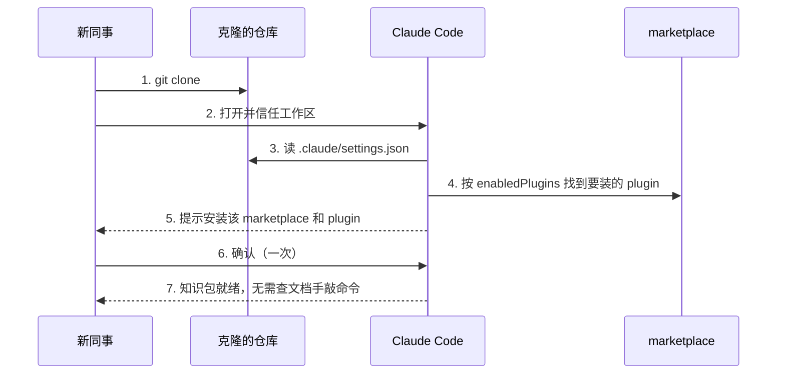
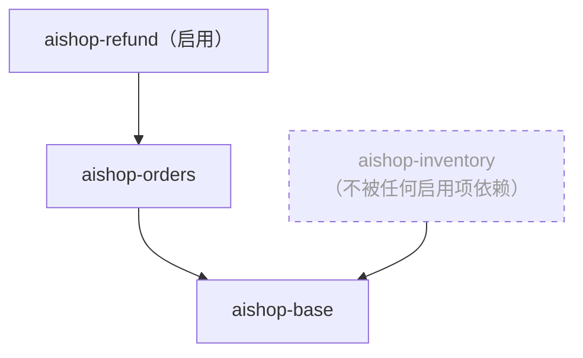

上一章给 `aishop-kb` 抹平了跨 agent 的格式差异。一份知识源经 Ruler 生成多端产物，Claude 读 `CLAUDE.md`、Cursor 读 `.cursor/rules`、其余工具读 `AGENTS.md`，MCP 端点则被各厂商客户端共同接入。知识的内核第一次做到了一处编写、多端可读。

但内核可读，不等于每个人都装好了。`aishop-kb` 现在有四个知识包（base、orders、inventory、refund）、一个 MCP 端点、一套多端规则文件。新同事要用上它们，还得自己一条条把包装上、把端点连上。

装什么、装哪个版本、从哪装，眼下靠一份手写文档传递。文档会过期，人会装错，也会有人干脆跳过。这一章把 `aishop-kb` 打成 plugin，用 marketplace 汇总，让克隆仓库的人不必读文档、不必手敲命令，环境自动把该装的装好。

先看新同事眼下拿到的东西——一份三个月没更新的入职清单：

```markdown
# 新人环境搭建 onboarding.md（最后更新：3 个月前）
1. claude plugin marketplace add acme/aishop-kb-marketplace
2. claude plugin install aishop-base@aishop-kb
3. claude plugin install aishop-orders@aishop-kb
4. claude plugin install aishop-refund@aishop-kb
# 注：inventory 那个包后来是不是改名了？装之前问一下 @王工
```

清单里的命令是对的，可它是一份静态文档。包新增了、版本升了、某个包改了名，清单不会自己跟上。照着敲的人装出来的环境，和仓库真正需要的环境之间，隔着一次「有没有人记得改文档」的偶然。

## 13.1 本章你会得到什么

1. 一套判断：plugin 是分发外壳、marketplace 是注册表，各自打包什么、不打包什么。
2. `aishop-kb` 的 `.claude/settings.json`：用 `extraKnownMarketplaces` + `enabledPlugins` 把安装意图写进随仓库走的配置，克隆即声明式安装。
3. 一张 `dependencies` 依赖图，以及它带来的两个能力——传递依赖自动解析、`plugin prune` 清理孤儿。
4. `examples/plugin-distribution/` 里可运行的解析器：`enabledPlugins` 只写一个顶层包，自动算出完整安装集，并识别出该被清理的孤儿。

## 13.2 plugin 作为分发外壳

### 13.2.1 外壳装 Claude，内核跨厂商

第 12 章确立过一条分界：可移植内核与分发外壳分离。plugin 在外壳一侧，它是安装器，不是知识本身。

知识的可移植内核活在 MCP 服务、Skills、`AGENTS.md` 里，这些是不同厂商 agent 都能复用的部分。plugin 做的事，是把这些内核连同它们的配置打包成一个可安装单元，交给 Claude 环境一键装上。

把分界当真，直接决定一个包里该放什么。plugin 不该内联一份知识正文的副本，而该引用内核——携带 MCP 服务的连接配置、指向 Skills 目录、声明依赖关系。

同一份订单知识，既能通过 MCP 端点被 Cursor、Codex 调用，又能通过 plugin 在 Claude 侧被声明式安装。外壳换掉，内核不动。

反过来，若把知识正文直接烤进 plugin，等于把跨厂商可复用的内核锁进 Claude 专有的打包格式，退回第 12 章要避免的厂商绑定。**plugin 只当 Claude 侧的安装器，知识内核仍归 MCP 与 Skills。**

### 13.2.2 三层命名指向同一份知识

同一份知识在能力阶梯的不同层各有一个名字，容易被误读成不同东西，这里对齐一次。本章示例里的 `aishop-orders` plugin，打包的就是第 9 章 manifest 里那个 `@kb/orders` 知识包，也就是第 8 章 L1 层的 `kb-orders`。

命名分三层不是冗余，每层各表达一件事：

1. L1 包名（`kb-orders`）表达它在分层组织里的位置。
2. manifest scope（`@kb/orders`）表达它的召回命名空间。
3. plugin 名（`aishop-orders`）表达它作为可安装单元的标识。

## 13.3 marketplace 作为注册表

一个知识 plugin 的结构不复杂：一份 manifest 描述它是什么、版本多少、依赖哪些别的 plugin，外加它携带的 Skills 与 MCP 服务配置。多个 plugin 汇总在一个 marketplace 里。

marketplace 是一份列出可安装 plugin 的清单，托管在一个 git 仓库中，供人按名字发现和安装。它扮演的是 npm registry 之于 npm 包的角色：一个可寻址的注册表，把包名解析到「从哪取、什么版本、依赖什么」。

区别在于，marketplace 本身就是一个 git 仓库。私有 marketplace 直接放进公司自己的 GitHub 组织即可，不需要额外的注册表服务。

两个 manifest 的真实路径要写准，它们都放在 `.claude-plugin/` 目录下：

| manifest | 位置 | 作用 |
| --- | --- | --- |
| plugin manifest | 插件目录内 `.claude-plugin/plugin.json` | 描述单个 plugin：名字、版本、依赖 |
| marketplace manifest | 仓库根 `.claude-plugin/marketplace.json` | 汇总本仓库提供的所有 plugin |

本章示例为了让解析器代码尽量短，把 `marketplace.json` 放在了示例目录根。实操时按官方的 `.claude-plugin/` 目录结构走。

## 13.4 声明式安装

### 13.4.1 两个配置字段

声明式安装把安装意图写进随仓库走的配置文件，取代那份会过期的入职清单。Claude Code 支持在仓库的 `.claude/settings.json` 里（project scope，即这份配置随仓库走、对所有克隆者生效）声明两件事：去哪找 marketplace、默认启用哪些 plugin。

```json
{
  "extraKnownMarketplaces": {
    "aishop-kb": {
      "source": { "source": "github", "repo": "acme/aishop-kb-marketplace" }
    }
  },
  "enabledPlugins": {
    "aishop-refund@aishop-kb": true
  }
}
```

两个字段各司一职：

1. `extraKnownMarketplaces` 是一个对象，键是 marketplace 名，值描述它的来源（`source` 指向托管它的 git 仓库）。它告诉 Claude Code 去哪个注册表找 plugin。
2. `enabledPlugins` 是一个对象 map，键形如 `plugin@marketplace`、值为布尔。它声明这个仓库默认启用哪些 plugin。

`enabledPlugins` 是对象 map 而非数组，这一点要记牢。它是 `{ "aishop-refund@aishop-kb": true }`，不是 `[ "aishop-refund@aishop-kb" ]`。

对象形态有两个好处。每一项可被独立开关，值取 `false` 即声明显式不启用；`plugin@marketplace` 这个复合键还天然表达「哪个 plugin、来自哪个 marketplace」，避免同名 plugin 在多个 marketplace 间撞车。

### 13.4.2 从克隆到就绪的动线

两个字段合起来，把团队成员的安装动线压缩成一条几乎无摩擦的路径，如图 13-1。



图 13-1：声明式安装的克隆→信任→提示→确认动线。配置随仓库走，每个克隆者信任工作区后被提示安装声明的 plugin，点一次确认即装好。第 2 步的信任与第 6 步的确认是安全边界所在，详见第 14 章。

对比那份入职清单，动线把分发的人力成本从「每人查文档手装」降到「克隆后点一下确认」。安装意图写在配置里、随仓库对每个克隆者生效，不再依赖某个人记得更新清单，也不再有人装错版本。

### 13.4.3 提示确认不是全自动

这里有一处必须说准的边界。声明式安装不是完全静默的全自动。它的机制是克隆并信任工作区时，Claude Code 自动提示安装，用户确认一次，而不是绕过用户直接装。

配置里也没有一个跳过确认直接装的开关。不存在这样一个字段，把 `enabledPlugins` 里声明的东西在用户无感知的情况下装上。

这个确认提示不是设计疏漏，而是刻意保留的安全阀。plugin 可能携带会执行代码的 hooks、MCP 服务、LSP；声明式安装若做成静默全自动，等于让任何被克隆的仓库都能在成员机器上自动拉起并运行外部代码。

因此机制被设计成两道人为闸门：信任工作区是第一道，确认安装是第二道。**这两道闸门就是 trust gate，会跑代码的组件如何受额外约束、CI 里如何预置信任，是第 14 章的主题。**

## 13.5 依赖图与传递依赖

### 13.5.1 dependencies 构成依赖图

plugin 之间存在依赖。`aishop-refund` 依赖 `aishop-orders`（退款规则引用订单状态），`aishop-orders` 又依赖 `aishop-base`（组织级基础约定）。

manifest 里的 `dependencies` 字段声明一个 plugin 依赖哪些别的 plugin。所有 plugin 的 `dependencies` 合起来，构成一张 npm 式的依赖图，如图 13-2。



图 13-2：`aishop-kb` marketplace 的 plugin 依赖图。启用 `aishop-refund` 会顺实线把 `aishop-orders`、`aishop-base` 一起装上。虚线的 `aishop-inventory` 也依赖 `aishop-base`，但它本身不被任何启用项依赖，会被 `plugin prune` 识别为孤儿。`aishop-base` 被两方共同依赖，是一个被共享的底层节点。

### 13.5.2 传递依赖自动解析

依赖图带来的第一个能力是自动解析传递依赖。`enabledPlugins` 里只声明顶层需要什么——本章示例只写了 `aishop-refund`——安装时顺着依赖图遍历，把 `aishop-orders`、`aishop-base` 一并算进安装集。

`aishop-base` 被两条路径指向，遍历时要去重。无论从 `aishop-orders` 还是 `aishop-inventory` 走到它，都只装一次。

示例的解析器用一个 `Set` 累积结果、进入前先判重（`if (result.has(name)) return`），正是处理共享底层节点的标准做法。依赖图不是树，是有向图，同一个节点可被多条边指向。

### 13.5.3 prune 清理孤儿

依赖图带来的第二个能力是清理。plugin 装进环境后会占用上下文，它携带的 Skills、MCP 服务描述都要进 agent 的可见范围。

当某个 plugin 不再被任何启用项需要，它可能还残留在环境里白占上下文。`plugin prune` 算出哪些已装的 plugin 不再可达，把这些孤儿清理掉，回收它们占的上下文预算。

判定的判据是可达性，而非是否被直接依赖。从当前启用项出发算出可达集，已装集合里凡不在可达集中的都是孤儿。

示例里模拟环境多装了一个 `aishop-inventory`，它不在 `aishop-refund` 这条依赖链上，prune 就把它识别出来。一个 plugin 只要还在某条从启用项出发的依赖链上就不是孤儿，只有彻底脱离所有链才被清理。

### 13.5.4 版本约束

依赖不仅约束装什么，也约束装哪个版本。Claude Code 用 `{plugin-name}--v{version}` 的 git tag 约定给依赖标注版本（如 `aishop-orders--v3.1.0` 对应一个 git tag），依赖声明里可带 semver range 限定可接受的版本范围。

这和第 9 章知识包 manifest 用 `^`、`~` 表达可控升级是同一套心智。分发层的版本约束和内容层的版本约束不是两套东西，是一套贯穿到底的语义版本机制。一个 `^3.0` 约束在两层都意味着「接受 3.x 的向后兼容更新」。

本章示例为了聚焦依赖图怎么解析，只处理裸包名、不做版本消解。官方 schema 里 `dependencies` 数组可以混写：既可以是裸包名字符串（如 `"aishop-base"`），也可以是带版本约束的对象（如 `{ "name": "aishop-orders", "version": "^3.0" }`）。

示例只解析前者是刻意简化。把版本消解摘掉后，依赖图的遍历、去重、prune 这些结构性机制反而看得更清楚。

## 13.6 动手：解析依赖图 + prune

`examples/plugin-distribution/` 给出一个 `marketplace.json`（列出 base、orders、inventory、refund 四个 plugin 及各自 `dependencies`）和一个 `.claude/settings.json`（声明 `extraKnownMarketplaces` + `enabledPlugins` 对象 map，字段名对应 Claude Code 官方 schema）。在此之上实现两个函数：

1. `resolveInstallSet`：按 `enabledPlugins` 顺着依赖图算出完整安装集，含传递依赖，用 `Set` 去重共享节点。
2. `prune`：从启用项算出可达集，标出已装但不可达的孤儿。

```bash
cd examples/plugin-distribution && npx tsx src/main.ts
```

跑起来会看到：`enabledPlugins` 只写了 `aishop-refund`，解析器却算出要装三个——`aishop-refund` 加它依赖的 `aishop-orders` 加 `aishop-orders` 依赖的 `aishop-base`。接着模拟环境多装了一个 `aishop-inventory`，prune 把它识别为孤儿。

这就是「声明顶层、自动解析、自动清理」的分发机制在代码里的样子。示例只演示依赖图的结构性机制，不实际调用安装命令（那需要 Claude Code 环境）。真实的克隆信任时提示安装加确认动线、与信任边界，见第 14 章。

## 本章要点

- 分发是能力阶梯的最后一级，目标是让全团队装上同一套、对的版本，取代逐人手敲的入职清单。
- **plugin 是分发外壳（Claude 侧安装器），不是知识本身**：知识内核在 MCP 加 Skills，plugin 引用并打包内核成可安装单元，汇总在 marketplace（git 托管的注册表）里；两个 manifest 都在 `.claude-plugin/` 目录下。
- **声明式安装靠 `.claude/settings.json` 的 `extraKnownMarketplaces`（对象）加 `enabledPlugins`（对象 map，非数组）**：克隆并信任工作区时 Claude Code 自动提示安装、用户确认一次即装好，不是静默全自动，没有跳过确认的字段，这道确认是刻意保留的安全阀（trust gate，第 14 章）。
- `dependencies` 字段构成 npm 式依赖图（可带 `{plugin}--v{version}` git tag 约定的 semver 约束，同第 9 章心智）：声明顶层需要什么，传递依赖自动解析（`Set` 去重共享节点），`plugin prune` 按可达性清理孤儿。

## 下一章

`aishop-kb` 现在克隆即声明式安装，但两道人为闸门——信任工作区、确认安装——在 CI 这类非交互环境里没人来点。下一章讲分发的信任边界 trust gate，以及如何在 CI 里安全地预置信任、非交互装包。

## 配套代码

见 `examples/plugin-distribution/`。

---

> 本章来自《Agent 知识库工程实战：组织、分发、共建与度量》开源版 · 作者「递归客」
> 在线阅读完整书系：[inferloop.dev](https://inferloop.dev)
