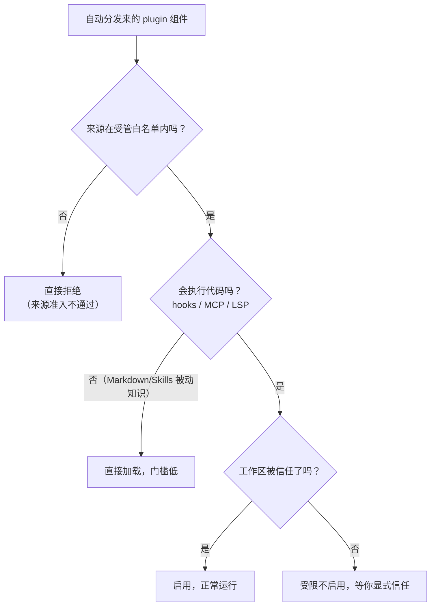
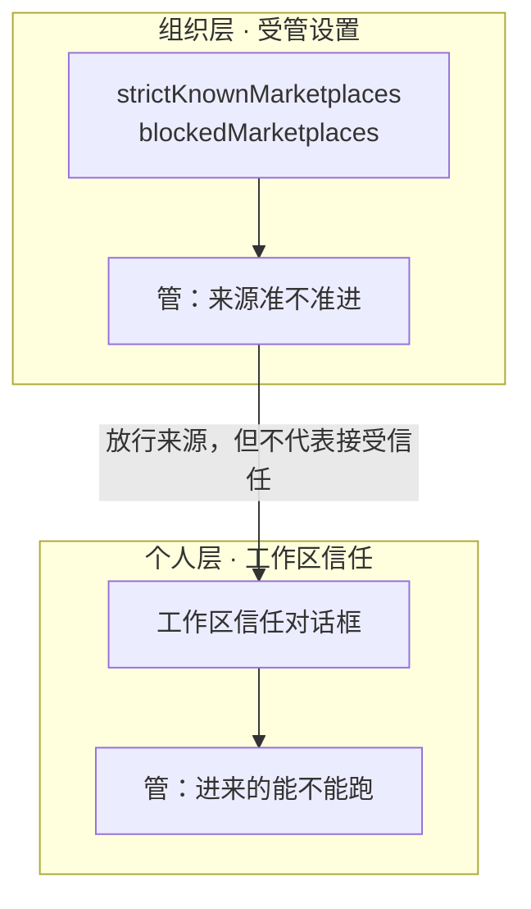
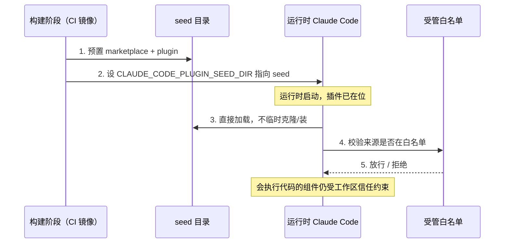

第 13 章把 `aishop-kb` 打成了 plugin，用 marketplace 汇总，在 `.claude/settings.json` 里用 `extraKnownMarketplaces` + `enabledPlugins` 声明。克隆仓库、信任工作区，[Claude Code](https://claude.com/claude-code) 就提示把声明的知识包一次装好。

但声明式装进来的东西不只是 Markdown。plugin 可以携带 hooks、[MCP](https://modelcontextprotocol.io) 服务、LSP 配置，这三类都会在你机器上执行代码。克隆即装的便利，此刻也是一条让外部代码自动落地的通道。

本章给 `aishop-kb` 的分发加上信任边界——trust gate，界定哪些能自动装、装好的东西什么时候准跑，再把这条边界接进 CI。

来看一个具体处境。你克隆了一个第三方仓库，它的 `.claude/settings.json` 声明了一个 plugin：

```json
{
  "extraKnownMarketplaces": {
    "vendor-kb": { "source": { "source": "github", "repo": "some-vendor/kb-marketplace" } }
  },
  "enabledPlugins": { "vendor-audit@vendor-kb": true }
}
```

这个 `vendor-audit` plugin 里带着一个 hook——一段绑定在「工具调用前」这个时机的脚本，由 agent 运行时代你触发，无需你手动执行。仓库来路不明，脚本内容你没读过。

声明式分发的动线到这里出现分岔。知识文档可以先读进上下文，但一个会在你机器上跑的脚本，不能因为一句声明就自动运行。本章要划的就是这条分岔线。

## 14.1 本章你会得到什么

1. 一条分档判据：分发负载按会不会执行代码分档——被动知识低门槛加载，会执行代码的组件必须工作区被信任才启用。
2. 信任的两层模型：组织受管白名单管来源准入，个人工作区信任管组件能否运行，两层不能互相替代。
3. CI 与容器里的做法：用 `CLAUDE_CODE_PLUGIN_SEED_DIR` 把信任决策从运行时前移到构建时。
4. `examples/trust-gate-ci/` 里一个可运行的 trust gate 策略检查器，能看到同一批组件在不同信任策略下的判定差异。

本章给 `aishop-kb` 补的是分发的安全边界与 CI 通道，不改前几章的知识内容本身。

## 14.2 三类会执行代码的组件

把一个 plugin 的负载拆开看，能执行代码的入口有三个，风险各不相同。

1. hooks：绑定在会话生命周期事件上的脚本，例如「每次工具调用前跑一段校验」。它由 agent 运行时代你触发，无需手动执行，隐蔽性最高。
2. MCP 服务：plugin 声明的 MCP server，Claude Code 会把它作为子进程拉起。进程一旦启动，就具备它自身代码能触及的一切能力——读文件、发网络请求。
3. LSP 配置：语言服务器在后台常驻，为编辑和符号解析提供支持，同样是一个持续运行的进程。

这三类的共同点是会跑，区别只在触发时机和是否常驻。与之相对的是 plugin 里的被动负载——Markdown 文档、SKILL.md 说明，它们只会被读入模型上下文，不会被执行。

一旦克隆即装的链路里混进了会执行代码的组件，分发就不再是纯粹的内容搬运，而是一次带副作用的操作。分发的信任边界，正是沿着**会不会执行代码**这条线划开的。

## 14.3 trust gate：主动组件的信任闸

Claude Code 的机制是一道 trust gate（信任闸）。它的核心判断只有一句：区分被动知识与会执行代码的组件，后者必须工作区被显式信任才生效。

- 被动知识（Markdown、SKILL.md 这类纯内容）只被读取、不被执行，加载门槛低。
- 会执行代码的组件（hooks、MCP、LSP）风险高。当仓库内容来自他人（不是你自己写的），这些组件受额外信任限制——只有你显式信任了这个工作区，它们才会真正启用。

回到章首那个处境。`vendor-audit` 的知识文档可以先读着，但它那个 PreToolUse hook 想在你机器上跑，得先过工作区信任这一关。被自动化的只是提示安装那一步，让会执行代码的组件真正运行，始终被信任闸拦着。

### 14.3.1 三步判定顺序

trust gate 的判断可以收敛成一条三步决策链（图 14-1）。本章示例 `gate.ts` 就是按这个顺序实现的：先查来源白名单，再分被动/主动，最后看工作区信任。



图 14-1：trust gate 的三步判定。来源白名单先过滤准入，被动知识直接加载，会执行代码的组件必须工作区被信任才启用。三步的先后不能颠倒——白名单外的来源无论组件类型都先被拒，被动知识则无关工作区信任。

### 14.3.2 被动知识不等于零风险

门槛低需要一个限定：不执行代码，不等于没有风险。被动知识仍然是喂给模型的内容，可能藏着 prompt injection（提示注入，把恶意指令写进文档诱导 agent 做危险动作，例如把 `.env` 发到某地址）。

不执行代码因此推不出不能操纵 agent 行为。**被动知识不执行代码，不代表它没有风险。** 它依旧要过 prompt injection 这一关，只是不涉及拉起一个会跑的进程这类更高权限的动作。

这就划清了两种防护各自的辖区。trust gate 卡的是会执行代码这一层，靠工作区信任把主动组件拦在门外；投毒防护补的是被动内容那一层，靠内容审查把恶意指令拦在上下文之外。二者不可互相替代——工作区信任再严，也拦不住一份被信任来源分发、内容却被下毒的文档。

Claude Code 官方安全文档专门列了 prompt injection 防护一节，本书第 20 章会系统讲知识库的投毒防护与审计。本章只负责会执行代码这一层的边界。

## 14.4 信任的两层模型

trust gate 是个人工作区层面的闸。组织层面还有一层独立控制，二者容易被混为一谈，必须拆开。这两层管的是分发链路上两个不同的问题：一个管来源准不准进，一个管进来的能不能跑。

### 14.4.1 工作区信任对话框（个人层）

工作区信任对话框是个人层面的决策：你信不信当前这个工作区。你信任了，来自它的会执行代码的组件才被允许启用；不信任，这些组件即使装好了也处于受限状态。它对应图 14-1 里最后一步，是 trust gate 的落点。

### 14.4.2 marketplace 受管白名单（组织层）

组织层面用受管设置（managed settings，由组织统一下发、个人改不了的配置）锁死可信来源，两个开关各管一头：

- `strictKnownMarketplaces`：只允许从组织白名单里的 marketplace 安装，其余一律拒绝。
- `blockedMarketplaces`：明确拉黑指定 marketplace。

这两个开关让组织能保证全公司的 agent 只从信任的那几个 marketplace 装知识包，从源头掐掉有人不慎引入恶意 marketplace 的风险。它对应图 14-1 里第一步的来源准入判断。

### 14.4.3 两层各管一段

这两层各管一段、不能互相替代（图 14-2）。受管白名单放行了某个来源，只是说允许从这里装，**并不等于自动接受了工作区信任**——装进来的 hooks/MCP/LSP 要不要跑，仍由工作区信任那一层决定。

反过来，你信任了一个工作区，也不意味着它引用的任何 marketplace 都能绕过组织白名单。一个来源可能通过了组织白名单却因工作区未信任而组件不跑，也可能工作区已信任却因来源不在白名单而根本装不进来。



图 14-2：信任的两层模型。组织受管白名单管来源准入，工作区信任对话框管会执行代码的组件能否运行；上层放行不自动接受下层信任，两层串联才构成完整边界。

## 14.5 CI 与容器：构建时预置信任

trust gate 默认是交互式的——它要弹出对话框问你信不信这个工作区。CI 和容器里没有人点确认，这就和无人值守的流水线直接冲突。

错误的思路是想办法在 CI 里跳过信任对话框。这等于在自动化环境里主动拆掉安全边界，一旦流水线拉取的仓库被污染，会执行代码的组件就无阻碍地跑起来。**正确的思路是把信任决策从运行时挪到构建时。**

### 14.5.1 seed 目录预置

Claude Code 为容器/CI 提供了专用机制：在构建镜像时，把需要的 marketplace 和 plugin 预先放进一个目录，用环境变量 `CLAUDE_CODE_PLUGIN_SEED_DIR` 指向它。

Claude Code 启动时这些插件已经在位，运行时不用克隆、不用临时装，运行时的信任确认自然被绕开。信任决策被前移到构建这个镜像这一受控、可审计的动作里——谁往 seed 目录放了什么，在构建脚本和镜像层里一目了然（图 14-3）。



图 14-3：CI/容器的构建时预置时序。插件在构建阶段进 seed 目录，运行时直接加载；随后受管白名单管来源准入。图中最后一步对应本章反复强调的边界——白名单放行来源之后，会执行代码的组件是否运行仍归工作区信任那一层管，两层不能省。

落到 `aishop-kb` 这条主线，做法是：把 `aishop-kb` 的知识 plugin 和它依赖的 marketplace 在构建 CI 镜像时写进 seed 目录，CI 里跑 agent 任务时直接加载这套已审过的知识包。这样既不在流水线里临时克隆外部仓库，也不需要在无人值守环境里处理信任弹窗。知识分发在 CI 里变成一次构建期的确定性操作。

### 14.5.2 非交互安装命令的边界

流水线里也可以直接跑非交互安装命令：

```bash
claude plugin install <plugin>@<marketplace> --scope project
```

这条命令本身是官方的。`--scope` 支持 `user`/`project`/`local`，`project` scope 会写进 `.claude/settings.json`。但要认清它的边界。

- 非交互环境下工作区信任具体怎么处理，官方文档目前没有给出用受管设置一键预接受信任对话框的明确机制。务实的做法是走上面的 seed 目录预置，或用 CI 专用通道（如 Claude Code 的 GitHub Action，用它的 plugin 输入而不是裸的交互式安装路径）。
- 不要假设配了白名单信任确认就自动过了。上生产流水线前，先在真实 CI 环境里实测一遍这条链路。

还有一个易被想当然的细节：`-y`/`--yes` 目前主要出现在 `plugin uninstall --prune`、`plugin prune` 这类清理命令的非 TTY 说明里。`plugin install` 本身不要假设一定要加 `-y`，把 prune 类命令的非交互开关套到 install 上是常见的误抄。

## 14.6 安全与便利的权衡

这一章的所有机制都在同一根轴上取舍：越自动越省事，攻击面越大；越要人确认越安全，摩擦越高。trust gate 的设计不是把这根轴推到某一端，而是按会不会执行代码把负载切成两段——被动知识往便利端放（自动加载），主动组件往安全端放（必须显式信任）。

据此可以给团队三条务实默认：

1. 被动知识尽量走自动分发，不要为纯内容设无谓的确认门槛。
2. 会执行代码的组件默认收紧，宁可多一次工作区信任确认，也不让它静默启用。
3. CI 这类无人值守环境不靠运行时确认兜底，而是把信任前移到构建时的 seed 目录，让谁授权了什么变成可审计的构建产物。

**安全与便利的平衡点不是一个固定值，而是随这段负载会不会跑代码滑动的。** 这正是 trust gate 想让你养成的判断习惯。

## 14.7 动手：trust gate 策略检查器

`examples/trust-gate-ci/` 实现一个最小的 trust gate 策略检查器。给它一批要分发的组件（每个标注类型 knowledge/hook/mcp/lsp 和来自哪个 marketplace）、一个信任策略（工作区是否可信、允许的 marketplace 白名单），它对每个组件按 `gate.ts` 里的三步顺序判定。

判定的四种结果与图 14-1 一一对应：

| 组件情形 | 判定 |
|---|---|
| 来自白名单外 marketplace | 拒绝 |
| 被动知识（knowledge/Skill） | 直接加载 |
| 会执行代码 + 工作区可信 | 启用 |
| 会执行代码 + 工作区未信任 | 受限不启用 |

跑起来能看到：同一批组件，在工作区可信 + 来源在白名单下，知识直接加载、hook/MCP 启用；把工作区改成不可信，会执行代码的组件立刻变成受限不启用；再引一个白名单外 marketplace 的组件，它被直接拒绝。这三种判定结果对应到 CI，就是流水线该放行还是该失败的依据。

示例是对 Claude Code 信任模型的教学抽象。真实的 trust gate 由 Claude Code 运行时实施，`strictKnownMarketplaces` / `blockedMarketplaces` 是组织受管设置。

## 本章要点

- 声明式克隆即装的便利背后有安全含义：自动装的 plugin 可能携带 hooks/MCP/LSP 这类会执行代码的组件，分发因此从内容搬运变成带副作用的操作。
- trust gate 沿会不会执行代码划界：被动知识低门槛直接加载，会执行代码的组件必须工作区被信任才启用。被动知识不执行代码不等于零风险，prompt injection 由第 20 章的投毒防护另行拦截，两层防护不可互替。
- 信任是两层模型：组织受管设置（`strictKnownMarketplaces` / `blockedMarketplaces`）管来源准入，个人工作区信任管会执行代码的组件能否运行。上层放行来源不自动接受下层信任，两层串联才是完整边界。
- CI/容器里把信任前移到构建时：用 `CLAUDE_CODE_PLUGIN_SEED_DIR` 的 seed 目录预置插件、运行时不临时装。`claude plugin install ... --scope project` 可用，但非交互下工作区信任官方无一键预接受机制，`-y` 属 prune 类清理命令而非 install——上线前先实测或走 CI 专用 Action。

## 下一章

分发的信任边界立好了，`aishop-kb` 已经能被安全地组织、包化、跨端分发。但到此为止，装进它的知识几乎都是从代码衍生出来的。第五部分从第 15 章开始转向全书最难的一块——那些只在人脑里、散落在各个角落的手写业务知识，怎么低摩擦地灌进 `aishop-kb` 并被全团队共建。

## 配套代码

见 `examples/trust-gate-ci/`。

---

> 本章来自《Agent 知识库工程实战：组织、分发、共建与度量》开源版 · 作者「递归客」
> 在线阅读完整书系：[inferloop.dev](https://inferloop.dev)
