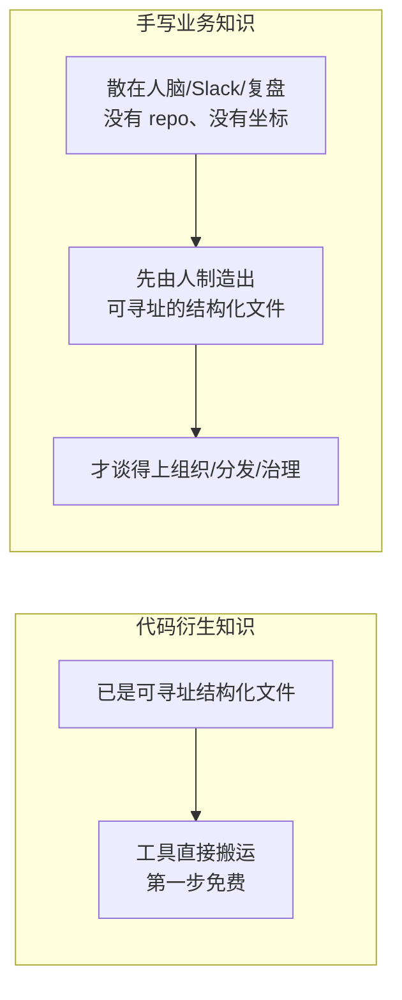
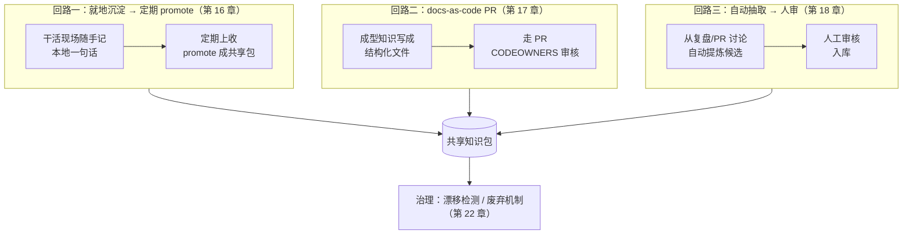

到第四部分结束，`aishop-kb` 已经长成一座相当完整的知识库。代码衍生的知识——API 签名、字段定义、符号引用——被分层组织进 L0/L1/L2，打包成带版本和 owner 的知识包，通过知识 MCP 服务对外暴露，可跨 agent 分发，也有了 trust gate 与权限隔离。凡是能从 `aishop` 代码里自动提取的知识，都已经在库里了。

但库里有一整类知识始终是空的：那些只在人脑里的业务规则。「退款必须先过风控」「大促库存提前扩容 3 倍」「`legacy_channel` 字段对账还在读、不能删」——这些规则一条都没进来，因为没有任何工具能自动把它们生成出来。

本章是第五部分的开篇，不动 `aishop-kb` 的产物本身，先勘察这块最难的地形：手写业务知识为什么难、为什么值钱，以及从第 16 章起要给 `aishop-kb` 补上的三条共建回路各自对付哪一道难处。

先看这类知识缺席时会发生什么。给 `aishop` 的 agent 一个任务："给退款接口补一个自动审批开关"。它读遍了库里所有代码衍生知识——`refund.ts` 的签名、`Order` 的字段、完整调用链——写出的代码对所有退款一律自动放行：

```ts
// agent 写出的代码：读全了代码知识，却漏掉了两条业务规则
export function autoApproveRefund(order: Order): boolean {
  return true; // 一律自动放行
}
```

它漏掉了两条规则：退款超过 5000 要人工审核、命中风控名单的订单不许自动退。这两条不在它能读到的任何地方，只活在 `refund.ts` 的一行注释和一位老员工的记忆里。代码知识再全，也补不上这个缺口。

## 15.1 本章你会得到什么

1. 一条区分两类知识的判据——抽取的第一步是否可寻址——说清手写业务知识为什么无法自动化。
2. 四道摩擦的拆解：散落、没主人、无即时回报、会腐化，各自需要不同机制对付。
3. 一张三条共建回路的总览图，指明后三章各攻哪一道摩擦、按什么顺序建。
4. `examples/tribal-knowledge-audit/` 一个可运行的欠账审计脚本，把 `aishop` 代码里泄露的业务知识盘成一份清单。

## 15.2 两类知识的分野：抽取起点是否可寻址

第 2 章把知识分成代码衍生与手写业务两类来源。二者的根本差异不在价值高低，而在**抽取的第一步是否免费**。

某个函数怎么调、某个类型有哪些字段、某个符号被谁引用，这类知识之所以能被 GitMCP、Sourcegraph、Context7 自动知识库化，不是因为工具聪明。它本就是可寻址的结构化文件，躺在 `src/` 下某一行，有唯一坐标。

工具做的只是去那个坐标取出、换一种形态。抽取链条的第一环——找到承载知识的那份文件——不需要任何人参与。这也是第 10、11 章能把代码衍生层直接声明为依赖、无须自建的原因：原料本就有坐标，接现成端点即可。

`aishop` 的几条核心业务规则不具备这个前提。它们没有那份 repo，散在人的记忆、Slack 消息、会议纪要、事故复盘里，没有唯一坐标。这里还要再分两种，因为难度并不相同：

1. 一部分已经被打字成了文本——一条 Slack 消息、一份复盘纪要。它可检索，只是从未被治理、从未进库。第 18 章讲怎么从这类现成文本里挖候选。
2. 另一部分从未被任何人写下来，只在某个人脑子里。对它而言，第一步不是搬运，而是先由人制造出那份可寻址的文件。

没有任何工具能替代第二种的第一步，因为要被结构化的原料还在人脑里。这条分野决定了本部分为什么难，如图 15-1。



图 15-1：两类知识抽取起点的分野。代码衍生知识的第一步（找到文件）免费，手写业务知识的第一步（制造出文件）必须靠人。

## 15.3 手写业务知识为什么是护城河

既然这么难，一个务实的问题是：能不能放弃它，只把代码衍生那块做好？不能，放弃它等于放弃知识库最有价值的部分。

代码衍生知识没有壁垒。任何团队接上 GitMCP，都能让 agent 读懂一个开源库的 API，这不是谁的独特价值。

真正让 agent 从会写通用代码变成懂这家公司业务的工程师的，是那些只有本团队才知道的业务规则、历史决策与踩过的坑。它们不在任何模型的训练数据里，通用模型永远不会自带。

它的不可复制性来自一个具体结构：这类知识从没被完整写下来。竞争对手能读到开源代码、扒到架构博客、甚至挖走一名工程师，却复制不走退款先过风控背后那次事故的教训——因为那次教训从没以可抄的形态存在过。被挖走的工程师带走的也只是记忆碎片，而非可移交的资产。

值钱和难在这里是同一件事的两面。由此得到一条贯穿本部分的判断：**代码衍生知识决定 agent 能力的下限，手写业务知识决定它的上限。** 前者让 agent 及格，后者让它比别人的强。

本书把最重的篇幅压在这一部分，正因为它回报最高，也最少有人认真做。

## 15.4 四道摩擦

把只在人脑里的知识变成 git 里的文件，难处集中在四道摩擦上。它们相互独立，需要不同机制分别对付，笼统地号召"多写文档"对任何一道都无效。

### 15.4.1 散落：不知道有哪些知识该写

知识不在一个地方，它分布在几十个人、几百条聊天、无数次口头传递里。困难不只在收集成本高，更在于你甚至不知道有哪些知识需要被写下来。

一条隐性规则往往要等 agent 或新人犯了错，才暴露出这里原来有条没人说过的约定。缺乏一个持续发现欠账的机制，团队对自己缺多少知识只有模糊焦虑，没有具体清单。

### 15.4.2 没主人：无人负责、无人更新

一条业务规则通常是集体在多次迭代中演化出来的，没有天然 owner。`aishop` 那条大促扩容 3 倍是去年双十一临时拍的，参与的人早已各自忙别的。

没主人的知识有两个直接后果：写错了没人负责，过期了没人更新。缺少明确 owner，任何入库的知识都会缓慢滑向无人认领的状态。

### 15.4.3 无即时回报：成本我出、收益别人拿

这是四道摩擦里最根本的一道。一位工程师知道退款超 5000 要人工审核，但把它写成结构化文档，对他当下的任务没有任何帮助——受益的是未来某个他不认识的人和某个还没跑起来的 agent。

成本由当下的作者独自承担，收益由未来的消费者分散获得。这种错配是绝大多数知识从未被写下来的根本原因。任何指望"靠自觉"的方案都会撞上这堵墙，唯一可行的方向是**把书写的成本压到近乎为零**。

### 15.4.4 腐化：写下来了还会过期

业务在变，写好的知识会过期。一份没人维护的旧知识比没有知识更危险：它会以理直气壮的权威口吻，把 agent 稳稳带向一个早已作废的结论。

空白至少诚实，过期的知识会主动撒谎。所以知识入库不是终点，需要一套持续验证与废弃的治理机制在背后托着。

## 15.5 三条共建回路

四道摩擦对应三条共建回路，外加一章治理。设计的核心思路不是让所有知识走同一条路，而是按摩擦水平分流——让不同成熟度的知识各走各的通道，每条针对性地削平一道摩擦，如图 15-2。



图 15-2：三条共建回路按摩擦从低到高分流，汇入共享知识包，再由治理机制持续维护。

### 15.5.1 回路一：就地沉淀 → 定期 promote

摩擦最低、承接量最大的一条。让人在自己干活的地方随手记一句本地笔记，再由定期流程把有价值的上收成共享知识。

它直接对付无即时回报：把书写的当下成本压到近乎为零，作者不必离开工作现场、不必立刻考虑格式与归属，先脏后净。第 16 章展开。

### 15.5.2 回路二：docs-as-code PR

摩擦中等、走正式共建的一条。已经成型的知识以结构化文件走 PR，由 CODEOWNERS 审核后合入知识包。

它对付没主人、会写乱：PR 与 CODEOWNERS 天然给每条知识指定了审核人与归属，把 git 那套成熟的协作评审机制直接搬到知识上。第 17 章展开。

### 15.5.3 回路三：自动抽取 → 人审入库

面向摩擦最高知识的一条兜底。从 PR 讨论、事故复盘、code review 里自动提炼候选，再由人审核入库。

它对付散落、想不起来写：不指望人主动想起该写什么，而由系统从既有文本流里持续发现候选，把发现欠账这一步自动化。第 18 章展开。

### 15.5.4 腐化交给治理

腐化不属于任何一条录入回路，它发生在知识入库之后。漂移检测、TTL、owner、最后验证时间等废弃机制是第 22 章治理的核心，为前三条回路录入的所有知识兜底。四道摩擦与解法的对应关系汇总于表 15-1。

表 15-1：四道摩擦 × 对应解法 × 所在章

| 主要针对的摩擦 | 解法 | 摩擦高低 | 章 |
|---|---|---|---|
| 无即时回报（成本我出收益别人拿） | 就地沉淀 → 定期 promote | 最低 | 第 16 章 |
| 没主人、会写乱 | docs-as-code PR + CODEOWNERS | 中等 | 第 17 章 |
| 散落、想不起来写 | 自动抽取候选 → 人审入库 | 最高 | 第 18 章 |
| 写了会腐化 | 治理（漂移检测 / 废弃机制） | —— | 第 22 章 |

## 15.6 降低贡献摩擦是唯一杠杆

四道摩擦里，无即时回报是最根本的一道，它决定了整个共建体系的设计取向。既然没法靠回报驱动人写知识（回报天然滞后且归于他人），唯一能动的变量就是成本。

这一取向贯穿后三章的所有设计：

1. 第 16 章让沉淀发生在工作现场而非另开文档系统，因为切换到别处去写本身就是一道致命摩擦。
2. 第 17 章复用工程师本已熟练的 PR 流程，而非发明一套新的知识审批流。
3. 第 18 章让系统替人发现候选，因为想起来该写什么也是一种摩擦。

衡量一套知识共建方案是否可行，标准不是它的规范多完整、流程多严谨，而是**它把贡献者的摩擦降到了多低**。摩擦越低的回路，越靠近日常工作，能持续沉淀的知识就越多。

## 15.7 动手：审计藏在代码里的手写知识欠账

攻坚从盘点欠账开始。`examples/tribal-knowledge-audit/` 扫描 `aishop` 的代码，找出业务知识已经泄露到代码里、但还没被结构化的信号，聚成一份待沉淀清单。它扫三类信号：

1. `BIZ-RULE` 注释——业务规则只活在一行注释里，如 `refund.ts` 那条退款超阈值需人工审核。
2. 未解释的魔法数字——如 `refund.ts` 里孤零零的 `REVIEW_THRESHOLD = 5000`，为什么是 5000 没人写下来。
3. 带业务含义的 `TODO/FIXME`——如 `orders.ts` 里那句 `legacy_channel` 为什么不能删。

跑一遍：

```bash
cd examples/tribal-knowledge-audit
npx tsx src/audit.ts
```

会得到 6 条欠账——2 条 `BIZ-RULE`、2 个魔法数字、2 条业务 `TODO/FIXME`。每一条此刻都只以一句注释加一个魔法数字的形式存在，既没有 owner，也没被结构化。审计脚本刻意把每条的 `owner` 字段标成 `unknown`，让没主人这道摩擦直接显形在报告里。

这个审计把"我们知识不太够"的模糊焦虑，变成一份具体、可逐条消化的清单。真实项目里可以把它固化成 CI 的一个知识欠账指标，持续跟踪还有多少业务知识锁在注释和人脑里没进库。这 6 条正是第 16 章 promote 要上收的原料。

## 本章要点

- 基础设施解决知识怎么组织分发，解决不了知识从哪来；手写业务知识是本部分要攻的主战场。
- 两类知识的分野在于抽取起点是否可寻址：代码衍生知识本就有坐标、第一步免费；手写业务知识没有坐标，第一步是先由人制造出结构化文件，无法自动完成。
- 它是护城河：代码衍生知识决定 agent 能力下限，手写业务知识决定上限；难和值钱是同一件事的两面。
- 它难在四道摩擦——散落、没主人、无即时回报、会腐化；三条共建回路按摩擦分流，治理兜底腐化。
- **无即时回报是最根本的摩擦，因此降低贡献摩擦是共建体系唯一的杠杆。**

## 下一章

第 16 章动手，给 `aishop-kb` 的 CLI 加一个 `promote` 命令：让工程师在干活现场随手记一句本地笔记，再由定期上收流程把有价值的沉淀成共享知识包——把摩擦最低的第一条回路先建起来。

## 配套代码

见 `examples/tribal-knowledge-audit/`。

---

> 本章来自《Agent 知识库工程实战：组织、分发、共建与度量》开源版 · 作者「递归客」
> 在线阅读完整书系：[inferloop.dev](https://inferloop.dev)
