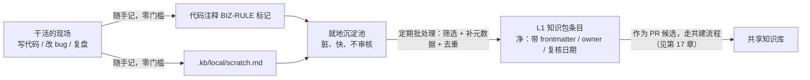
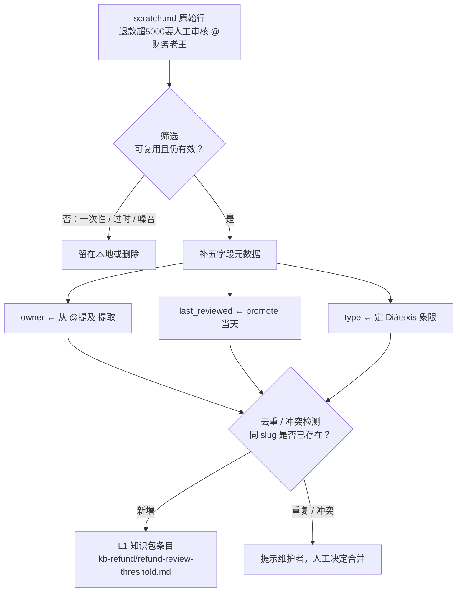

到上一章为止，`aishop-kb` 已经有了两条 CLI 命令：`coverage`（第 5 章，扫覆盖度、找盲区）和 `serve`（第 10 章，起知识 [MCP](https://modelcontextprotocol.io) 服务）。这两条命令服务的都是代码衍生知识——原料本就是有坐标的文件，工具把它取出来换个形态即可。

上一章勘清了另一块地形：手写业务知识没有可寻址的起点，四道摩擦里最根本的一道是无即时回报——成本我出、收益别人拿，导致绝大多数业务规则从未被写下来。基础设施再完整，也没法把只在人脑里的规则自动搬进 `aishop-kb`。

这一章给 `aishop-kb` 加第三条命令 `aishop-kb promote`。它落地共建回路里摩擦最低的一条：让工程师在干活现场零门槛随手记，再由一个定期流程把有价值的条目上收进共享知识包。

## 16.1 本章你会得到什么

1. 一条把捕获和规整拆成两种摩擦的设计原则——先脏后净，各自交给不同的人在不同时间做。
2. 两种就地沉淀载体的落地约定：代码注释里可 grep 的 `BIZ-RULE:` 标记，与仓库内的 `.kb/local/scratch.md`。
3. `aishop-kb promote` 命令：`examples/promote-tool/` 里可运行的批处理，把脏随手记补齐元数据、写成规范的 L1 知识包条目。

## 16.2 高门槛方案收不上知识

先看一个具体处境。`aishop` 的一名工程师在改对账相关代码时，查到一条没人写下来的规则：`legacy_channel` 字段不能删，对账系统还在读它。

按团队规范，他应该新建一个知识包、起标题、选类型、填 owner、提 PR、等 CODEOWNERS 审核。他正在 bug 的上下文里，这一串动作要求他切到另一个系统、重新载入一套心智。于是他做了成本最低的事——在字段旁边塞了行裸注释，继续修 bug：

```typescript
// 这个字段别删，对账还在用
export interface Order {
  legacyChannel?: string;
}
```

这条规则没进知识库。它以一行谁都 grep 不到、agent 读不懂的注释存在，等下一个人重新踩坑时再被发现一次。问题不出在这名工程师身上，出在方案本身：它要求贡献者在成本最高的时刻（正被别的任务占着上下文）付出最高的规整成本。

高门槛方案在几乎所有团队都收不上东西，根源是上一章界定过的那道摩擦——写下来没有即时回报，成本由当下的作者独自承担，收益归于未来某个读到它的人。规范定得越严，门槛越高，愿意付这份成本的人越少。**任何指望贡献者一次写对的方案，都是在跟这道摩擦对赌，而且必输。**

正确的前提不是提高质量要求，而是承认一件事：知识的捕获和知识的规整，是两件摩擦完全不同的事，必须拆开。

## 16.3 先脏后净：把贡献拆成两种摩擦

把 "沉淀一条业务知识" 这个动作拆成两步，每步只承担一种摩擦。它们的分工如图 16-1。



图 16-1：就地沉淀 → 定期 promote 的流转。左边零门槛地脏，右边定期地净。

### 16.3.1 就地沉淀：摩擦趋零的捕获

第一步只负责把知识从人脑里捞出来，不管格式、不管分类、不管审核。工程师在他正干活的地方，随手记一句 "退款超 5000 要人工审核"，成本接近于零。

这一步允许脏。记下来的可能是半句话、可能有错别字、可能和别人记的重复，全都没关系。它唯一的设计目标，是让 "记一句" 的成本低到人愿意随手做。

### 16.3.2 定期 promote：集中承担的规整

第二步由一个定期运行的流程（比如每周一次），把就地沉淀里有价值的条目上收成结构良好、带完整元数据的共享知识。这一步才讲究净——补标题、定 owner、写复核日期、做去重。

它的成本不低，但由少数自愿维护知识的人集中处理，且不打断任何人正在进行的工作。拆分之后，多数人只承担趋零的捕获成本，规整成本集中到少数维护者身上。

维护者是自愿的知识守护者，他付出规整成本换来的正是一个有序、可信的知识库。**先脏后净把捕获和规整这两件摩擦不同的事，拆到了不同的人和不同的时间。**

## 16.4 就地沉淀的载体

就地沉淀的「就地」，指的是在工程师已经打开的地方记，不要求他切换到另一个工具。切换本身就是摩擦。据此，就地沉淀不该只有一种载体，而应覆盖工程师日常停留的位置，每个位置对应不同形态的知识。

### 16.4.1 代码注释里的 BIZ-RULE 标记

有些业务知识天然依附于某段代码——某个字段为什么不能删、某个阈值为什么是这个数、某个分支为什么必须保留。这类知识最好的落点就是那段代码旁边的注释，它和代码同生命周期，代码改到这里，读注释的人一眼就看到规则。

裸注释的问题是无法被机器识别和抽取。16.2 那行注释就是反例：它救不了下一个人。解决办法是约定一个可 grep 的前缀标记，例如 `BIZ-RULE:`：

```typescript
// BIZ-RULE: legacy_channel 字段不可删，对账系统仍在读它 @订单组
// 见 aishop scratch.md，待 promote 到 kb-orders
export interface Order {
  legacyChannel?: string;
}
```

前缀让就地沉淀在代码里也能被结构化收集——promote 流程 `grep -r 'BIZ-RULE:'` 就能把散在整个仓库的规则集中起来，和 `scratch.md` 里的条目合流进同一个待上收池。

标记不改变工程师的书写习惯（还是写注释），只多加一个前缀，摩擦增量几乎为零。它把 "埋在代码里、没被当成知识" 的注释，显式化成了可抽取的候选。

### 16.4.2 仓库内的 scratch.md

另一些知识不依附于具体某行代码——一条跨模块的约定、一次线上事故的教训、一个还没想清楚归属的规则。这类知识没有明确的代码落点，强行塞进某个文件的注释反而找不回来。

它们的载体是仓库里一个专门的随手记文件，本书约定放在 `.kb/local/scratch.md`（第 8 章 L2 本地层的一部分）。放在仓库里而非中心化系统，理由还是就地：工程师本来就在仓库里干活，往一个已打开的文件追加一行，比切到浏览器登录另一个系统低得多。

`scratch.md` 的格式约定到极致简单——每条一行、`- ` 开头，其余不管：

```markdown
- 退款超5000要人工审核 @财务老王
- 大促库存扩3倍 去年双11拍的
- legacy_channel别删 对账系统还在读
- 风控命中的订单不能自动退款 @风控组
- 今天中午吃啥
```

### 16.4.3 载体对照

不同载体在 "离干活现场多近" 和 "结构化程度" 上各有取舍，选择依据是知识有没有明确的代码落点（表 16-1）。

表 16-1：就地沉淀的几种载体对照

| 载体 | 离现场程度 | 结构化程度 | 适合的知识 | promote 抽取方式 |
|---|---|---|---|---|
| 代码注释 `BIZ-RULE:` 标记 | 最近，就在代码旁 | 弱（半结构，靠前缀） | 依附于具体代码的规则 | `grep` 前缀标记 |
| 仓库内 `scratch.md` | 近，同仓库 | 弱（一行一条） | 无明确代码落点的约定、教训 | 读文件、逐行解析 |
| PR 描述 / commit message | 中，随提交 | 中（有模板） | 一次变更背后的决策理由 | 从 PR 讨论抽取（第 18 章） |
| 聊天 / 事故复盘记录 | 远，另一个系统 | 无 | 突发讨论、临时结论 | 需人工搬运或自动提炼 |

表中越靠上，就地程度越高、摩擦越低，但结构化程度也越低，越依赖 promote 阶段补规整。这正是先脏后净的分工：把结构化的负担从捕获端整个移到 promote 端，换取捕获端的零门槛。

本章聚焦前两种（`BIZ-RULE:` 标记与 `scratch.md`），它们是就地沉淀的主力。从 PR 讨论、复盘记录里自动提炼候选属于另一条贡献回路，详见第 18 章。

## 16.5 定期 promote 的三个动作

promote 是一个定期运行的批处理，把就地沉淀池里的条目升级成规范的 L1 知识包条目。它做三件事：筛选、补元数据、去重。一条随手记从脏文本变成 L1 条目，要顺次经过这三道加工，如图 16-2。



图 16-2：一条随手记经筛选、补元数据、去重三道加工，落地为 L1 条目。

### 16.5.1 筛选：不是所有随手记都值得上收

就地沉淀允许脏，代价是池子里金子和噪音混在一起。`scratch.md` 里既有 "退款超 5000 要人工审核" 这样的真业务规则，也会混进 "今天中午吃啥" 这样的噪音。

promote 的第一步是人工筛选：一次性的、过时的、纯个人的条目，留在本地或直接删掉，只有可复用、仍然有效的知识才进入下一步。

筛选必须由人做，不能自动化。判断一条随手记是不是值得成为组织级知识，依赖对业务的理解，不是规则能覆盖的。配套示例里 `main.ts` 把选中的条目硬编码进 `specs` 数组，只是为了在书里把流程钉死、方便复现；真实场景是维护者打开 `scratch.md` 肉眼判断哪几条值得收。

### 16.5.2 元数据补齐：把脏条目变成可治理条目

选中之后，promote 给每条随手记补齐第 9 章那套元数据，让它从一行裸文本变成可寻址、可治理的知识条目。配套示例的 `promote()`（`src/promote.ts`）为每条补上五个字段：

```typescript
const content =
  `---\n` +
  `title: ${spec.title}\n` +       // 规范标题，替代半句话的原文
  `type: reference\n` +            // 知识类型
  `owner: ${spec.owner}\n` +       // 定 owner，从随手记的 @提及 提取
  `last_reviewed: ${REF_DATE}\n` + // 复核日期，promote 时即为最后验证时间
  `status: active\n` +             // 生命周期状态
  `---\n\n` +
  `- ${spec.note}\n`;
```

其中 `owner` 往往能从随手记里的 `@财务老王`、`@风控组` 直接提取。这也是为什么就地沉淀鼓励随手 `@` 一下责任人——这个零成本的习惯让 promote 阶段省掉了追查归属的工夫。

`last_reviewed` 取 promote 当天。一条知识被人工筛选并规整的这一刻，正是它最后一次被验证有效的时刻。这个日期是第 23 章漂移检测和 TTL 废弃机制的输入。

补齐之后，一条脏随手记就变成了带 owner、有复核日期、能被治理的结构化文件。

### 16.5.3 去重与冲突：批处理必须守住的关卡

就地沉淀零门槛的另一个代价是重复。同一条规则可能被不同人、在 `BIZ-RULE:` 标记和 `scratch.md` 里各记一遍，甚至措辞冲突。

promote 作为集中批处理，是拦截重复和冲突的唯一关卡。这也是它必须批处理、不能实时逐条上收的一个硬理由：只有把一批候选摆在一起，才看得出哪些是同一条、哪些互相矛盾。

配套示例的 `promote()` 目前从简，同 slug 直接覆盖写入。这在真实项目里不够，`src/promote.ts` 的注释也标了这个待补点。promote 前需判断目标文件是否已存在，避免维护者重复 promote 时误覆盖一条已入库、并被人工修改过的条目。

生产级的 promote 至少要做到：目标 slug 已存在时不静默覆盖，而是提示维护者这是新增、更新还是冲突，由人决定合并策略。**去重不是可选优化，是批处理这一步存在的部分理由。**

## 16.6 批处理把成本放对了地方

promote 被设计成定期批处理，而不是随手记一条就实时上收一条，这个选择省下的成本比它表面看起来多。

实时上收意味着每记一条就要立刻筛选、规整、审核一次，把规整的摩擦重新压回捕获的时刻——先脏后净的拆分就白做了。批处理把规整整体挪到独立的时间窗口，捕获端因此得以保持零门槛。

更省的是上下文切换。维护者一次打开就地沉淀池、集中审 10 条，和被 10 次实时打断、每次切进来审 1 条相比，省掉的是 9 次上下文切换的开销。

集中处理 10 条时，维护者脑子里装着的是这一批知识的整体图景，能一眼看出重复和冲突。逐条实时审则每次都要重新载入上下文，还看不到条目之间的关系。

批处理省的不是把成本往后拖延，而是让规整在成本最低的模式下发生。去重、冲突检测这类需要横向看一批的动作，也只有在批处理里才做得成。

## 16.7 aishop 实践：把 scratch.md 上收成知识包

`examples/promote-tool/` 把这条回路在 `aishop` 上跑通。它有一个 `.kb/local/scratch.md`（就地沉淀的随手记，内容正是上一章审计出的那些业务规则，脏、无格式），和一个 `promote` 工具：指定要上收哪几条，它把每条补齐 frontmatter，写成规范的 L1 知识包条目，没被选中的留在本地。

`scratch.md` 里有 5 条随手记，promote 选中 4 条——退款审核阈值、大促扩容、`legacy_channel` 不可删、风控不自动退款，正是第 15 章审计出的 4 条业务欠账。第 5 条 "今天中午吃啥" 是噪音，不上收。

选中的 4 条各自被 promote 进对应的 L1 包：`kb-refund`、`kb-inventory`、`kb-orders`、`kb-risk`。以退款阈值那条为例，一行脏文本 "退款超5000要人工审核 @财务老王" 被规整成 `out/kb/L1/kb-refund/refund-review-threshold.md`：

```markdown
---
title: 退款人工审核阈值
type: reference
owner: 财务老王
last_reviewed: 2026-07-06
status: active
---

- 退款超5000要人工审核 @财务老王
```

一条脏兮兮的随手记，变成了带完整元数据、有 owner、可被治理的 `kb-refund` 条目。这是手写业务知识落地的第一步：先零门槛捕获，再定期把它变成可寻址、可治理的结构化文件。promote 出来的条目在真实项目里作为 PR 候选，走下一章的 docs-as-code 共建流程被审核入库。

## 本章要点

- 高门槛方案（要求一次写对、带元数据、走审核）必然收不上知识，因为它跟 "写下来没即时回报" 这道结构性摩擦对赌，还把最高的规整成本压在贡献者上下文最紧张的时刻。
- 先脏后净的核心是把捕获和规整拆成两种摩擦：就地沉淀零门槛捕获（要脏要快），定期 promote 集中规整（才要净），交给不同的人在不同时间做。
- 就地沉淀要覆盖工程师日常停留的位置：依附代码的规则用 `BIZ-RULE:` 注释标记（可 grep 抽取），无代码落点的约定用仓库内 `.kb/local/scratch.md`；越就地摩擦越低、越依赖 promote 补规整。
- 定期 promote 做三件事：人工筛选、补齐五字段元数据（owner 从 `@提及` 提取、`last_reviewed` 取当天）、去重与冲突拦截；示例的去重目前只是同 slug 覆盖，生产级须做到已存在时不静默覆盖。
- 批处理省的不只是延后成本，而是消掉 N-1 次上下文切换，并让横向看一批才能做的去重与冲突检测成为可能。

## 下一章

promote 出来的条目还只是候选，谁审、按什么标准入库尚未定。第 17 章给 `aishop-kb` 加 `check` 命令，把 docs-as-code 共建流程补齐：用 CODEOWNERS 指定审核人，用结构校验做质量门禁，让每条知识都走 PR 被审后入库。

## 配套代码

见 `examples/promote-tool/`。

---

> 本章来自《Agent 知识库工程实战：组织、分发、共建与度量》开源版 · 作者「递归客」
> 在线阅读完整书系：[inferloop.dev](https://inferloop.dev)
