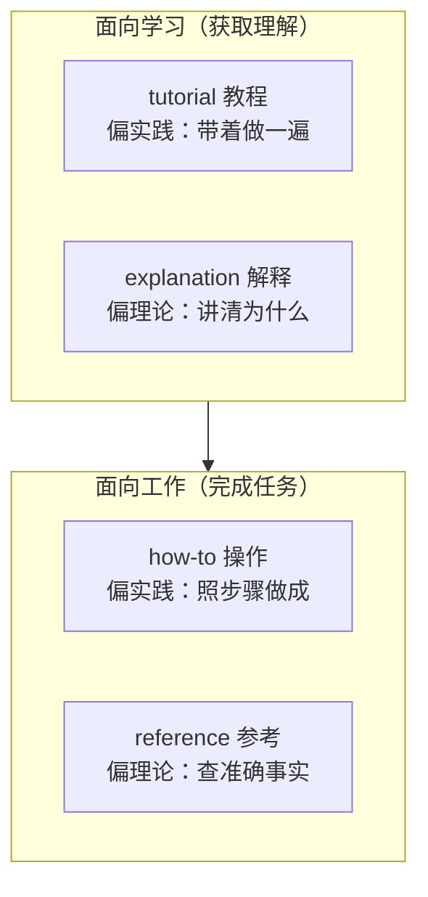
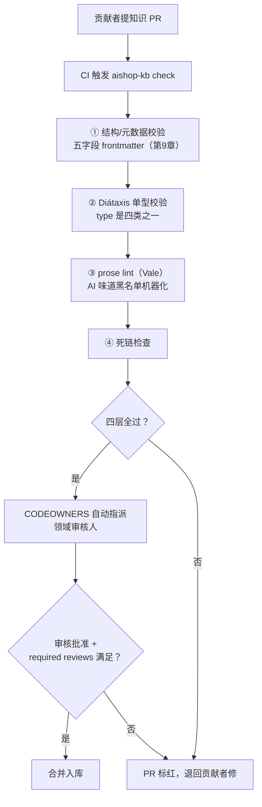

到上一章为止，`aishop-kb` 的 CLI 已经有三条命令：`coverage` 扫覆盖度、`serve` 起知识服务、`promote` 把工程师的随手记上收成 L1 候选。

第 16 章解决的是有没有人愿意写。`promote` 把贡献门槛压低之后，新的压力立刻浮现：人人能提，就意味着人人能写乱、写错、留死链。共享包 `kb-orders`、`kb-refund`、`kb-inventory`、`kb-risk` 接下来要接收来自所有人的 PR，谁能提、提了谁审、审之前机器先筛什么，还没有答案。

本章给 `aishop-kb` 补齐这套共建流程：把知识当代码管的 docs-as-code 动线、按领域自动指派审核人的 CODEOWNERS、以及一条新命令 `aishop-kb check`——在合并前跑四层自动质量门禁。

## 17.1 本章你会得到什么

1. `aishop-kb` 的一份 `.github/CODEOWNERS`：把四个知识包的审核归属钉死到领域组，关键包挂两名 owner。
2. `aishop-kb check` 命令：四层客观门禁（frontmatter 结构、Diátaxis 单型、Vale 文风、死链），在 CI 上不过关就拦。
3. 一条把谁审、机器筛什么拆干净的设计原则——机器筛客观问题，人只审机器筛不掉的判断。

## 17.2 一条被门禁挡下的知识 PR

先看一个具体处境。一名工程师在 `kb-refund` 包里提了条新退款规则，PR 的文件长这样：

```markdown
---
title: 超时未取消订单的退款
tpye: guide
---

# 超时退款

具体口径见 [对账说明](../kb-orders/reconcile-v1.md)。
让我们来探索一下这条规则背后的设计考量……
```

这条 PR 有四处问题，全是客观、可判定的：

1. frontmatter 拼错了字段名（`tpye`），且缺 `owner`、`last_reviewed`。
2. 类型值 `guide` 不在 Diátaxis 允许的四种之内。
3. 正文引用的 `../kb-orders/reconcile-v1.md` 已经改名，是一条死链。
4. 正文命中了本书写作规范里明令禁止的 AI 套话。

这四处没有一处需要退款业务专家来发现——它们该被机器在人看到之前就拦下。本章要建的，就是这道机器防线，以及它拦不掉时该由谁接手。

## 17.3 docs-as-code：知识以文件活在 git

docs-as-code 的实质，是让知识复用软件工程已经打磨了二十年的协作基础设施，而不是另造一套。知识以结构化文件存活在 git 仓库里，任何人想改就提一个 PR。

PR 里能看逐行 diff、能逐条评论、能被指定的人审核、能被 CI 自动检查。审核通过、检查全绿，合并即入库。

这套动线把贡献知识的操作成本压到近乎为零。工程师提知识 PR 和提代码 PR 用的是同一套工具、同一份肌肉记忆，不必登录另一个系统、不必学一套新的编辑器和权限模型。

git 这层地基还白送了知识治理最基础的两项能力：

- 可追溯：每条知识的每次改动都带作者、时间、commit message 和关联 PR，谁在什么时候为什么加了这条规则永远可查，事故复盘时是硬通货。
- 可回滚：一次错误的知识改动和一次错误的代码改动一样，`git revert` 即可退回，不会像在线文档那样改了就找不回上一版。

但 PR 只解决了贡献动线这一半。PR 能被提出，不等于内容质量过关，也不等于有合适的人来判断它对不对。剩下的两半——谁来审、机器先筛什么——分别交给 CODEOWNERS 和质量门禁。

## 17.4 Diátaxis 四象限：先给知识定形

在讨论谁审、机器筛什么之前，要先给知识定形。开放贡献最先失控的往往不是质量而是形态。

同一个包里，有人写成手把手的操作步骤，有人写成大段背景解释，有人塞进一张字段表。混在一篇里谁都读着别扭，agent 召回时也判断不了这段知识是用来照做的还是用来理解的。

Diátaxis 是一个被广泛采用的文档分类框架。它按两个维度——面向学习还是工作、偏实践还是理论——把文档切成四个象限，任何一篇都应落在且只落在其中一个（表 17-1）。

表 17-1：Diátaxis 四象限与知识包中的对应

| 类型 | 面向 | 回答的问题 | aishop 知识库中的例子 |
|---|---|---|---|
| tutorial（教程） | 学习 + 实践 | 带我上手做一遍 | 第一次接入 `kb-orders` 的端到端演练 |
| how-to（操作指南） | 工作 + 实践 | 怎么完成这个具体任务 | 如何为一个新退款场景补一条 `kb-refund` 规则 |
| reference（参考） | 工作 + 理论 | 准确的事实是什么 | 订单状态机各状态的字段定义与流转表 |
| explanation（解释） | 学习 + 理论 | 为什么是这样 | 下单先锁库存这条业务约束的来龙去脉 |

四象限沿两条轴的分布如图 17-1。



图 17-1：Diátaxis 四象限沿「学习 ↔ 工作」和实践 ↔ 理论两条轴的分布。`type` 字段把这条分类纪律固化下来。

四象限的纪律是一篇文档只属于一个象限。混写的代价是双向的：想理解概念的读者被操作步骤打断，想照做的读者被背景解释拖慢。

对人写的文档，这条纪律提升可读性。对 agent 用的知识，它还多一层工程价值：`type` 成了召回时的意图过滤器。

agent 执行一个退款操作时，检索可以优先命中 `type: how-to` 的条目、跳过 `type: explanation` 的长篇背景。这正是第 3 章讨论知识载体形态时埋下的伏笔在消费端的兑现。

因此每条知识的 frontmatter 都带一个 `type` 字段，取值限定为这四种之一。这个约束不能靠贡献者自觉，得由下面的质量门禁强制。

## 17.5 CODEOWNERS：按领域自动指派审核人

开放贡献不等于无人负责。CODEOWNERS 是一个声明哪些路径归谁审的文件，GitHub、GitLab 都原生支持，解决的正是上一章点名的「没主人」摩擦。

它的机制是路径到审核人的映射。在 `aishop-kb` 的 `.github/CODEOWNERS` 里，声明 `kb/kb-refund/` 下的知识归财务组审、`kb/kb-orders/` 下的归订单组审：

```
# 每块知识的审核归属——改哪块由哪块的主人把关。
kb/kb-refund/     @finance-team @finance-lead
kb/kb-orders/     @order-team
kb/kb-inventory/  @inventory-team
kb/kb-risk/       @risk-team @security-lead
```

于是任何人提了一个改退款知识的 PR，财务组会被平台自动请求评审，没有他们批准就合不了。审核归属不再依赖贡献者找对人这一步易错的人肉路由，而由改动路径自动决定。

### 17.5.1 required reviews 与 CODEOWNERS 是正交的

这里有一处 GitHub 语义容易踩坑。给一个路径列两名 owner，默认分支保护下只要其中一人批准即可合并，而非两人都批。

若要真正强制两人都过审，得另在分支保护规则里把 required approving reviews 设成 2。CODEOWNERS 只声明谁有资格审，审几人是分支保护的事，两者正交。

哪些包该要求两人，本书采用 `ai-asset-standards` 的约定并给出一条务实判据：

- 涉及资金或安全边界的包算关键包，至少两名 owner 评审，避免单点误判。
- 一般业务包一名 owner 即可。

这就是上面 `kb-refund`、`kb-risk` 挂两名 owner，而 `kb-orders`、`kb-inventory` 只挂一名的原因。退款和风控的知识错了会直接造成资损或安全事故，多一双眼睛的成本远低于出错的成本。

**CODEOWNERS 把开放贡献和有人负责从对立变成协作：谁都能提，但改哪块由哪块的主人把关。** 判据出处见 `ai-asset-standards` 的 `11-distribution-contribution.md`。

## 17.6 质量门禁：机器筛客观问题

CODEOWNERS 决定谁来审，但不该让人去做机器能做的事。格式对不对、元数据全不全、`type` 合不合法、正文有没有 AI 套话、链接死没死——这些都是客观、可判定、可自动化的检查。

让人肉去 catch 这些是对审核精力的浪费。它们交给 CI 质量门禁，在 PR 上自动跑，不过关就拦，让 CODEOWNERS 的人审只花在机器筛不掉的地方。

`aishop-kb check` 的门禁包含四层客观检查，逐层拦截（表 17-2）。

表 17-2：知识质量门禁的四层检查项

| 层 | 检查项 | 拦截示例 | 承载工具 |
|---|---|---|---|
| ① 结构/元数据 | 五字段 frontmatter 齐不齐、`last_reviewed` 是否超期 | 缺 `owner`、字段名拼错 | 复用第 9 章校验脚本 |
| ② Diátaxis 单型 | `type` 是否为四种合法类型之一 | `type: guide` 非法 | 自定义校验 |
| ③ prose lint | 正文是否命中 AI 味道黑名单 | 命中「让我们来探索」 | Vale |
| ④ 死链 | 正文引用的本地路径是否存在 | 链接指向已改名文件 | 死链检查器 |

这四层在一条 PR 流水线里的位置如图 17-2。贡献者提 PR，CI 依次跑完四层，全绿才进入 CODEOWNERS 的人审，任一层红了 PR 就标红退回。



图 17-2：`aishop-kb` 的 PR 共建流水线。机器先把结构、类型、文风、死链这些客观问题筛掉，人只审机器筛不掉的：内容对不对、该不该入库。

### 17.6.1 Vale：把 AI 味黑名单变成机器规则

四层里最值得展开的是 prose lint，因为它把本书一直强调的去 AI 味从一句主观要求变成了可执行的机器规则。

承载它的 Vale 是一个开源、可自托管、规则可自定义的散文 linter。它读一份 YAML 定义的规则集，对文本逐条匹配并给出定位。

本书那份 AI 味道黑名单——「让我们来探索」「值得注意的是」「不难发现」等——写成 Vale 规则后，任何命中都会在 PR 上直接标红，具体到行。

**文风检查从靠资深 reviewer 人肉发现、发现全凭状态，变成 CI 门禁必然拦截、标准恒定。** 这也是让新贡献者对齐文风的最省力方式：他们不必读完整份写作规范，被门禁拦几次就学会了。

### 17.6.2 四层只管客观问题

这四层的边界要划清：它们只管客观问题。语义层面的问题——两条知识互相矛盾、内容几乎重复、事实错误——是更难的判断，四层门禁一概管不了。

那部分交给下一章的抽取与人审流程（第 18 章）。质量门禁的价值不在于筛掉一切问题，而在于把能自动化的那部分从人审里彻底剥离，让人的判断力集中在真正需要人的地方。

## 17.7 黄金路径：让走正道最省事

治理机制若只靠强制，贡献者会想方设法绕过。真正让共建持续的，是把正确的贡献方式同时做成最省事的贡献方式——走正道比走歪路更快、更少摩擦，绕过的动机自然消失。

具体到 `aishop-kb`，黄金路径体现在三处：

1. 知识文件带一份模板，`type`、`owner`、`last_reviewed` 预填占位，贡献者填空即可，比自己从头攒 frontmatter 快。
2. 门禁的报错精确到缺哪个字段、哪句是 AI 套话、哪个链接死了，照着改一遍就过，比猜哪里不合规快。
3. CODEOWNERS 自动把 PR 指派给对的人，贡献者不用打听这块该找谁审。

反过来，任何绕过门禁的做法——手动跳过 CI、把知识写进代码注释而非知识包——都要付出更多解释成本，得不偿失。

**门禁负责兜底拦截不合格的，黄金路径负责让合格的产出毫不费力，一拉一推，开放贡献才长期不退化。**

## 17.8 动手：aishop-kb check

`examples/docs-as-code/` 给出 `aishop-kb` 知识仓库的最小门禁套件，零运行时依赖，只用 Node 内置模块。它包含三部分：

- 一个 `.github/CODEOWNERS`：声明四个知识包的审核归属，关键包 `kb-refund`、`kb-risk` 各挂两名 owner。
- 一个四层门禁脚本 `src/gate.ts`：对标 `ai-asset-standards` 的 `docs-ci.yml`。
- 一批待入库知识条目 `kb/`。

`src/gate.ts` 的四层逻辑与正文一一对应：`REQUIRED` 五字段做结构校验，`DIATAXIS` 数组做单型校验，`AI_TASTE` 黑名单做 prose lint，正文里的相对链接做死链检查。`src/main.ts` 遍历 `kb/` 下所有条目跑一遍门禁并汇总，对应 `aishop-kb check`。

跑 `npx tsx src/main.ts`，会看到五条知识里一条干净过关、四条各被一种问题拦下：

| 条目 | 结果 | 原因 |
|---|---|---|
| `kb-refund/good.md` | PASS | 干净过关 |
| `kb-inventory/bad-type.md` | FAIL | `type: guide` 非 Diátaxis 合法类型 |
| `kb-orders/no-owner.md` | FAIL | 缺 `owner` |
| `kb-risk/ai-taste.md` | FAIL | 命中「让我们来探索」 |
| `kb-orders/dead-link.md` | FAIL | 引了不存在的文件 |

脚本逐条打印具体问题，并以退出码 1 结束。这个非零退出码，就是这套门禁接入 CI 后拦截不合格 PR 的开关。

## 本章要点

- docs-as-code 让知识以结构化文件存活在 git、走 PR 共建，动线与写代码一致，白得可追溯与可回滚两项治理地基。
- Diátaxis 四象限（tutorial/how-to/reference/explanation）给知识定形，一篇只属一个象限；`type` 字段对人提升可读性，对 agent 充当召回意图过滤器。
- CODEOWNERS 按领域自动指派审核人；关键包要求至少两名 owner，双人强制需另在分支保护里设 required reviews 为 2——CODEOWNERS 与 required reviews 正交。
- 质量门禁四层（结构/元数据、Diátaxis 单型、Vale prose lint、死链）在 CI 自动跑，机器筛客观问题、人审主观判断；语义矛盾与重复超出四层能力，交第 18 章。
- 黄金路径让走正道最省事：模板预填、报错精确、审核自动指派——治理才从靠纪律转向靠默认。

## 下一章

四层门禁拦住了客观问题，人审补上了主观判断，但共建回路还缺一环：值钱的业务知识往往埋在 PR 讨论、事故复盘、code review 里，没人会主动把它们誊成知识条目。下一章给 `aishop-kb` 加一条 `extract` 命令，从这些现场自动抽取知识候选，再走本章的门禁与人审入库。

## 配套代码

见 `examples/docs-as-code/`。

---

> 本章来自《Agent 知识库工程实战：组织、分发、共建与度量》开源版 · 作者「递归客」
> 在线阅读完整书系：[inferloop.dev](https://inferloop.dev)
