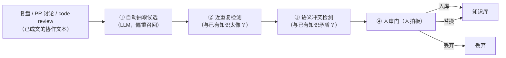
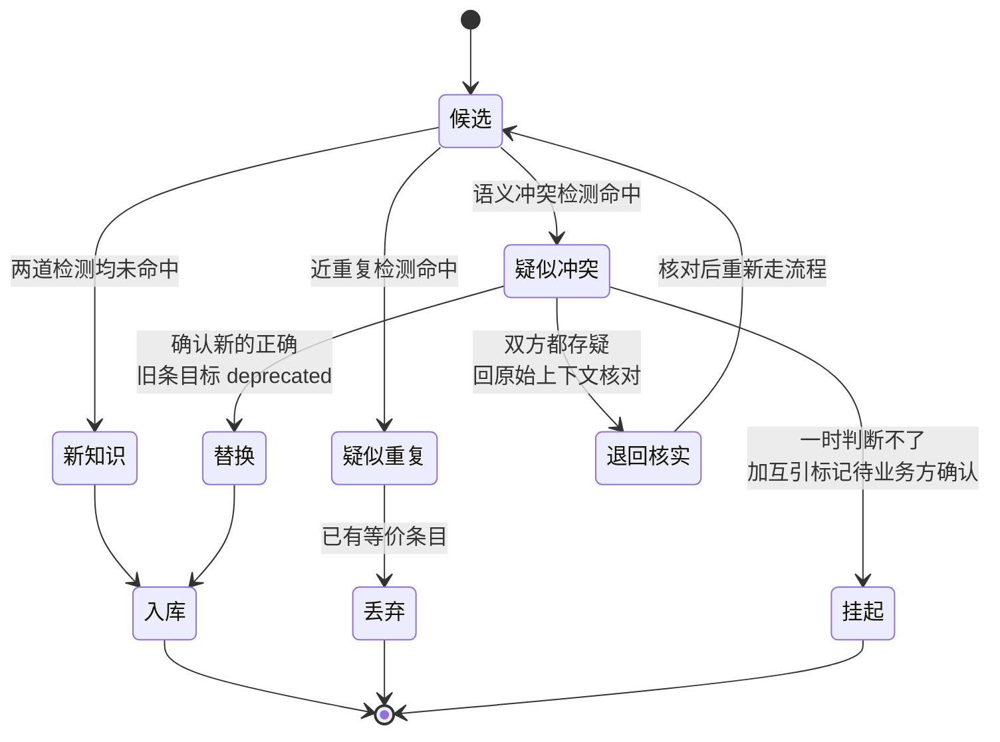

到上一章为止，`aishop-kb` 的 CLI 已经有四条命令：`coverage` 扫覆盖度、`serve` 起知识 MCP 服务、`promote` 把本地随手记上收成共享包、`check` 跑质量门禁。这四条覆盖了从沉淀到分发的主干。

但它们都建立在同一个前提上：有人主动把知识写下来。就地沉淀（第 16 章）靠人随手记，docs-as-code 共建（第 17 章）靠人提 PR。企业里最值钱的一批业务知识却不走这条路——它们藏在事故复盘、PR 讨论、code review 里，早已成文。只是没人回头把结论誊进知识库。

本章给 `aishop-kb` 加第五条命令 `extract`：自动从这些协作文本里提炼知识候选，做冲突与近重复检测，最后交人审入库。它补的是前四条命令都触及不到的一类知识。

## 18.1 本章你会得到什么

1. 一条 `aishop-kb extract` 流水线：从复盘 / PR / code review 文本抽出候选，两道检测后进人审队列。
2. 两道入库前检测的机制——近重复检测防知识静默分叉，语义冲突检测抓彼此矛盾的规则。
3. 一条不可让渡的硬约束：自动抽取只产候选，绝不自动 commit，入库与否始终由人拍板。
4. `examples/extract-review/` 里可离线复现的完整实现，含一次真实的数值冲突（阈值 3000 vs 5000）。

## 18.2 已成文却未被治理的知识

先看一个具体实例。`aishop` 上个月出过一次退款事故，复盘纪要里写着这么一段：

```
本次事故：一笔大额退款没走人工审核被薅。
结论：退款金额超过 3000 元需人工审核（原阈值 5000，本次调低）。
另外支付回调要加幂等。
```

这段话已经成文、已经躺进某个文档。可知识库里那条规则还写着 5000。没有人在复盘之后回头改它。三周后，一个新来的 agent 查退款审核阈值，读到的仍是过期的 5000。

问题不在于知识没被写下来，而在于它写下来之后从未进入被治理、可被 agent 取用的集合。第 15 章归纳的第三道摩擦——散落、想不起来收——正是这种状态。对这类知识，让人再写一遍是重复劳动，指望人主动去收则永远排不上优先级。

本章的贡献回路就针对这道摩擦：从日常协作的文本副产物里自动抽取候选，经冲突与近重复两道检测，最后由人审入库。它与前两条回路的根本区别在于驱动力——**前两条靠人主动，这一条靠系统兜底**。

## 18.3 抽取：从文本副产物到候选条目

抽取的输入是原始的、非结构化的协作文本，输出是一批结构化的候选知识条目。三类来源的信噪比与抽取难度各不相同（表 18-1）。

表 18-1：三类抽取来源的信噪比

| 来源 | 信噪比 | 抽取难点 |
|---|---|---|
| 事故复盘 | 最高 | 结论段几乎逐条是硬规则，且已被人提炼过一轮，摘结论句即可 |
| PR 讨论 | 中等 | 通用约定埋在与本次改动强绑定的一次性对话里，要把两者分离 |
| code review 评论 | 最低但覆盖最广 | 多数是风格与实现细节，偶尔一条点出架构级约束 |

事故复盘信噪比最高。复盘的结论段落几乎逐条都是硬业务规则，且往往已被人提炼过一轮，抽取只需把结论句摘出来。

PR 讨论信噪比中等。reviewer 的一句「退款超过 5000 要人工审核，别漏了」是极有价值的约定，却埋在大量不具沉淀价值的对话里，抽取要能把通用约定从一次性讨论中分离出来。

code review 评论信噪比最低但覆盖面最广。多数评论关乎风格与实现，偶尔一条会点出「这里没考虑并发下单会超卖」这种架构级约束。

生产环境用大模型做抽取：给它一段复盘或一串 PR 评论，让它回答这里面有哪些应当沉淀为团队知识的业务规则。规则式抽取（按业务关键词命中句子）只在演示中够用，处理不了用不同措辞表达同一规则这类语义变体。

### 18.3.1 抽取偏重召回而非准确

抽取这一步的评价指标不是准确率（precision，抽出的候选里有多少真该入库），而是召回率（recall，真该入库的知识里有多少被抽了出来）。这个取向由流水线结构决定，不是随意的偏好。

原因是后面有人审兜底，两类错误的代价不对称：

- 抽多了：人审队列里多几条一眼就能丢弃的噪音，代价是几秒钟的浏览。
- 抽漏了：一条本该沉淀的知识永久沉没，再也没有第二次机会被发现。

因此抽取应当把阈值调低、宁滥勿缺。**漏抽是永久沉没，抽多只是人审多看一眼**——代价既然不对称，就把边界情况都推给人审。

配套示例把这一点做成了可观察的现象。复盘文本里有一句叙事性的「本次事故：一笔大额退款没走人工审核被薅」，它不是规则，却含业务关键词，于是被一并抽出，最终落入新知识、可入库。

这条噪音是重召回的必然代价，它换来的是不漏掉同一段文本里真正的规则句。人审时一眼丢弃即可，成本远低于漏抽。这也是为什么示例的人审队列里实际有 5 条候选，而不是三类候选对应的 3 条。

## 18.4 入库前的两道检测

抽取产出的候选，绝不能直接写进知识库。一条候选可能与已有知识重复，可能与已有知识矛盾，也可能本身就是错的。

第 17 章的质量门禁校验的是单条知识本身合不合格——格式、类型、文风。抽取候选还有一类问题落在质量门禁的射程之外：单条看毫无问题，放进已有知识库里却出问题。

这类问题只有两种形态——与已有知识重复，或与已有知识矛盾——对应两道检测。整条流水线如图 18-1。



图 18-1：自动抽取 → 两道检测 → 人审入库的流水线。前三步自动降摩擦，第四道人审门守住质量。这两道检测正是现有 CI 未覆盖的缺口——它此前只做结构校验与死链检查。

### 18.4.1 近重复检测挡住知识的静默分叉

近重复指候选与某条已有知识几乎在说同一件事。若直接入库，知识库里就出现两条几乎一样的条目。

它们的危害不在当下，而在将来：某天有人改了其中一条、忘了另一条，两条开始各说各话，知识库从此静默分叉、持续漂移（漂移的治理见第 22 章）。

检测办法是相似度比对：把候选与所有已有知识嵌成向量，算相似度，超过阈值即标为疑似重复，提示人审这条是不是已经有了。

示例中，PR 讨论抽出的「退款金额超过 5000 元需要人工审核」与已入库那条只差一个字，相似度 0.73，被正确标为疑似重复。

### 18.4.2 语义冲突检测识别彼此矛盾的知识

冲突指候选与某条已有知识矛盾，这是两道检测里更危险的一类。示例中，已入库知识是退款超 5000 元需人工审核，而退款事故复盘抽出的候选是退款超 3000 元需人工审核。

两句话高度相似（都在讲退款审核阈值），关键数字却不同。示例算出相似度 0.87、数字 3000 与 5000 不一致，标为疑似冲突。

冲突比重复更值得警惕，因为**一条与现实矛盾的旧知识比没有知识更糟**。缺失的知识让 agent 无从作答，尚可被察觉；一条过期的旧知识会理直气壮地把 agent 带向错误答案，且不留痕迹。

反过来看，抽取新知识的时刻，恰恰是发现旧知识可能已经过期的最好时机。外部世界发生了变化（阈值从 5000 调到 3000），这个变化先以事故、以 PR 的形式落进文本；抽取把它捞出来时，也就同时暴露了库里那条尚未更新的旧知识。

冲突的形态不止一种，检测难度也随之分层（表 18-2）。

表 18-2：冲突的类型与可检测性

| 冲突类型 | 示例 | 检测手段 | 本章示例是否覆盖 |
|---|---|---|---|
| 数值冲突 | 阈值 5000 vs 3000 | 高相似度 + 关键数字比对 | 覆盖 |
| 极性冲突 | 允许自动退款 vs 不允许自动退款 | 需 LLM 判断语义极性 | 未覆盖 |
| 条件冲突 | 大促锁库存 vs 常态不锁库存 | 需 LLM 抽取并比对适用条件 | 未覆盖 |
| 范围冲突 | 全站包邮 vs 仅一线城市包邮 | 需 LLM 判断集合包含关系 | 未覆盖 |

配套示例只覆盖第一行的数值冲突：先用相似度找出高度相关的已有知识，再比对关键数字是否一致，不一致即标为冲突。

后三类冲突字面相似度可能很高，简单比对却抓不出矛盾，生产环境必须交由 LLM 做语义裁决。示例把冲突检测停在数值这一层，是为保持零依赖、可离线复现，而非因为其余三类不重要——极性与条件冲突在真实业务里更常见、也更隐蔽。

### 18.4.3 检测阈值的迁移不能照搬

配套示例把近重复阈值设为 `DUP_THRESHOLD = 0.5`。这个数字是在本地词袋 embedding 下手工试出来的，与具体 embedding 实现强绑定，换成真实 embedding 模型后必须重新标定。

标定方法是准备一批已知重复 / 不重复的样本对，扫描候选阈值，观察准确率与召回率的权衡曲线，选一个让漏检足够低的点。

这里的取舍与抽取一步同向：检测这一关也偏向多标记。多标一条疑似，人审多看一眼即可；漏标一条真冲突，一条与现实矛盾的知识就混进了库。阈值定得偏低、把边界情况推给人审，是这条流水线一以贯之的安全取向。

## 18.5 人审入库是不可让渡的硬约束

抽取与检测都为降摩擦、提效率，最后拍板的必须是人。候选带着疑似重复、疑似冲突的标记进入人审队列，由人决定入库、丢弃、还是替换掉某条旧知识。**自动抽取只产候选，绝不自动 commit 进库**——这是本章不可让渡的硬约束，不是一条可按团队偏好放松的建议。

理由是错误代价的量级。这条候选对不对、该不该替换那条旧的，是业务判断，判错的后果不是局部的。

一条错误知识一旦自动写进库，会污染所有依赖它的 agent，且以库里有明文规则的权威姿态传播，比 agent 凭空编造更难被下游察觉。用几秒钟的人工确认，换掉这种全局污染的风险，是这条流水线里性价比最高的一步。

一条候选进入人审队列时已带着 ① 疑似重复、② 疑似冲突或 ③ 新知识三种标记之一，对应三条处理路径，如图 18-2。



图 18-2：候选在人审门内的状态流转。三种检测标记分流到不同处理路径，只有入库是终态推进，替换会把旧条目标为 `deprecated`。

人审面对一条疑似冲突时，处理选项通常有三种：

1. 确认新的正确：替换旧条目，并把旧条目标为 `deprecated`（第 9 章的 status 字段），保留废弃痕迹以便追溯。
2. 一时判断不了：让两条暂时并存，加上互相引用的标记，挂起等业务方确认，不在信息不足时强行下判断。
3. 退回核实：候选与旧知识都存疑时，退回复盘或 PR 的原始上下文重新核对来源。

这道判断由对应知识包的 CODEOWNERS（第 17 章）来做最合适——他们既懂该领域业务，又对这批知识负最终责任。

三种自动化各司其职、互不替代：抽取解决想不起来收，检测解决重复与矛盾，而入库与否这个最终判断始终归人审。自动化用来降摩擦，人审用来守质量，这是贯穿本书共建部分的同一条原则。

## 18.6 动手：aishop 的抽取到人审流水线

`examples/extract-review/` 实现这条完整流水线，也就是 `aishop-kb extract` 背后的逻辑。它预置了一批已入库知识（含「退款金额超过 5000 元需人工审核」），和两段 `aishop` 的原始协作文本——一段退款事故复盘、一段 PR 讨论。

运行 `npx tsx src/main.ts`，三类候选各被正确标记：

- 复盘里的「退款金额超过 3000 元需人工审核」标为疑似冲突（与已有 5000 那条相似度 0.87、数字不同）。
- PR 里的「退款金额超过 5000 元需要人工审核」标为疑似重复（相似度 0.73）。
- 支付回调加幂等、大促库存扩容等标为新知识、可入库。

三类都进人审队列，等人拍板。有两点实现边界要说清。

其一，抽取偏重召回，会一并挖出叙事性噪音句（本次事故……被薅），它同样落入新知识、可入库，这正是重召回的代价。人审时直接丢弃即可，所以队列里实际有 5 条而非 3 条。

其二，图 18-1 把近重复与语义冲突画成两道门是为讲清逻辑。代码实现上（见 `src/detect.ts`）是一次相似度计算加一个数字比对分支：相似度达阈值且数字不同则判冲突，否则判重复。效果与画成两道门等价。想扩到极性、条件类冲突，把这个分支替换为 LLM 裁决即可，示例保留了这个插槽。

## 本章要点

- 最值钱的业务知识常已成文于事故复盘、PR 讨论、code review，却因想不起来收而从未进入被治理的集合；第三条贡献回路靠系统兜底，而非指望人主动。
- 抽取偏重召回而非准确：漏抽是永久沉没，抽多只是人审多看一眼，代价不对称，故宁滥勿缺、噪音交人审兜底。
- 入库前设两道检测，补上现有 CI 的缺口：近重复防止知识静默分叉，语义冲突识别彼此矛盾的规则；冲突比重复更危险，因为过期旧知识比缺失知识更能误导 agent。
- 冲突分数值、极性、条件、范围多类，示例只覆盖可离线复现的数值冲突，其余须由 LLM 语义裁决；检测阈值与 embedding 实现强绑定，迁移须重新标定。
- 人审入库是不可让渡的硬约束：自动抽取只产候选、绝不自动 commit；入库与否是业务判断，判错会以权威姿态污染所有下游 agent。

## 下一章

抽取、检测、共建都做完，`aishop-kb` 里的知识已经足够多、足够干净。接下来的问题换了一端：agent 在具体任务里怎么把这些知识用好。第六部分从第 19 章的消费端工程开始，讲检索时机与上下文注入——知识建得再好，注入错了时机也是白搭。

## 配套代码

见 `examples/extract-review/`。

---

> 本章来自《Agent 知识库工程实战：组织、分发、共建与度量》开源版 · 作者「递归客」
> 在线阅读完整书系：[inferloop.dev](https://inferloop.dev)
