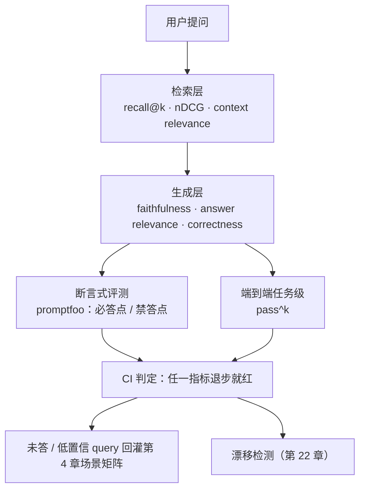

到这一章，`aishop-kb` 已经是一个能用的命令行工具。它有 `coverage`（扫覆盖度）、`serve`（起知识 MCP 服务）、`promote`（把就地记录上收成共享包）、`check`（结构与冲突校验）、`extract`（从协作文本抽取候选）五条命令，覆盖了建、发、共建、治理的主干。

其中 `coverage`（第 5 章）回答的是一个前置问题：该覆盖的知识，有没有覆盖到。它扫的是考纲齐不齐，不管考试得几分。

下面这次运行暴露了两者之间的裂缝：

```
$ aishop-kb coverage
业务场景覆盖率：100%  （42/42 场景命中知识）

$ 问 agent：退款多少金额需要人工审核？
agent：超过 3000 元需人工审核。
```

覆盖度满分，agent 却答错了。退款阈值早已从 3000 改成 5000，知识库里那条旧规则没跟着改，agent 检索到它、原样复述。

考纲每一格都填了知识，不代表每一格的知识都对。`coverage` 证明了"该有的有没有"，证明不了"有了准不准"。本章给 `aishop-kb` 加最后一条度量命令 `eval`——用 promptfoo 跑断言、用 pass^k 跑任务级可靠性，把"这座知识库真的让 agent 答对了吗"变成一组能进 CI 的数字。

## 21.1 本章你会得到什么

1. `aishop-kb eval` 命令：一次跑完断言式评测与 pass^k，有失败就非零退出，可直接接进 CI。
2. 一套分两层的评测指标——检索层与生成层各测一段，附一张判断故障出在哪层的对照表。
3. 一条核心判断的落地：faithfulness 满分为何仍会答错，以及该用什么指标兜住它。
4. `examples/eval-promptfoo/` 里能独立跑的最小评测器，当场复现"忠实地答错"这个 FAIL。

## 21.2 两层指标：检索层与生成层

一次问知识库、agent 作答里有两个环节会各自出错，指标也就分两层。把它们混成一个总分，会掩盖故障究竟发生在哪一段：是该召回的知识根本没召回（检索层的锅），还是知识召回对了但 agent 答歪了（生成层的锅）。

两层的关系、两种评测方式、以及最后如何汇入 CI，如图 21-1 所示。



图 21-1：有效性评测的数据流。检索层和生成层各测一段，再分两条路径评（断言式 + 任务级），结果汇入 CI，一条回灌场景矩阵形成覆盖闭环，一条接第 22 章漂移检测。

### 21.2.1 检索层：召回了没有、排得对不对

检索层度量的是喂进上下文的片段本身对不对、全不全、顺不顺。它决定了生成层的上限——片段残缺或跑题，再强的模型也答不好。三个指标各管一件事（表 21-1）。

表 21-1：检索层三项指标

| 指标 | 度量什么 | 失败时的表现 |
|---|---|---|
| recall@k | 该召回的相关知识，有没有出现在 top-k 结果里 | 关键片段掉出 top-k，agent 根本看不到答案 |
| nDCG | 相关结果是否排在靠前位置（排序质量） | 相关片段虽召回但排在第 8 条，在上下文里被淹没 |
| context relevance | 召回片段与问题的相关比例 | top-k 塞满无关片段，挤占 token 预算、稀释信号 |

recall 和排序质量为什么要分开测，是这一层最容易被忽略的点。只看 recall 的团队会以为相关片段进了 top-10 就万事大吉，但 agent 的上下文预算有限，实际只会认真读前几条。

相关片段排在第 8 位，和没召回差别不大。nDCG（归一化折损累积增益，对相关结果是否靠前加权打分的排序指标）正是为此存在——它给靠前的正确结果更高权重，把召回了但埋得很深这种隐性故障暴露出来。

context relevance 约束的是另一头。召回一堆边角料填满 top-k，recall 数字好看，却在稀释真正有用的信号、浪费上下文窗口。三者共同刻画检索质量，缺一个都会留下盲区。

### 21.2.2 生成层：拿到知识后答得对不对

生成层假设检索已经把该给的知识给到了，度量 agent 在此基础上把答案组织得对不对。这一层沿用 RAGAS 框架的定义——RAGAS 是 RAG 评测的事实标准框架，附录 A 把它列为对标基准。它的三个核心指标是：

- faithfulness（忠实度 / groundedness）：答案里的每一句，是否都能在召回的知识里找到支撑。它的反面就是幻觉率——答案中有多少是知识里没有、模型自己编的。
- answer relevance：答案切不切题，有没有答非所问或绕圈子。
- correctness：对照 ground truth（人工标注的标准答案），答案到底对不对。

这三个指标不是三次同一测量，而是三个正交维度。一个答案可以 answer relevance 很高（紧扣问题）、faithfulness 也很高（完全忠于召回内容），correctness 却是零——只要它忠实地复述了一条错误的知识。

把这三者当成一个笼统的答得好不好，恰恰会漏掉知识库最危险的一类故障。

### 21.2.3 faithfulness 高 ≠ 答案对

这是全书关于度量的最重要判断，也是最容易被工程师误读的一个指标。**faithfulness 度量的是答案忠于召回，测不出知识本身对不对。** 当一条知识已经过期，一个 faithfulness 满分的 agent 会忠实地、毫不犹豫地给出一个错误答案。

章首那道退款题就是标准例子。知识库里写着"退款金额超过 3000 元需人工审核"，而这条规则早已改成 5000。agent 检索到它、原样复述，faithfulness 100%——它没编任何东西，字字有据。

但 correctness 是零，因为它忠于的那条知识本身是错的。把 faithfulness 当成正确性代理指标的团队，会在监控面板上看到一片绿色，同时线上每一笔 3000 到 5000 元的退款都在被错误地拦下来。

要抓住知识本身过期这类故障，只有两条路：

1. correctness：用独立维护的 ground truth 去对照，直接暴露答案与真相的偏差。
2. 第 22 章的漂移检测：从源头盯住知识与代码、与现实的一致性。

度量证明"有了准不准"，治理保证"知识本身是新的"，二者缺一，绿色的面板都可能是假象。度量与治理是一体的，不能只做其一。

## 21.3 promptfoo：声明式断言评测

度量要能反复跑、能进 CI、能在每次知识变更后自动回归，就不能靠人工每次手测。本章的评测工具选 promptfoo——一个原生 Node/TS、用 YAML 声明式定义评测、CI 友好的开源评测框架。

选它而非自研，是因为它把评测即代码标准化了：测试用例是版本化的 YAML，跑起来是一条命令，退出码直接决定流水线红绿。

### 21.3.1 把必答点、禁答点写成 YAML

promptfoo 的用法贴合工程师的直觉。把测试问题和判定条件写成一份 YAML，每个问题挂上"答案必须包含 X""不得出现 Y"这类断言——这正是第 4 章 golden 里定义的必答点和禁答点。

promptfoo 逐条跑你的 agent、逐条判定、出一份通过率报告。那道退款题写成 promptfoo 配置是这样：

```yaml
# promptfooconfig.yaml
tests:
  - vars:
      question: 退款多少金额要人工审核
    assert:
      - type: icontains       # 必答点：答案要包含
        value: "5000"
      - type: not-icontains   # 禁答点：答案不得出现
        value: "3000"
```

`icontains`（大小写不敏感的包含断言）与 `not-icontains` 是 promptfoo 内置的断言类型，一正一反，恰好对应必答点和禁答点。

断言式评测的价值在于确定和廉价。它不需要跑一个昂贵的 LLM 裁判，一次字符串匹配就能判定，适合作为 CI 里每次提交都跑的第一道回归门禁。它抓的正是知识库最常见的一类回归——改一处知识，把别处答案搞挂了。

### 21.3.2 aishop-kb eval 的最小实现

生产直接用 promptfoo，`aishop-kb eval` 底下的配套示例用一个零依赖的最小评测器把机制讲透。示例 `examples/eval-promptfoo/src/eval.ts` 里的 `mustInclude` / `mustNotInclude`，和上面 YAML 的 `icontains` / `not-icontains` 是同一套断言的两种写法。

示例的 `evalGolden` 函数做的就是断言判定：让一个接了知识库的 mock agent 作答，检查答案命中所有必答点、避开所有禁答点，任一不满足即判 FAIL。

示例知识库里故意埋了那条过期的"退款超过 3000"。于是三道 golden 里，退款那道会 FAIL——agent 忠实地照过期知识作答，缺必答点 5000、命中禁答点 3000。

这不是 agent 蠢，而是精确复现了上一节的判断：faithfulness 高，correctness 却是零。断言式评测的可贵之处，就在于它能把这种"忠实地答错"当场抓成一个红色的 FAIL。

## 21.4 端到端任务级评测与 pass^k

检索和生成指标度量的都是单次问答的质量。但知识库存在的终极目的不是答对一道题，而是让 agent 把一个完整任务做成。

所以在指标层之上还需要一层更贴近生产的评测——端到端任务级评测。它不看中间指标，直接看agent 用了知识库，任务有没有从头做到尾完成。这是 tau-bench 那类 agent 评测框架的思路，度量的是最终结果而非中间产物。

### 21.4.1 pass^k：把稳定性从平均分里拆出来

任务级评测有一个比平均通过率严厉得多、也诚实得多的指标：pass^k——同一个任务重复跑 k 次，要 k 次全过才算数。它严厉，是因为生产环境要的从来不是"平均能做对"，而是每次都稳定做对。

一个平均通过率 80% 的知识库听起来不错。但如果这 80% 是"5 次里对 4 次"，就意味着每 5 个退款任务就有 1 个会用错规则——放到线上就是每天若干笔真实的错误处理，不可接受。

示例 `eval.ts` 里的 `passHatK` 用组合公式 `C(success,k)/C(trials,k)` 估计随机抽 k 次全过的概率。pass^1 就是单次通过率，pass^2 是随机抽 2 次都过的概率，k 越大要求越严。对那个"5 次对 4 次"的退款任务，示例跑出的数字是：

```
退款任务（5 次对 4 次）：pass^1=0.80  pass^2=0.60  pass^3=0.40
库存任务（5 次全对）：  pass^1=1.00  pass^2=1.00  pass^3=1.00
```

同一个任务，pass^1=0.80 看着还行，pass^3 却只有 0.40。库存任务 5 次全对，pass^k 在任何 k 下都是 1.00，两相对照，**平均分漂亮和稳定可靠是两回事。**

k 取多大取决于业务对可靠性的要求。越是不容出错的关键路径（退款、扣款、锁库存），越该用更大的 k 去卡稳定性。

### 21.4.2 断言式与任务级各管一段

这两种评测不是二选一，而是覆盖不同粒度（表 21-2）。断言式评测便宜、确定、适合每次提交都跑，抓的是单点知识回归；任务级评测贵、需要多次采样、更接近生产真相，抓的是端到端可靠性。

CI 里两者都要有：断言式做快速回归门禁，任务级做定期的稳定性体检。

表 21-2：两种评测方式的分工

| 维度 | 断言式评测（promptfoo） | 端到端任务级评测（pass^k） |
|---|---|---|
| 度量对象 | 单次问答是否命中必答点 / 避开禁答点 | 完整任务多次运行是否稳定完成 |
| 判定成本 | 低，字符串断言即可 | 高，需重复采样、可能需 LLM 裁判 |
| 关键指标 | 通过率 | pass^k（k 次全过率） |
| 在 CI 的位置 | 每次提交都跑的回归门禁 | 定期跑的稳定性体检 |

## 21.5 度量闭环：双指标进 CI 与未答 query 回灌

把本章和第 5 章接起来，度量就成了闭环。覆盖度（第 5 章）管该有的知识有没有、有没有盲区，有效性（本章）管有了之后答得准不准、稳不稳。

两个都是持续指标，都该钉进 CI。`aishop` 每次知识变更，流水线同时跑覆盖度扫描和有效性评测，任一退步就红。

### 21.5.1 退出码决定流水线红绿

"钉进 CI"的具体形态，就是让评测的退出码决定流水线红不红：

```yaml
# .github/workflows/kb-health.yml 里的一步
- name: 知识库有效性评测
  run: npx tsx examples/eval-promptfoo/src/main.ts   # 有 FAIL 就非零退出，流水线红
```

示例 `main.ts` 在有断言不通过时以退出码 1 结束（`process.exitCode = 1`），正是为了能这样接进 CI。知识库每次变更都重跑一遍，一旦某次改动让原本 PASS 的题变红，流水线立刻拦住，改坏的知识进不了主干。

### 21.5.2 未答 query 回灌场景矩阵

CI 之外，有效性评测还有一条向上游的反馈路径，兑现第 4、5 章埋下的闭环。线上跑起来后，用可观测手段收集 agent 没答上来、或低置信的真实 query，把它们回灌进第 4 章那份业务场景矩阵。

每一条未答 query 都是考纲上漏掉的一个场景。回灌后场景清单自己就长出来，下一轮覆盖度扫描会把它当作新的待覆盖项，驱动知识库去补。这条从度量到治理的闭环如图 21-2 所示。


图 21-2：未答 query 回灌的度量→治理闭环。线上收集到的每一条失败 query 都被送回场景矩阵，成为下一轮覆盖度扫描的新盲区，补题并沉淀知识后再评测，评测又暴露出新的未答 query，闭环持续自我扩张。

这条回灌路径是度量真正的意义所在：它不只是给知识库打个分，而是反过来指出知识库该往哪里补。评测发现的每一个失败，要么变成一条待修的知识（correctness 低），要么变成一个待覆盖的新场景（未答 query）。

闭环因此能自我扩张，而不是停在一张静态的分数表上。再加上第 22 章的漂移检测，覆盖度、有效性、新鲜度三者构成完整的知识库健康度看板。

## 21.6 动手：断言式评测 + pass^k

`examples/eval-promptfoo/` 是一个零运行时依赖的 TypeScript 项目，实现本章两件事，也就是 `aishop-kb eval` 底下跑的东西：

1. 断言式评测（promptfoo 风格）：`src/eval.ts` 定义一个含过期知识的 mock 知识库、一批带必答点 / 禁答点的 golden，`evalGolden` 逐条判定，`main.ts` 算通过率并在有 FAIL 时非零退出。
2. pass^k：`passHatK` 用 `C(success,k)/C(trials,k)` 给几个任务算出不同 k 下的可靠性。

跑 `npx tsx src/main.ts`，会看到断言式评测通过 2/3——答对的题命中所有必答点、避开禁答点，那道因过期知识而答错的退款题被判 FAIL。pass^k 里，"5 次对 4 次"的退款任务 pass^1=0.80 看着还行，pass^3 掉到 0.40，稳定性不够暴露无遗。

运行方式与预期输出见该目录 README。这就把证明知识库有用落成一组能进 CI 的具体数字。

## 本章要点

- 覆盖度管"该有的有没有"，有效性管"有了准不准、稳不稳"；后者靠可运行、可进 CI 的评测证明，不靠感觉——**考纲全不等于分数高。**
- 指标分两层：检索层（recall@k、nDCG、context relevance）度量拿到的知识对不对全不全，生成层（faithfulness、answer relevance、correctness，沿用 RAGAS 定义）度量拿到之后答得对不对，混成一个总分会掩盖故障出在哪一段。
- **faithfulness 高不等于答案对**：忠于一条过期知识仍会忠实地答错，faithfulness 锁不住正确性上限，须靠 correctness 的 ground truth 对照和第 22 章漂移检测。
- promptfoo 用 `icontains` / `not-icontains` 把断言式评测钉进 CI；端到端任务级评测看任务成没成，**pass^k 要 k 次全过才算，比平均通过率更接近生产真相。**
- 覆盖度 + 有效性双指标进 CI，未答 / 低置信 query 回灌第 4 章场景矩阵形成覆盖闭环，加第 22 章漂移检测，构成知识库健康度看板。

## 下一章

`eval` 让 `aishop-kb` 能证明知识现在是对的，但证明不了它明天还对。最后一章讲治理与生命周期：给 CLI 加 `drift`（漂移检测）和 `health`（健康度汇总）两条命令，把覆盖度、有效性、新鲜度三项拧进同一条 CI 流水线，给全书收官。

## 配套代码

见 `examples/eval-promptfoo/`。

---

> 本章来自《Agent 知识库工程实战：组织、分发、共建与度量》开源版 · 作者「递归客」
> 在线阅读完整书系：[inferloop.dev](https://inferloop.dev)
