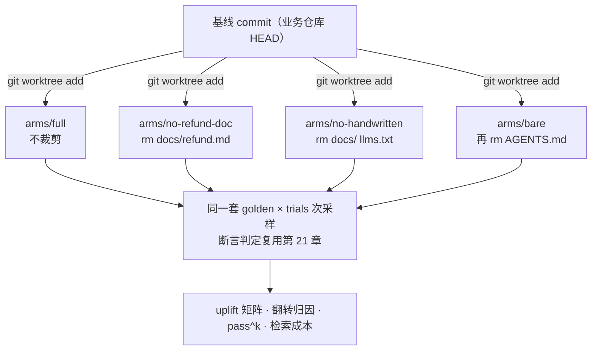
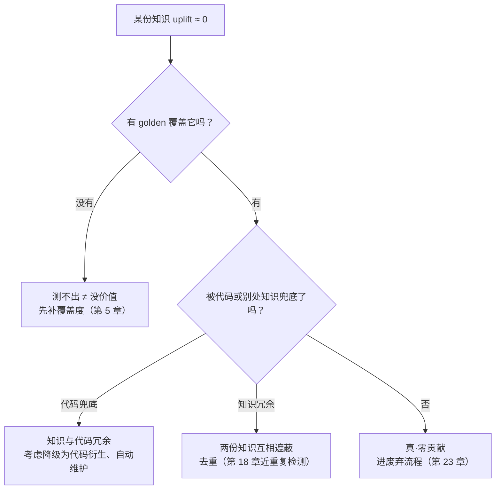

上一章给 `aishop-kb` 装上了 `eval`。现在它的 CLI 有六条命令——`coverage`、`serve`、`promote`、`check`、`extract`、`eval`——golden 全绿，pass^k 达标，看板一片绿色。

但绿板会遇到一个它答不上来的问题。`aishop` 的季度规划会上，平台组为 `aishop-kb` 申请下个季度的维护人力，评审人问：eval 通过率 100%，很好——那把这座库整个摘掉，让裸 agent 直接读 `aishop` 源码，通过率会掉到多少？

没人答得上来。`eval` 度量的是接了知识库之后的绝对分，它证明 agent 答对了，证明不了知识库功不可没——也许其中大半的题，agent 靠 grep 源码也能答对。回答这个问题的方法，机器学习里叫**消融实验**（ablation study）：摘掉系统的一个组件再测，用分数的落差度量这个组件的贡献。

本章给 `aishop-kb` 加第七条命令 `ablate`，把消融做成一套可复现的工程流程：git worktree 切出互相隔离的实验臂，挂载矩阵控制每个臂能看到哪些知识，同一套 golden 逐臂采样打分，输出 uplift、逐题归因与稳定性报告。

## 22.1 本章你会得到什么

1. `aishop-kb ablate` 命令与它底下的完整流水线：臂定义 → git worktree 物化 → 挂载裁剪 → 多次采样 → 归因报告。
2. 一套边际贡献的打分方法：uplift 矩阵、逐 golden 翻转归因、pass^k 稳定性、检索成本——四个视角各回答一个不同的问题。
3. 臂隔离的三个泄漏点：越界读取、索引悬挂、会话缓存，任何一个没堵住，测出来的增量都是歪的。
4. `examples/ablation-harness/` 可独立运行的四臂消融，当场量出：这座知识库整体贡献 0.68，其中手写层 0.56。

## 22.2 绝对分与边际贡献

有效性评测与消融实验回答的是两个不同的问题（表 22-1）。

表 22-1：评测与消融的分界

| | 有效性评测（第 21 章） | 消融实验（本章） |
|---|---|---|
| 回答的问题 | 接了知识库，agent 答得准不准 | 分数里有多少是知识库挣的 |
| 实验配置 | 单配置 | 多臂对照 |
| 核心指标 | 通过率、pass^k | uplift（臂间差值）、翻转归因 |
| 结论形态 | 这套系统能不能用 | 该往哪投入、什么可以裁 |
| 运行频率 | 每次知识变更（CI 门禁） | 定期体检、决策节点前 |

uplift 的定义就是臂间差值：`uplift(臂) = pass_rate(全量臂) − pass_rate(消融臂)`，即被摘掉的那部分知识的边际贡献——越大，说明被摘的知识越承重。真 agent 有采样噪声，个别臂偶见小幅负值属正常，按 22.5.3 的显著性判据处理。

**评测证明 agent 答对了，消融证明知识库功不可没**——前者是上线依据，后者是投入依据。两者共用同一套测题基建：消融复用第 4 章的场景矩阵和第 21 章的断言判定，只是把"跑一遍"变成"摘掉不同的知识各跑一遍"。

工具上也不需要新轮子。promptfoo 的同一份 tests 可以配多个 provider，每个 provider 指向一个臂的 agent 配置，跑完直接出并排对照表——第 21 章选它做断言评测的理由，到消融这里继续成立。

检索系统的研究里这套方法同样是标配：RAG 论文报告效果时，通常逐个摘掉 rerank、混合检索等组件给出消融表，读者可以借同一套读表习惯来读本章的矩阵。

## 22.3 实验臂：挂载矩阵，而非有无开关

最朴素的消融是二值的：挂知识库跑一遍，不挂再跑一遍。它能回答库有没有用，回答不了哪一层、哪个包在承重——而后者才是投入与裁撤决策需要的粒度。

臂的正确形态是**挂载矩阵**：每个臂声明去掉哪个知识子集，其余保持不变。`aishop-kb` 的四个基准臂如表 22-2。

表 22-2：四个基准臂与各自回答的问题

| 臂 | 卸载内容 | 回答的问题 |
|---|---|---|
| full | 无 | 基线：全量知识的绝对分 |
| no-refund-doc | `docs/refund.md` | 单个领域包的边际贡献 |
| no-handwritten | `docs/` + `llms.txt` | 整个手写层值多少分 |
| bare | 手写层 + `AGENTS.md` | 裸 agent 靠源码能考多少 |

臂的粒度沿知识库自身的结构切。第 8 章分层之后，一个 L1 包就是一个天然的消融单元——从 `AGENTS.md` 的依赖声明里摘掉一行，就是一次单包消融。**依赖声明即召回边界，也因此天然是消融的控制开关。**

臂数不必多。基准四臂足以支撑大多数决策；对某个具体包有疑问时，为它加一个单包臂即可。臂数、题数、采样次数是成本的三个乘数，见 22.5.3。

## 22.4 臂的物化：git worktree 与隔离

臂定义好了，还要把它变成 agent 真实工作的环境。直接在工作区里删文件、跑完再恢复，是最容易想到也最危险的做法：删错恢复不了，臂之间互相污染，并行无从谈起。

正确做法是让每个臂都是从同一基线 commit 物化出来的独立工作区。git worktree 恰好为此而生：共享同一个对象库，切出 N 个互不干扰的目录，秒级创建、跑完即弃（图 22-1）。



图 22-1：消融流水线。所有臂来自同一基线 commit，靠 worktree 目录互相隔离；打分与断言完全复用第 21 章的判定器（examples/ablation-harness/src/materialize.ts）。

### 22.4.1 三个泄漏点

消融最常见的失败不是流程跑不通，而是臂与臂之间知识泄漏，把增量测歪。三个必须堵住的口：

1. 越界读取。agent 的 cwd 必须锁死在臂目录，禁止沿绝对路径或上级目录读到臂外的知识。臂里删了 `docs/`，agent 顺着一条硬编码路径把原仓库的文档读回来，消融就白做了。
2. 索引悬挂。卸载 `docs/refund.md` 之后，`llms.txt` 里指向它的条目必须同步剔除。否则 agent 拿着索引去读一个不存在的文件——测出来的是"索引坏了"的分数，不是"缺这份知识"的分数。挂载裁剪必须连带维护索引一致性。
3. 会话缓存。真 agent 有 prompt cache、会话记忆、工具结果缓存，任何一种都可能把上一个臂读到的知识带进下一个臂。每个臂必须用全新会话跑，臂间不共享任何缓存层。

**臂的隔离质量决定消融结论的可信度。** 数字算错还能重算，泄漏测歪的增量会直接导向错误的投入决策。

## 22.5 打分：uplift、翻转归因与 pass^k

四臂、5 道 golden、每题采样 5 次跑完，`examples/ablation-harness/` 给出的通过率矩阵是：

```
臂               G1   G2   G3   G4   G5   均值   uplift
full            5/5  5/5  5/5  5/5  5/5  1.00    —
no-refund-doc   3/5  0/5  5/5  5/5  5/5  0.72   0.28
no-handwritten  1/5  0/5  5/5  5/5  0/5  0.44   0.56
bare            3/5  0/5  5/5  0/5  0/5  0.32   0.68
```

四行数字，三个结论：知识库整体贡献 0.68；手写层贡献 0.56；裸 agent 剩下的 0.32，全是代码衍生知识兜的底。

### 22.5.1 翻转归因：把分数落差落到具体知识上

uplift 是臂级的总量，决策还需要题级的归因：哪道题在哪个臂从 PASS 翻成 FAIL，那道题的承重知识就是被摘掉的那份。示例的五道题翻出四种形态：

1. 硬伤型。G2（风控名单拦退款）、G5（扩容双写校验）在去掉文档的臂里直接归零——规则只存在于文档，代码里没有任何等价物，摘掉就没有兜底。这正是第 15 章"手写业务知识最值钱"的数字证据。
2. 兜底型。G1（退款阈值）翻而不死：代码里有常量可反推，但 agent 要在现行常量和一条旧测试注释里的 3000 之间碰运气。
3. 免疫型。G3（先锁库存）任何臂都不翻——知识就在代码注释里，消融手写层动不了它。免疫型同时是一个治理信号：这份文档知识与代码冗余，可考虑降级为自动生成。
4. 本地约定型。G4（金额单位）只在 bare 臂翻——它的承重方是 `AGENTS.md`：文档层摘掉它还在，代码里又没有等价物。这一类量出的是 L2 本地层的贡献。

### 22.5.2 pass^k 暴露兜底的不稳

兜底型知识用平均通过率看，会得出危险的结论。G1 在 bare 臂 pass^1=0.60，像是还能用；pass^3=0.10 才是真相——连续三次都对的概率只有一成。

对照 full 臂的 pass^3=1.00：**手写知识的价值不只是把答案从错变对，还包括把碰运气变成每次都对。** 只看单次分数，这一层贡献是隐形的。

### 22.5.3 采样数与成本预算

mock agent 确定可复现，trials=5 够演示；真 agent 是概率系统，采样太少时 3/5 与 5/5 的差异可能纯属噪声。成本是三个乘数的积：臂数 × 题数 × 采样次数，每一项都乘在真 agent 的单次调用成本上。

噪声的量级值得算一笔账。3/5 对 5/5 看着差距不小，做 Fisher 精确检验单尾 p ≈ 0.22——远够不上显著，5 次采样根本分不清运气和实力。同样是六成对全对，把每臂采样加到 10 次（6/10 对 10/10），p ≈ 0.04 才跨过 0.05 的显著线。

由此得出一条可操作的经验法则：**trials=5 的矩阵只用来定性看形态（硬伤、兜底、免疫），要对某个包下裁撤结论，把该包的臂加采到每题 10 次以上再判。**

压成本的方法是分层采样，不是全面砍：

1. 全量臂与目标臂多采——它们的差值就是结论；中间臂少采。
2. 翻转干净的题（0/5、5/5）少采，临界的题（3/5 这种）加采到显著为止。
3. 消融是定期体检，不是 CI 门禁——它比评测贵一个数量级，跑在决策节点前，而不是每次提交。

检索成本是消融的副产物。示例里去掉手写层后，agent 平均每次作答读取的字节数从 1014 涨到 1753——没有索引可导航，只能全量扫代码。第 6 章"盲爬烧 token"的定性判断，在这里变成了数字。

## 22.6 uplift 的判读与治理动作

消融报告最终要变成动作。uplift 显著的知识是投入依据；uplift 趋近于零的知识要小心——它的成因不止一种，每种对应的动作也不同（图 22-2）。



图 22-2：uplift ≈ 0 的判读路径与对应动作。把零 uplift 直接当废弃依据，是消融最常见的误用。

示例里的 `docs/risk.md` 落在第一种：没有任何 golden 覆盖它，消融根本测不出它的贡献。**uplift 未知不等于 uplift 为零**——消融结论的边界由 golden 的覆盖度决定，这也是覆盖度（第 5 章）必须先于消融的原因。

兜底方也不一定是代码。顶层 `aishop-kb` 的成品库里，"下单先锁库存"同时存在于 `kb-orders` 与 `kb-inventory` 两个包——单包消融时它们互相遮蔽，各自测出 uplift ≈ 0，看起来都可以裁。

这时正确的动作是去重（第 18 章 `extract` 的近重复检测），而不是废弃。**单包 uplift 对冗余知识天然失真**，必要时用成对消融（两个包一起摘）验证。

排除覆盖盲区与兜底之后，剩下的才是真正的零贡献知识：有题考它、没有兜底、摘掉也不掉分。它是第 23 章废弃机制最硬的输入——比 TTL 和 `last_reviewed` 都硬，因为它是实验证据，不是启发式。

## 22.7 动手：给 aishop-kb 加 ablate

`examples/ablation-harness/` 把本章全部机制落成一个可独立运行的项目：

- `fixture/aishop/`：被消融的仓库快照，代码衍生知识与手写知识并存，还埋了一条旧测试注释里的 3000 当兜底干扰项。
- `src/arms.ts` 与 `src/materialize.ts`：挂载矩阵与 worktree 物化，含索引一致性维护。
- `src/agent.ts`：确定性 mock agent，按第 6 章的检索优先级协议取知识；生产替换成真 agent 的一次 CLI 调用（cwd 锁在臂目录），其余打分与归因逻辑不变。
- `src/main.ts`：编排与五段报告——通过率矩阵、翻转归因、pass^k、检索成本、治理提示。

跑 `npx tsx src/main.ts`，22.5 节的全部数字当场复现；加 `--keep` 保留臂目录，可进去逐臂检查挂载结果。

顶层 `aishop-kb` 同步获得第七条命令 `ablate`。它与 `eval` 共用 golden，在内存里按 namespace 逐包摘除——依赖声明即召回边界，摘一个包就是从依赖清单里划掉一行。

跑 `aishop-kb ablate`，报告正好给出图 22-2 的三种活例子：

1. `kb-refund`、`kb-risk` 各承重一道题——投入有据。
2. 锁库存规则在 `kb-orders` 与 `kb-inventory` 里各存一份，两个单包臂互相遮蔽出双零 uplift——冗余失真，该去重而不是裁撤。
3. `kb-reconcile` 同样 uplift ≈ 0，但原因不同：golden 里没有一道题考对账知识，落在"没有覆盖、测不出"那一支——先补题，再谈贡献。

## 本章要点

- **评测证明 agent 答对了，消融证明知识库功不可没**：前者度量绝对分，是上线依据；后者度量边际贡献 uplift，是投入与裁撤依据。
- 实验臂是挂载矩阵而非有无开关；分层与依赖声明让摘掉一个包精确可控——**依赖声明即召回边界，也因此天然是消融的控制开关。**
- 臂用 git worktree 从同一基线 commit 物化、互相隔离；越界读取、索引悬挂、会话缓存三个泄漏点，任何一个没堵住增量就是歪的。
- 打分四视角各管一件事：uplift 看总量，翻转归因把落差落到具体知识，pass^k 暴露代码兜底的不稳，检索成本量化没有索引的代价；硬伤型翻转是手写业务知识价值的数字证据。
- **uplift 未知不等于 uplift 为零**：零 uplift 先查 golden 覆盖、再查代码或冗余知识兜底，剩下的才进废弃流程；消融是定期体检，不是 CI 门禁。

## 下一章

消融量出了每份知识的贡献，也交出了一份疑似零贡献名单。但今天有贡献的知识明天会腐化，零贡献名单也需要一套正式的退出机制。最后一章讲治理与生命周期：给 CLI 加 `drift` 和 `health`，把覆盖度、有效性、漂移拧进同一条 CI，给全书收官。

## 配套代码

见 `examples/ablation-harness/`。

---

> 本章来自《Agent 知识库工程实战：组织、分发、共建与度量》开源版 · 作者「递归客」
> 在线阅读完整书系：[inferloop.dev](https://inferloop.dev)
