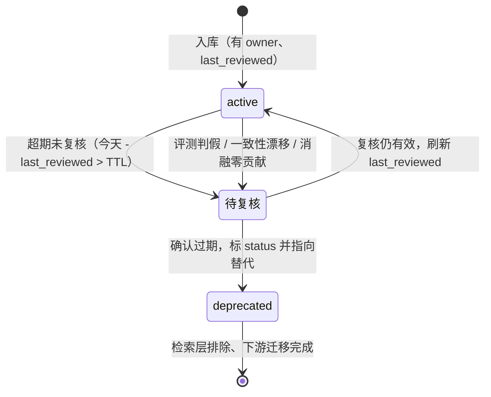
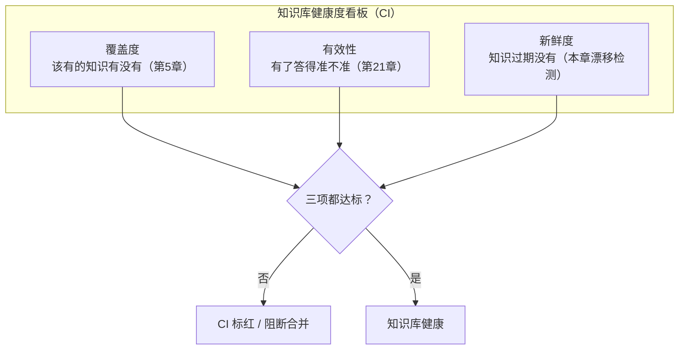
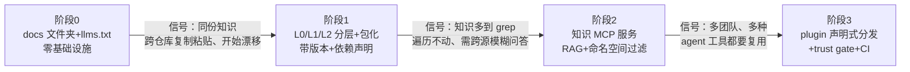

读到这一章，`aishop-kb` 已经会自建、能扫覆盖度、能对外提供服务、能被全团队共建、能自我评测，还能量出每份知识的边际贡献。它的 CLI 长齐了七条命令——`coverage`、`serve`、`promote`、`check`、`extract`、`eval`、`ablate`。知识分 L0/L1/L2 三层，每个包带 `owner` 和 `last_reviewed` 元数据。

但知识建好不等于一劳永逸——它会腐化。腐化不像散落或无主那样在贡献时就暴露，它不产生任何显性信号。一条知识写下的那刻是对的，之后现实变了、它没变，就成了一条理直气壮的错误。

本章给 `aishop-kb` 加最后一条命令 `aishop-kb drift`（漂移检测），配一张 `health` 健康度看板，再把覆盖度、有效性、漂移拧进一条 `.github/workflows/kb-health.yml`。到本章末，你手里就是一座完整、可自托管、能自检的 `aishop-kb`。

先看一条具体的旧知识。`aishop` 的退款包 `kb-refund` 里写着一行规则，半年没人动过：

```markdown
---
owner: 财务老王
last_reviewed: 2026-01-10
status: active
---
- 退款超过 3000 需人工审核。
```

代码那边，退款阈值常量 `REFUND_REVIEW_THRESHOLD` 早在两个月前从旧的 3000 调成了现行的 5000。测试改了、上线了，唯独这条知识没人回头看。

于是 agent 被问到退款审核阈值时，理直气壮地照 3000 回答。它没有编造，只是忠实地读了一条烂知识，把过期值当成现行值输出——一笔 4000 元的退款，按现行 5000 的规则本可自动放行，agent 却照旧知识的 3000 判它超线、硬塞去人工审核；反过来任何按这个答案配置的自动化，都会照 3000 而非 5000 划线，把退款审核卡在错误的边界上。

这正是第 21 章那条判断的落地——faithfulness 高不等于答案对。一个忠于错误知识的 agent，faithfulness 满分而答案全错。

腐化是第 15 章列的手写业务知识四道摩擦里最后、也最阴险的一道。前十几章拆掉了前三道——分层解决散落、CODEOWNERS 解决无主、就地沉淀解决无即时回报。**剩下的腐化，要靠本章的漂移检测、废弃机制和健康度看板来治。**

## 23.1 本章你会得到什么

1. 给 `aishop-kb` 加的 `drift` 命令：一次跑出时间漂移与一致性漂移两类检查，可当 CI 门禁。
2. 一套知识生命周期状态机——active / 待复核 / deprecated，让每条知识都有明确去向，不会无声烂在库里。
3. 一张三位一体健康度看板（覆盖度 + 有效性 + 新鲜度），以及把它拧进 CI 的 `kb-health.yml`。
4. 一张落地路线图：按你的真实信号判断该停在能力阶梯哪一阶——全书的最终 recap。

## 23.2 漂移检测：知识与现实的自动比对

治理腐化的前提是先发现腐化。人工定期通读整个知识库不现实，库越大越靠不住人肉盯。可行的路径是把「知识和现实对不上」变成机器可判定的检查，纳入 CI。

漂移分两类，检测手段不同，`aishop-kb drift` 一次把两类都跑了。

### 23.2.1 时间漂移：last_reviewed 与 TTL

时间漂移指一条知识太久没被任何人验证过。它不断言这条已经错了，只断言这条该有人回头看一眼。检测靠第 9 章给每条知识加的 `last_reviewed` 字段，配一个按知识类型设定的 TTL（time-to-live，存活期）。

TTL 不一刀切，按知识的变动速度分档：

- 变动快的业务规则（定价、风控阈值）给短 TTL，比如 30 天；
- 稳定的架构约定给长 TTL，比如 180 天；
- 组织级 L0 基础层几乎不变，可以更长。

扫描时把 `今天 - last_reviewed` 和该条 TTL 一比，超期的自动标红，推给 owner 复核。复核不等于重写——owner 确认仍有效，就把 `last_reviewed` 刷到今天，等于给这条知识续一期。

时间漂移的价值不在精确，而在兜底。它抓不出「昨天改、今天错」的知识，但能保证没有任何一条知识可以无限期不被审视。对纯业务规则那类无法和代码自动比对的知识，时间漂移是唯一能自动施加的治理压力。

### 23.2.2 一致性漂移：知识值与代码实际值

一致性漂移更强，它直接断言知识和它描述的东西对不上。前提是知识里有一个可以和客观来源比对的值，代码衍生知识天然具备这个条件。

`aishop-kb drift` 对 `kb-refund` 做的正是这件事。它从知识里抽出阈值 3000，比对代码常量 `REFUND_REVIEW_THRESHOLD` 的 5000，`3000 ≠ 5000`，一致性漂移当场暴露——就是本章开头那条烂知识：知识还停在旧值 3000，代码早已是现行的 5000。

本章示例 `governance-ci` 是 `drift` 命令的最小实现，对 `aishop` 的三个知识包跑一遍，揪出三条漂移：

```text
① 漂移检测
========================================================
  [废弃仍在库] kb-legacy：status=deprecated，应下线或迁移下游
  [时间漂移] kb-refund：last_reviewed 已 177 天 > TTL 90
  [一致性漂移] kb-refund：知识说阈值 3000，但代码里已是 5000
  共 3 条漂移。
```

前两条靠元数据判定，第三条靠值比对判定。同一个 `kb-refund` 同时踩中时间漂移和一致性漂移，这不是巧合——长期没人复核的知识，正是最容易和现实对不上的知识。

这个边界是：一致性漂移只对有可抽取、可比对确定值的知识有效——阈值、字段名、枚举值、API 签名。对下单先锁库存再扣款这类纯流程规则，代码里没有单一常量可比对，一致性漂移无能为力，只能靠时间漂移施压。

这也印证第 1 章那条论断的另一面：文件式知识随代码 PR 一起改，reviewer 当场就能看见知识和代码是否同步，天然少一层漂移。任何和代码分离的知识——中心化索引、独立文档、[MCP](https://modelcontextprotocol.io) 注册知识——都必须额外补一套漂移检测。**漂移检测不是可选的加分项，而是任何与代码分离的严肃知识库的必需品。**

### 23.2.3 度量到治理的反馈闭环

时间漂移和一致性漂移都从知识侧主动扫描。还有一条从使用侧被动发现漂移的通道，把第 21 章的度量和本章的治理接成闭环。

第 21 章用 [promptfoo](https://www.promptfoo.dev) 判定 agent 回答对不对。其中一类失败样本特别值钱：agent 忠实引用了某条知识（faithfulness 高），但对照 ground truth 是错的。这种失败几乎必然指向一条过期或错误的知识。

治理系统应当订阅这类失败：自动打标为待复核候选，连同触发的知识条目一起回灌给该条 owner。这条通道补上了主动扫描的盲区——一致性漂移抓不到纯业务规则的错，时间漂移只能按固定周期施压。

评测里的忠于知识却答错则是一个精准的实时信号，它告诉你具体是哪条知识、在什么问题上、正把 agent 带偏。度量因此不再是孤立报表，治理也不再是机械的定时扫描，两者接成一个回路：使用暴露问题、度量捕获问题、治理修复问题、修复后的知识再被使用。**这就是把知识库当软件工程在运维层的体现——像监控生产系统的错误率一样监控知识库的答错率。**

## 23.3 废弃机制与生命周期状态机

发现漂移之后要有处理机制。对确认过期的知识，最容易犯的错是直接删除。

### 23.3.1 deprecated 而非删除

删除会丢掉两样东西——历史和去向。一条被删的知识，没人知道它曾经存在、为什么被废、该用什么替代。如果还有下游仓库或文档引用它，删除会让那些引用变成断链。

正确做法是标记而非删除：给知识加 `status: deprecated`，明确告诉 agent 别再用，同时把它留在库里，用 `superseded_by: kb-refund@2.0` 指向替代。检索层看到 `deprecated` 就不再召回给 agent，但人和迁移工具仍能顺着它找到历史和去向。

这和 npm 包的 `deprecated` 语义一致——包还在、还能装，但装时会警告你它被弃用、该迁到哪个新包。知识的废弃借用同一套心智模型，读者在第 13 章已经见过它在 plugin 依赖上的形态。

`deprecated` 状态本身也是一种漂移。一条已废弃却仍留在库里可被检索的知识，是治理不到位的信号。本章示例把 `kb-legacy` 这条已废弃仍在库列为三条漂移之一，正是这个道理——废弃不是打个标就完事，还要保证检索层真排除、下游引用真迁走。

### 23.3.2 生命周期状态机

把 owner、last_reviewed、TTL、status 合起来，每条知识就有了一条明确的生命周期，在一个状态机里流转（图 23-1）。



图 23-1：知识条目的生命周期状态机。一条知识入库即 active；被 TTL 超期、评测判假、一致性漂移或消融零贡献任一信号推入待复核；复核后要么续期回 active、要么确认过期标 deprecated 并指向替代。

这套状态机是治理能自动化的关键。没有它，知识库是一堆状态不明的文件，只增不减、真假混杂，越久越不敢信。有了它，知识库变成每条目都有明确状态、能自动淘汰过期项、能沿状态转移施加治理动作的系统。

进入待复核的入口有四个——TTL 超期、评测判假、一致性漂移，以及第 22 章消融量出的零贡献。前三条是本章的发现通道，第四条是实验证据，状态机把它们统一收口成同一个复核动作。其中消融证据最硬：有 golden 考它、没有代码兜底、摘掉也不掉分，这样的知识进废弃流程几乎没有争议。

## 23.4 黄金路径：让走正道最省事

状态机和门禁属于管，靠规则约束行为。但只靠管治理不住知识库——人总能找到绕过规则的捷径。治理还需要引，让人自愿走正道。

黄金路径（golden path）的核心是一条朴素判断：如果按规范提知识 PR 比在代码里随手塞注释更麻烦，人就会选后者。门禁再严也只拦住走正道的少数人，拦不住抄近路的多数人。治理的成败，很大程度取决于正道和歪路谁的摩擦更低。

治理的一半工作前几章已经做了：

- 就地沉淀做到零门槛（第 16 章），随手记一条比塞代码注释还快；
- promote 自动补元数据（第 16 章），升级到共享包不用人工填字段；
- 门禁在 CI 里自动跑（第 17 章），贡献者不用记规范、不用等人催。

这些设计单独看是各章的体验优化，合起来是同一件事——把正道的摩擦压到低于歪路。当走正道本身就最省事，绝大多数人自然走正道。**治理于是从靠人肉评审堵歪路，变成靠流水线自动引上正道。**

这和 Packmind 提出的 ContextOps 生命周期（Build → Distribute → Govern → Maintain）是同一主张：治理靠模板和 pipeline 自动化，而不是靠人盯着。一个需要专人天天维护才不腐烂的知识库，本身就是设计失败。

## 23.5 健康度看板：覆盖度、有效性与新鲜度三位一体

把全书的度量收拢，一个知识库的健康由三个正交维度共同决定，缺一不可，且都该进 CI、都该能一眼看到（图 23-2）。



图 23-2：知识库健康度看板。覆盖度（该有的有没有，第 5 章）、有效性（有了准不准，第 21 章）、新鲜度（过期没有，本章）三项正交，任一退步 CI 就红。

三项互相不能替代，也互相不能推断：

- 覆盖度高不代表有效性高——该有的知识都在，但可能都写得不准；
- 有效性高不代表新鲜度高——今天测着准，明天业务一改，同一批知识就从对变错；
- 新鲜度高也不代表覆盖度高——每条都新鲜，但大片业务场景可能根本没有对应知识。

只盯一项的团队，会在另外两项上悄悄烂掉而不自知。所以健康度判定要三项一起算。本章示例里覆盖度 85% 达标、有效性 90% 达标，但新鲜度有三条未解决漂移，最终判定不健康，脚本以退出码 1 结束，可直接当 CI 门禁用。

**健康是三项的合取，不是平均——任何一项拖后腿，整体就不健康。** 落到 CI，就是把三条命令串成一个 workflow，任一非零退出就阻断合并：

```yaml
# .github/workflows/kb-health.yml
name: kb-health
on: [push, pull_request]
jobs:
  health:
    runs-on: ubuntu-latest
    steps:
      - uses: actions/checkout@v4
      - uses: actions/setup-node@v4
        with: { node-version: 20 }
      - run: aishop-kb coverage   # 覆盖度（第 5 章）
      - run: aishop-kb eval       # 有效性（第 21 章）
      - run: aishop-kb drift      # 新鲜度（本章）
```

到这一步，`aishop-kb` 不再是一个建完就不管的静态资产，而是一个有持续健康指标、会在退步时自动报警和阻断的工程系统。这正是本书从第 1 章一以贯之的主张——把知识库当软件工程做：它有版本、有依赖、有 CI、有监控、有生命周期，和任何一个严肃软件系统一样。

## 23.6 落地路线图：能力阶梯按信号升级

全书讲到这里，`aishop-kb` 已经从第 2 章那个空目录，长成一个分层组织、包化分发、MCP 服务化、跨 agent 可移植、有共建流水线、带评测和漂移检测 CI 的完整知识库。但这条完整路径不是每个团队都该走完的清单。

本书反复强调够用就别升级。最后用一张路线图把它落到操作层面：按你的真实信号，停在能力阶梯的合适一阶（图 23-3）。



图 23-3：落地路线图，即全书能力阶梯的最终 recap。四阶每一级都由左边那个具体信号触发才升级，没触发就停在原地。

按阶展开：

- 个人、小团队、单仓库：停在阶段 0（第 6 章）。一个 `docs/` 文件夹加 [`llms.txt`](https://llmstxt.org) 加确定性导航，零基础设施，对几十条知识完全够用。为这个规模上 MCP 是纯负债——维护一套向量库和索引 worker，换来的检索质量还不如 `grep`。
- 知识要跨仓库复用：升到阶段 1（第 8、9 章）。L0/L1/L2 分层加带语义版本的知识包加依赖声明。触发信号很明确——同一份知识开始在多个仓库被复制粘贴，且副本各自漂移。
- 大规模、跨源、需要语义问答：才升到阶段 2（第 10、11 章）。手搭知识 MCP 服务，RAG 管线进场。触发信号是确定性 `grep` 遍历不动，或需要跨多个源做开放式模糊问答——这正是第 1 章界定的向量检索主场，RAG 的家在这一阶，不在更早。
- 跨团队规模化分发：升到阶段 3（第 12、13、14 章）。跨 agent 可移植加 plugin 声明式安装加 trust gate。触发信号是多个团队、多种 agent 工具都要复用同一批知识，手工分发已经协调不过来。

判断该停在哪一阶，只看一件事：现有一阶是不是已经在产生实际痛苦。没有痛苦就不升级——每升一阶都是新增一套要长期运维的基础设施，为用不上的规模买单，是知识库工程最常见的过度设计。

## 23.7 四支柱的最终关系

路线图只描述了四支柱里的两根——组织和分发。它们是阶梯，随规模逐级往上爬，够用就停。另外两根支柱——共建（第五部分）和度量治理（第二、六部分）——不在这条阶梯上。

无论 `aishop-kb` 停在哪一阶，手写业务知识的共建都要做。知识总得有来源，代码衍生知识能自动化，可企业真正值钱的业务规则只能靠人手写沉淀，这件事在阶段 0 和阶段 3 同样绕不开。

度量治理也一样——哪怕只有一个 `docs/` 文件夹，也需要知道覆盖够不够、答得准不准、有没有过期。共建和度量是贯穿每一级的两条纵线，不是阶梯的某一级台阶。

至此，你手里的 `aishop-kb` 是一座能自建、能分发、能共建、能自检的完整知识库：一个 `docs/` 起步的文件夹，长成了带版本的分层包、对外的 MCP 端点、跨 agent 的 plugin，配上覆盖度、有效性、漂移三项进 CI 的健康看板。它可自托管、可运行、能自我报警。

**组织和分发是随规模攀升的横向阶梯，共建和度量是从第一天贯穿到最后的纵向底线。** 选对停在哪一阶是省钱，做好那两条纵线是知识库到底有没有用。前者决定成本，后者决定价值。

## 本章要点

- 腐化是手写业务知识四道摩擦里最阴险的一道：一条过期知识格式规范、有 owner、过了门禁，内容却错，agent 忠实照做把事情做错——faithfulness 高不等于答案对，根源就在这里。
- 漂移检测把知识和现实对不上变成机器可判定的 CI 检查：时间漂移（last_reviewed 超出按类型设定的 TTL）施加复核压力，一致性漂移（知识里的确定值对比代码实际值）直接抓错；与代码分离的知识都必须补这道检测。
- 度量到治理成闭环：第 21 章评测里忠于知识却答错的样本自动打标待复核、回灌给 owner，补上主动扫描抓不到纯业务规则的盲区。
- 废弃用 deprecated 标记而非删除，保留历史、指向替代；owner + last_reviewed + TTL + status 让每条知识在一个生命周期状态机里流转，三个信号统一收口成复核动作。
- 黄金路径让走正道最省事，治理从人肉堵歪路变成流水线引上正道（Packmind ContextOps）。
- 健康度三位一体进 CI——覆盖度、有效性、新鲜度三项正交、互不替代，健康是三项的合取，任一退步就阻断。
- 落地路线图即能力阶梯的最终 recap：每阶由具体信号触发才升级，够用就别升级；组织与分发是随规模爬的阶梯，共建与度量是贯穿每一级的纵线。

## 全书回顾

到这里，`aishop-kb` 从第 1 章的一个检索机制判断起步，走完了组织、分发、共建、度量四支柱——这本书没有下一章，但你手里的知识库工程才刚刚开始运转。

全书各章逐步搭出的能力，最终组装成了书根下的 `aishop-kb/` 成品：一座完整、可自托管的知识库，加一套统一 CLI（`aishop-kb coverage / serve / promote / check / extract / eval / ablate / drift`）和一条 `kb-health.yml` CI。这八条命令，正是你从第 5 章到本章一条条加上去的。

## 配套代码

本章示例见 `examples/governance-ci/`；组装好的完整成品见书根 `aishop-kb/`——`npx tsx src/cli.ts health` 可一键跑出三位一体健康度看板。

---

> 本章来自《Agent 知识库工程实战：组织、分发、共建与度量》开源版 · 作者「递归客」
> 在线阅读完整书系：[inferloop.dev](https://inferloop.dev)
